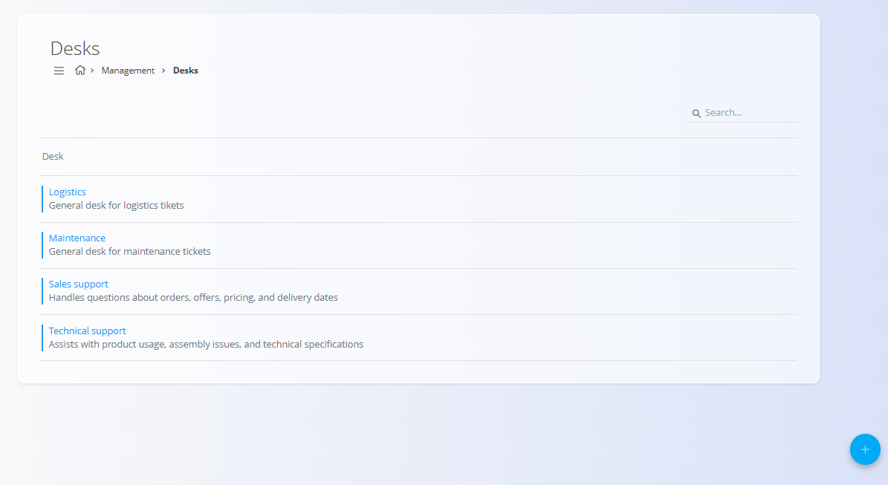
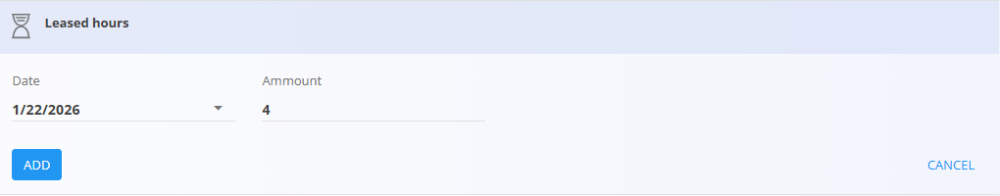

<!-- app_route: /management/customer-support/desks -->
<!-- app_label: Področja -->
<!-- canonical_source_url: https://github.com/Tom-PIT/Connected.Docs/blob/main/sl/Domene/Stranke/Upravljanje/Podrocja.md -->
<!-- canonical_source_title: Področja -->

# Področja

**Področja** se uporabljajo za organizacijo in upravljanje **podpornih prijav** glede na odgovornost, na primer **Vzdrževanje**, **Logistika** ali **Prodaja**. Določajo, kako so prijave razvrščene, kako se pošiljajo obvestila ter kako se obravnavajo dodatne funkcionalnosti, kot so e-poštni vnos prijav, zakupljene ure in obračunavanje.

Področja zagotavljajo, da so prejete zahteve pravilno usmerjene in dosledno obdelane v celotni organizaciji.

Za dostop do tega zaslona pojdite na **Stranke / Upravljanje / Področja** v [**navigaciji**](../../../Skupno/UI/Navigacija.md).

## Shema

| Polje | Opis |
|------|------|
| **Naziv področja** | Naziv področja, prikazan v seznamih in pogledih prijav (obvezno). |
| **Opis** | Kratek opis namena področja (neobvezno). |
| **Omogočeno** | Določa, ali je področje aktivno in lahko prejema prijave. |
| **Pred-definirane oznake** | Oznake, ki se samodejno dodelijo prijavam, ustvarjenim v tem področju. |
| **E-pošta pošiljatelja (Obvestila)** | E-poštni naslov, ki se uporablja kot pošiljatelj obvestil za to področje. |
| **IMAP omogočeno** | Omogoča ustvarjanje prijav iz prejetih e-poštnih sporočil. |
| **IMAP e-pošta** | E-poštni naslov za prejemanje prijav. |
| **IMAP poverilnice** | Identifikacijski podatki za IMAP nabiralnik. |
| **IMAP strežnik** | Naslov IMAP strežnika. |
| **IMAP vrata** | Vrata IMAP strežnika. |
| **IMAP omejitve** | Pravila, ki omejujejo, kdo lahko ustvari prijavo prek e-pošte. |

## Upravljanje

Področja so dostopna v razdelku **Upravljanje** sistema. Vsa področja se upravljajo centralno in se uporabljajo v vseh delovnih tokovih, povezanih s prijavami in podporo strankam.

### Seznam področij

Uporabniški vmesnik prikazuje seznam vseh definiranih področij.

Vsako področje vključuje:
- barvni indikator stanja (omogočeno / onemogočeno),
- naziv področja,
- kratek opis (če je podan).

## Dejanja

### Ustvariti novo področje

Za ustvarjanje novega področja kliknite [**akcijski gumb**](../../../Skupno/UI/AkcijskiGumb.md).

Obrazec področja je razdeljen na več sklopov, ki določajo njegovo obnašanje. Pri dodajanju ali urejanju uporabite polja, opisana v razdelku [**Shema**](#shema).

### Splošno

Sklop **Splošno** določa osnovne lastnosti področja:

- **Naziv področja**
- **Opis**
- **Pred-definirane oznake**
- stanje **Omogočeno**

### Obvestilo

V razdelku **Obvestilo** je določen e-poštni naslov, s katerega se pošiljajo vsa obvestila za to področje.

### IMAP

Sklop **IMAP** omogoča povezavo področja z e-poštnim nabiralnikom. Ko je omogočen, se prejeta e-poštna sporočila samodejno pretvorijo v podporne prijave.

### Zakupljene ure

Sklop **Zakupljene ure** omogoča upravljanje predplačanih ali pogodbeno dogovorjenih ur podpore za področje. Za dodajanje zakupljenih ur kliknite **Dodaj zakupljene ure** in vnesite:

- **Datum**
- **Količina**

### Računi

Sklop **Računi** omogoča pregled računov, povezanih z aktivnostmi področja. Za dodajanje računa kliknite **Dodaj račun** in vnesite:

- **Datum**
- **Količina**

### Urediti področje

Klik na področje v seznamu ga odpre v načinu urejanja. Vsa polja in nastavitve je mogoče spreminjati, spremembe pa se shranijo samodejno.