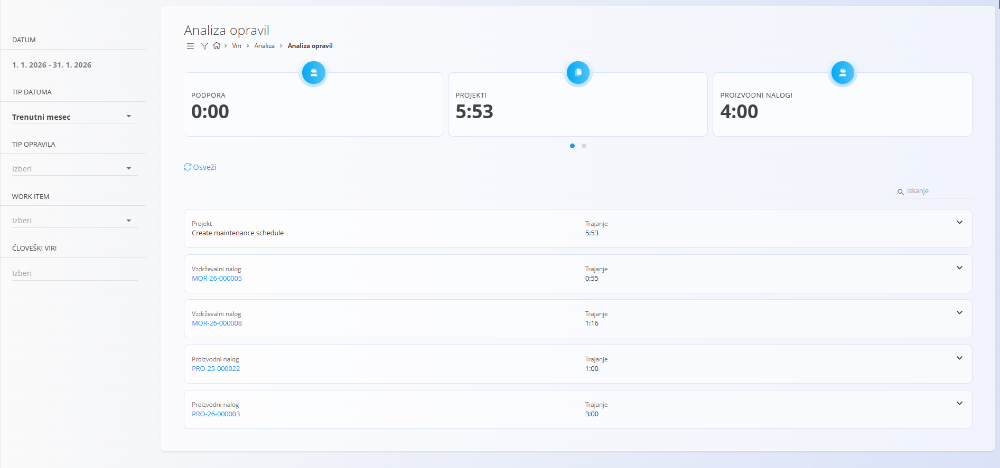
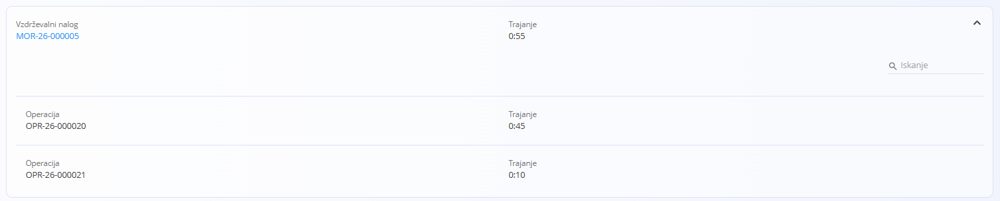
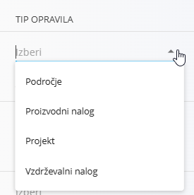

# Analiza opravil

Pogled **Analiza opravil** omogoča analitični pregled **zabeleženega delovnega časa v sistemu**.  
Združuje napor, zabeležen na različnih tipih opravil (projekti, proizvodni nalogi, vzdrževalni nalogi, področje), ter prikazuje tako **povzetke** kot tudi **podrobne razčlenitve**.

Ta pogled se uporablja predvsem za razumevanje, **kako je delovni čas porazdeljen** med tipi opravil in posameznimi opravili v izbranem časovnem obdobju.

Za dostop do **Analize opravil** pojdite na **Viri / Analiza / Analiza opravil** v [**navigaciji**](../../../Skupno/UI/Navigacija.md).

## Povzetni kazalniki

Na vrhu zaslona so prikazane povzetne kartice, ki prikazujejo **skupno trajanje zabeleženega dela**, združeno po tipu opravila, na primer:

- **Podpora**
- **Projekti**
- **Proizvodni nalogi**
- **Vzdrževalni nalogi**

Vrednosti se samodejno posodabljajo glede na izbrane filtre.

## Seznam opravil

Pod povzetnimi kazalniki je prikazan seznam opravil z njihovim **skupnim zabeleženim trajanjem**.

Vsak vnos prikazuje:
- **tip opravila** (Projekt, Proizvodni nalog, Vzdrževalni nalog, Področje),
- **referenco opravila** (koda ali naziv),
- **skupno trajanje** za izbrano obdobje.

Klik na opravilo odpre njegov **podrobni pogled**.

Opravila je mogoče razširiti za pregled njihove notranje strukture, kjer je na voljo.  
Pri razširitvi so prikazani tudi podrejeni elementi (na primer operacije znotraj proizvodnega ali vzdrževalnega naloga) skupaj s pripadajočim trajanjem.

## Filtri

Leva stranska plošča omogoča natančno prilagajanje analize s pomočjo naslednjih filtrov:

- **Datum**  
  Izbira poljubnega datumskega obdobja.

- **Tip datuma**  
  Vnaprej določeni obsegi:
  - **Trenutni mesec**
  - **Trenutni dan**

- **Tip opravila**  
  Filtriranje po:
  - **Področje**
  - **Vzdrževalni nalog**
  - **Proizvodni nalog**
  - **Projekt**

- **Opravilo**  
  Omejitev analize na posamezno opravilo.

- **Človeški viri**  
  Filtriranje po enem ali več uporabnikih, katerih delovni čas se vključi v analizo.

Vsaka sprememba filtra takoj **preračuna kazalnike in seznam opravil**.

## Osveževanje podatkov

Dejanje **Osveži** ponovno naloži analitične podatke glede na trenutno izbrane filtre.

Ta pogled je namenjen **analizi in poročanju** ter ne omogoča neposrednega urejanja podatkov o času.

---