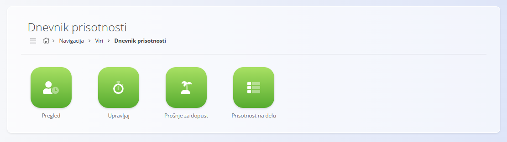

# Dnevnik prisotnosti

Razdelek **Dnevnik prisotnosti** omogoča dostop do vseh pogledov, povezanih s časom za vire.  
Uporablja se za pregled zabeleženega delovnega časa, upravljanje časovnih vnosov in odsotnosti ter spremljanje prisotnosti na delu.

## Razpoložljivi pogledi

Področje Dnevnik prisotnosti je sestavljeno iz več namenskih pogledov, od katerih vsak pokriva določen vidik beleženja časa in prisotnosti:

- **[Pregled](DnevnikPrisotnostiPregled.md)** - Pregled zabeleženih časovnih vnosov, ki uporabnikom omogoča vpogled v evidentirano delo in časovne zapise.

- **[Upravljaj](DnevnikPrisotnostiUpravljaj.md)** - Upravljanje časovnih vnosov, vključno z urejanjem, popravki in administracijo že zabeleženih podatkov.

- **[Prošnje za dopust](DnevnikPrisotnostiProsnjeZaDopust.md)** - Upravljanje vnosov plačanih odsotnosti, kot so dopusti ali druge odobrene odsotnosti.

- **[Prisotnost na delu](DnevnikPrisotnostiPrisotnostNaDelu.md)** - Pregled prisotnosti, ki prikazuje prisotnost in vzorce dela za vire.

Vsak pogled je osredotočen na specifičen delovni tok, kar zagotavlja jasno ločitev med beleženjem časa, upravljanjem odsotnosti in spremljanjem prisotnosti na delu.
