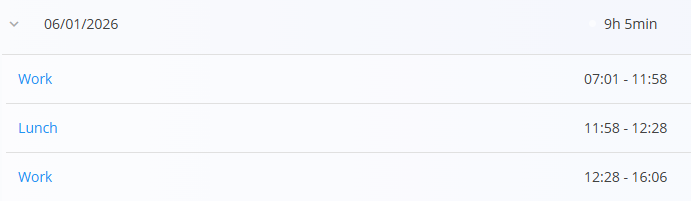
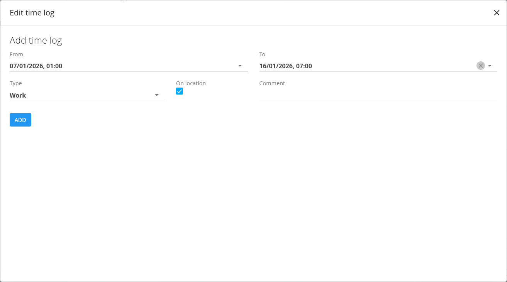
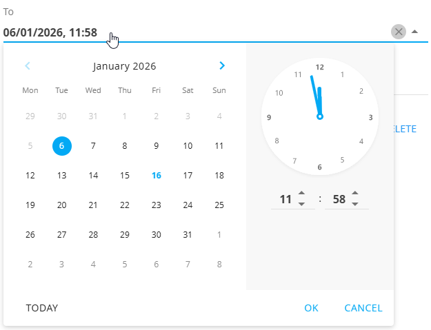

<!-- app_route: /time-logs/view -->
<!-- app_label: Dnevnik prisotnosti – Pregled -->
<!-- canonical_source_url: https://github.com/Tom-PIT/Connected.Docs/blob/main/sl/Domene/Viri/Pregledi/DnevnikPrisotnostiPregled.md -->
<!-- canonical_source_title: Dnevnik prisotnosti – Pregled -->

# Dnevnik prisotnosti – Pregled

Zaslon **Dnevnik prisotnosti – Pregled** omogoča podroben pregled zabeleženega delovnega časa za izbranega zaposlenega in obdobje. Uporablja se za pregled dnevne prisotnosti, pregled posameznih časovnih vnosov ter ročno dodajanje ali popravljanje časovnih zapisov po potrebi.

Za dostop do pogleda **Dnevnik prisotnosti – Pregled** pojdite na **Viri / Dnevnik prisotnosti / Pregled** v [**navigaciji**](../../../Skupno/UI/Navigacija.md).

## Namen

Pogled Dnevnik prisotnosti – Pregled se primarno uporablja za:

- pregled zabeleženih delovnih ur za izbrano obdobje,  
- pregled dnevne razčlenitve časa (delo, malica, zasebno ipd.),  
- dodajanje ali prilagajanje časovnih vnosov po potrebi,  
- primerjavo zabeleženih ur s pričakovanimi delovnimi urami.  

Zaposleni ta zaslon običajno uporabljajo za **spremljanje lastnega časa**, pooblaščeni uporabniki pa lahko **pregledujejo in upravljajo časovne vnose** drugih zaposlenih.

## Filtri in kontekst

V levi stranski vrstici so na voljo naslednji filtri in izbirniki:

- **Datum** – izbira časovnega obdobja za prikaz (na primer celoten mesec),
- **Zaposleni** – izbira zaposlenega, za katerega so prikazani časovni vnosi,  
  - ta izbirnik je viden samo pooblaščenim uporabnikom,  
  - zaposleni vidijo isti zaslon brez možnosti izbire zaposlenega.

Sprememba kateregakoli od teh parametrov osveži prikazane časovne vnose in povzetke.

## Povzetni kazalniki

Na vrhu zaslona so prikazane povzetne kartice, ki omogočajo hiter pregled izbranega obdobja:

- **Ure** – zabeležene ure v primerjavi s pričakovanimi delovnimi urami,  
- **Plačan dopust** – skupno število odobrenih dni plačanega dopusta,  
- **Bolniška odsotnost** – skupno število odobrenih dni bolniške odsotnosti.  

Ti kazalniki omogočajo hiter vpogled v prisotnost in morebitna odstopanja.

## Dnevni seznam časovnih vnosov

Pod povzetkom so časovni vnosi združeni po **dnevih**.

Vsaka vrstica prikazuje:

- **Datum**,  
- **Skupni zabeležen čas za dan**.

### Razširitev dneva

Klik na posamezen dan razširi vrstico in prikaže posamezne časovne vnose, kot so:

- Delo  
- Malica  
- Privat
- Druge konfigurirane vrste časa  

Vsak vnos prikazuje čas začetka in konca.

## Urejanje časovnih vnosov

Klik na posamezen vnos (na primer **Delo** ali **Malica**) odpre pogovorno okno **Uredi časovni vnos**.

V tem pogovornem oknu lahko pooblaščeni uporabniki:

- prilagodijo **začetni in končni čas**,  
- spremenijo **vrsto časa**,  
- določijo, ali je bil vnos **na lokaciji**,  
- dodajo ali posodobijo **komentar**.

Spremembe se shranijo takoj in se odražajo v dnevnih in skupnih povzetkih.

Pri urejanju polj **Od** in **Do** se uporablja kombiniran **izbirnik koledarja in ure**.

To omogoča natančno izbiro datuma in časa za posamezen časovni vnos. Spremembe se po potrditvi takoj uveljavijo in so vidne v dnevnih seštevkih.

## Dodajanje novega časovnega vnosa

S pomočjo **akcijskega gumba** (spodaj desno) lahko pooblaščeni uporabniki ročno dodajo nov časovni vnos.

To se običajno uporablja, kadar:

- zaposleni sam ni mogel zabeležiti časa,  
- so potrebni popravki za nazaj.  

Uporablja se isto pogovorno okno kot pri urejanju obstoječih vnosov, kar zagotavlja dosleden delovni tok.

## Seštevki in pričakovane delovne ure

Na dnu zaslona so prikazani seštevki za izbrano obdobje:

- zabeležene delovne ure,  
- plačan dopust,  
- bolniška odsotnost,  
- pričakovane delovne ure,  
- razlika med zabeleženimi in pričakovanimi urami.  

Te vrednosti omogočajo jasen pregled skladnosti in morebitnih odstopanj za izbranega zaposlenega in časovno obdobje.

---