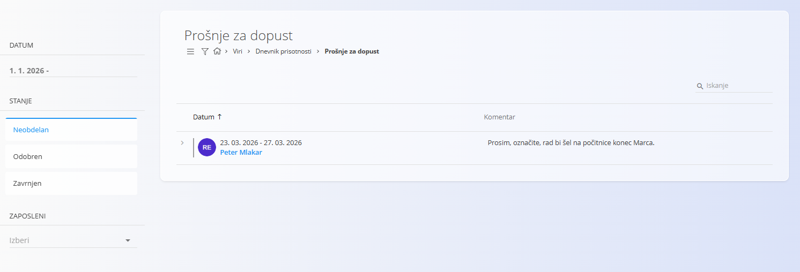
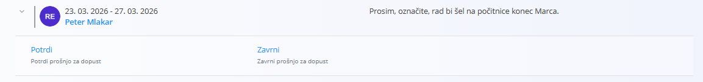

<!-- app_route: /time-logs/paid-leave-management -->
<!-- app_label: Dnevnik prisotnosti – Prošnje za dopust -->
<!-- canonical_source_url: https://github.com/Tom-PIT/Connected.Docs/blob/main/sl/Domene/Viri/Pregledi/DnevnikPrisotnostiProsnjeZaDopust.md -->
<!-- canonical_source_title: Dnevnik prisotnosti – Prošnje za dopust -->

# Dnevnik prisotnosti – Prošnje za dopust

Pogled **Dnevnik prisotnosti – Prošnje za dopust** je namenjen predvsem vodjem in odgovornim uporabnikom za **pregled, odobritev ali zavrnitev prošenj za plačani dopust**, ki jih oddajo zaposleni.

Za dostop do pogleda **Prošnje za dopust** pojdite na **Viri / Dnevnik prisotnosti / Prošnje za dopust** v [**navigaciji**](../../../Skupno/UI/Navigacija.md).

## Pregled

Ta zaslon omogoča centraliziran pregled prošenj za dopust, vključno z:

- zaprošenim datumskim obdobjem,
- zaposlenim, ki je oddal prošnjo,
- neobveznim komentarjem ali pojasnilom,
- trenutnim stanjem prošnje.

Prošnje so razvrščene kronološko in jih je mogoče filtrirati s pomočjo filtrov na levi strani.

## Stanja prošenj za dopust

Vsaka prošnja za dopust ima stanje, ki odraža njen trenutni status:

- **Neobdelan** – prošnja čaka na odločitev,  
- **Odobren** – prošnja je bila odobrena,  
- **Zavrnjen** – prošnja je bila zavrnjena.  

Levi filtri omogočajo hiter preklop med stanji in osredotočanje na odprte ali že obdelane prošnje.

## Pregledovati in upravljati zahtevke za dopust

Prošnje v stanju **Neobdelan** je mogoče neposredno razširiti v seznamu.

Ob razširitvi so na voljo naslednja dejanja:

- **Odobri** – potrdi dopust za izbrano obdobje,  
- **Zavrni** – zavrne prošnjo za dopust.  

Po sprejeti odločitvi:

- se prošnja samodejno odstrani iz seznama *Neobdelan*,  
- prikaže se v razdelku **Odobren** ali **Zavrnjen**, glede na izbrano dejanje.

To omogoča jasen pregled nad čakajočimi in zaključenimi odločitvami.

## Filtrirati in iskati zahtevke za dopust

Leva stranska vrstica ponuja filtre za lažje upravljanje večjega števila prošenj:

- **Datum** – filtriranje po datumskem obdobju (npr. *1. 1. 2026 –*),  
- **Stanje** – *Neobdelan*, *Odobren*, *Zavrnjen*,  
- **Zaposleni** – prikaz prošenj za izbranega zaposlenega.  

Iskalno polje v zgornjem desnem delu omogoča hitro iskanje posameznih prošenj.

## Povezava z dnevnikom prisotnosti

Odobrene prošnje za dopust se samodejno odražajo v časovnih evidencah zaposlenega in so vidne v pogledu **Dnevnik prisotnosti – Pregled**.

Ta zaslon je osredotočen na **odločitvene in potrditvene delovne tokove**, medtem ko so podrobni pregledi prisotnosti in ur obravnavani v drugih pogledih.