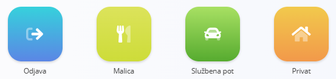
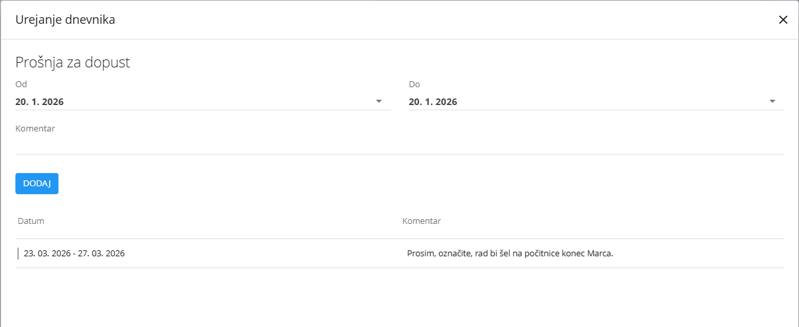

# Dnevnik prisotnosti – Upravljaj

Pogled **Dnevnik prisotnosti – Upravljaj** je namenjen **sprotnemu beleženju prisotnosti in dnevnemu evidentiranju časa**.  
Zaposlenim omogoča beleženje začetka in konca dela, odmorov, službenih poti, zasebnega časa ter hiter dostop do odsotnosti in potnih nalogov.

Za dostop do pogleda **Dnevnik prisotnosti – Upravljaj** pojdite na **Viri / Dnevnik prisotnosti / Upravljaj** v [**navigaciji**](../../../Skupno/UI/Navigacija.md).

## Namen pogleda

Ta pogled je primarno namenjen **dnevnim prijavam in odjavam** ter sprotnemu spremljanju delovnega časa.

Tipični primeri uporabe vključujejo:

- beleženje začetka in konca delovnega dne,
- evidentiranje odmora (npr. malica),
- beleženje službenih poti in zasebnega časa,
- hiter pregled današnje prisotnosti,
- hiter dostop do dejanj, povezanih z odsotnostmi (dopust, bolniška odsotnost) in potnimi nalogi.

## Tipičen potek na lokaciji (čitalec kartic)

V številnih okoljih se ta pogled uporablja skupaj s **fizičnim čitalcem kartic** (na primer ob vhodu v objekt).

Tipičen potek je naslednji:

1. Zaposleni **prisloni kartico** ob prihodu na delo.  
2. Sistem zabeleži **začetek delovnega dne**.  
3. Ob ponovnem pristopu kartice se prikažejo **gumbi za beleženje časa**.  
4. Zaposleni izbere dejanje (na primer **Malica**).  
5. Po koncu malice ponovno prisloni kartico, kar zaključi malico in nadaljuje **Delo**.  
6. Ob koncu dneva zaposleni prisloni kartico in izbere **Odjava**, s čimer zaključi delovni dan.

V tem primeru zaposleni **ne uporablja neposredno uporabniškega vmesnika**, vendar so vsa dejanja vidna tudi v pogledu **Dnevnik prisotnosti – Upravljaj**.

## Oddaljena ali računalniška uporaba

V drugih okoljih (na primer **delo na daljavo** ali pisarniško delo) se ista dejanja izvajajo neposredno prek računalnika.

V tem primeru zaposleni:

- odpre pogled **Dnevnik prisotnosti – Upravljaj**,
- uporabi razpoložljive gumbe za:
  - začetek dela,
  - beleženje malice ali zasebnega časa,
  - zaključek delovnega dne.

S tem je zagotovljena enaka logika beleženja prisotnosti ne glede na lokacijo dela.

> [!NOTE]
> Dejanja beleženja časa morda niso na voljo vsem uporabnikom prek računalnika.  
> V mnogih okoljih se prisotnost primarno beleži prek **fizičnega čitalca kartic**.  
>  
> V nekaterih primerih (na primer delo na daljavo) so ista dejanja na voljo tudi neposredno v aplikaciji.

## Podatki v glavi zaslona

Na vrhu zaslona so prikazane naslednje informacije:

- **Ime zaposlenega**
- **Trenutno stanje** (na primer *Aktivno – Delo*)
- **Trenutni datum**
- **Čas prve prijave**
- **Čas zadnje odjave**
- **Današnji skupni čas**
- **Skupni čas za izbrano obdobje**

Ta razdelek omogoča hiter pregled prisotnosti in poteka delovnega dne.

## Dejanja beleženja časa

Kadar so na voljo, so prikazana naslednja dejanja beleženja časa:

Pogosta dejanja vključujejo:

- **Odjava** – zaključi trenutno delovno sejo,
- **Malica** – zabeleži odmor,
- **Službena pot** – beleži čas na službeni poti,
- **Privat** – beleži zasebni čas med delovnim dnem.

Izbira dejanja takoj posodobi stanje zaposlenega in zabeleži ustrezen časovni vnos.

## Dejanja za dopust in odsotnosti

Iz tega pogleda imajo uporabniki tudi neposreden dostop do dejanj, povezanih z odsotnostmi in potovanji.

Klik na dejanje, povezano z odsotnostjo (na primer **Dopust** ali **Bolniška odsotnost**), odpre pogovorno okno za vnos odsotnosti.

V tem pogovornem oknu lahko uporabnik:

- izbere datuma **Od** in **Do**,
- doda neobvezen **Komentar**,
- izbere **Tip odsotnosti** (pri bolniški odsotnosti),
- potrdi vnos.

Zabeležene odsotnosti se samodejno prikažejo v dnevniku prisotnosti in povzetkih.

Klik na **Potni nalogi** odpre dokumente za urejanje službenih poti:

- **[Potni nalogi](../Dokumenti/PotniNalogi.md)**

Klik na **Pregled** odpre podroben pregled časovnih vnosov za izbrano obdobje:

- **[Dnevnik prisotnosti – Pregled](DnevnikPrisotnostiPregled.md)**

Ta dejanja omogočajo upravljanje prisotnosti, odsotnosti in potovanj neposredno iz konteksta beleženja časa.

---