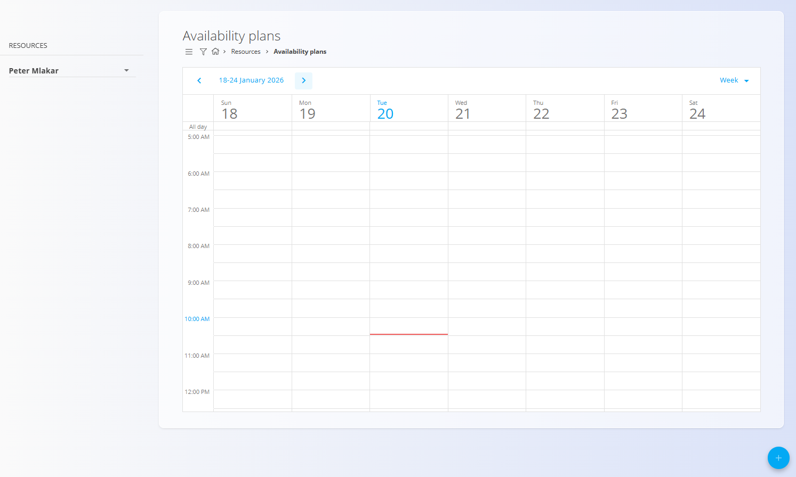
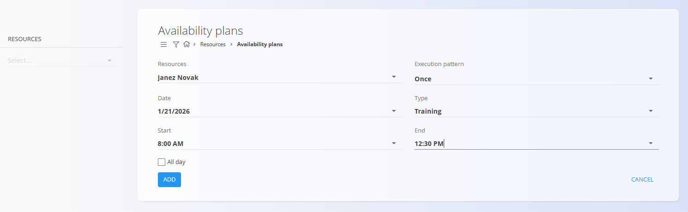

<!-- app_route: /management/resources/availabilty-plans -->
<!-- app_label: Plani razpoložljivosti -->
<!-- canonical_source_url: https://github.com/Tom-PIT/Connected.Docs/blob/main/sl/Domene/Viri/Pregledi/PlaniRazpolozljivosti.md -->
<!-- canonical_source_title: Plani razpoložljivosti -->

# Plani razpoložljivosti

**Plani razpoložljivosti** omogočajo koledarski pregled, kdaj so viri na voljo ali nedosegljivi za delo.  
Običajno se uporabljajo za beleženje planiranih odsotnosti, usposabljanj ali drugih obdobij, ki vplivajo na razpoložljivost virov.

Za dostop do **Planov razpoložljivosti** pojdite na **Viri / Pogledi / Plani razpoložljivosti** v [navigaciji](../../../Skupno/UI/Navigacija.md).

## Shema

| Polje | Opis |
|------|------|
| **Viri** | Vir ali viri, za katere se ustvari plan razpoložljivosti (na primer zaposleni ali ekipa). |
| **Vzorec izvajanja** | Določa, ali se plan izvede **Enkrat** ali po **ponavljajočem se vzorcu**. |
| **Datum** | Datum plana razpoložljivosti (izhodiščni datum za vzorec izvajanja). |
| **Cel dan** | Označuje, da plan pokriva celoten dan. |
| **Tip** | Tip razpoložljivosti (na primer *Usposabljanje*, *Odsotnost*, *Drugo*). |
| **Začetek** | Začetni čas obdobja razpoložljivosti (če ni označeno *Cel dan*). |
| **Konec** | Končni čas obdobja razpoložljivosti (če ni označeno *Cel dan*). |

## Koledarski pogled

Glavni zaslon prikazuje koledar v **dnevnem**, **tedenskem** ali **mesečnem** pogledu.  
Na levi strani je mogoče izbrati enega ali več **virov**, za katere se plani prikažejo v koledarju.

Vsak vnos predstavlja planirano obdobje razpoložljivosti ali nerazpoložljivosti vira.

## Dejanja

Za ustvarjanje novega plana razpoložljivosti kliknite [akcijski gumb](../../../Skupno/UI/AkcijskiGumb.md).

Pri ustvarjanju ali urejanju plana so na voljo polja, opisana v razdelku [**Shema**](#shema).

### Ustvariti nov plan razpoložljivosti

1. Kliknite akcijski gumb **+**.
2. Izberite **Vire** in **Tip**.
3. Nastavite **Vzorec izvajanja**, **Datum**, **Cel dan**, **Začetek** in **Konec** po potrebi.
4. Kliknite **Dodaj** za shranjevanje.

### Urediti plan razpoložljivosti

Klik na vnos v koledarju odpre obrazec za urejanje.  
Prilagodite **datum**, **časovni razpon**, **tip** ali **vzorec izvajanja** in shranite spremembe.

### Izbrisati plan razpoložljivosti

Plane razpoložljivosti je mogoče izbrisati iz **pogovornega okna za urejanje**.

Postopek brisanja:
1. Dvokliknite dogodek plana v koledarju, da odprete zaslon za urejanje.
2. Kliknite **Izbriši**.
3. Potrdite brisanje.

Če plan uporablja vzorec **Večkrat**, je prikazano dodatno potrditveno vprašanje:
- **»Ali želite odstraniti vse prihodnje vnose?«**

Nato se prikaže še končno potrditveno pogovorno okno:
- **»Ali ste prepričani, da želite izbrisati plan razpoložljivosti?«**

Po potrditvi je plan trajno odstranjen iz sistema.