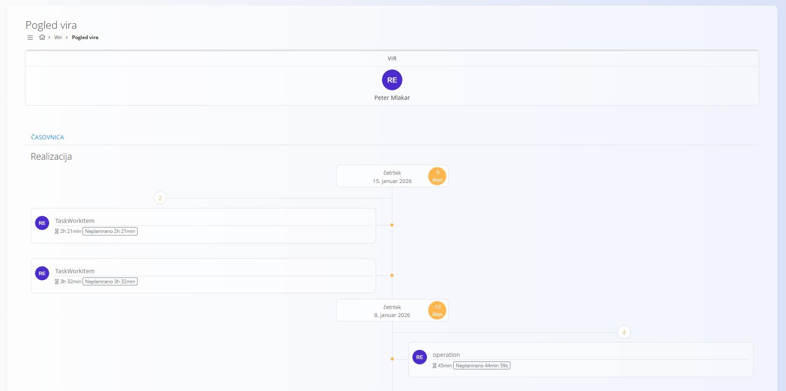

<!-- app_route: /resources/resource -->
<!-- app_label: Pogled vira -->
<!-- canonical_source_url: https://github.com/Tom-PIT/Connected.Docs/blob/main/sl/Domene/Viri/Pregledi/PogledVira.md -->
<!-- canonical_source_title: Pogled vira -->

# Pogled vira

Pogled **Pogled vira** omogoča **časovni pregled zabeleženega dela v sistemu** za **trenutno prijavljenega uporabnika**.

Za dostop do **Pogleda vira** pojdite na **Viri / Pogled vira** v [navigaciji](../../../Skupno/UI/Navigacija.md).

> [!NOTE]
> Ta pogled je namenjen **izključno pregledu in analizi**.
> Na tem zaslonu ni mogoče vnašati ali urejati podatkov.

## Pregled

Pogled prikazuje **kdaj in kje je bil zabeležen napor**, v obliki **navpične časovnice**.

Vsak vnos predstavlja zabeleženo delo uporabnika in omogoča razumevanje porazdelitve dela skozi čas.

Zaslon je osredotočen na **osebni pregled dela**, zato vedno prikazuje podatke **samo za trenutno prijavljenega uporabnika**.

## Časovnica

Osrednji del zaslona predstavlja **časovno razvrščeno časovnico**, urejeno kronološko.

Vsak vnos običajno prikazuje:

- povezano opravilo ali operacijo,
- količino zabeleženega dela,
- informacijo, ali je bilo delo **planirano** ali **neplanirano**.

Datumi so prikazani kot oznake na časovnici, kar omogoča hiter pregled **kdaj je bilo delo opravljeno**.

## Realizacija

Časovnica prikazuje **izključno realizirano (dejansko) delo**.

Vključeni so samo vnosi, ki so že bili zabeleženi v sistemu prek:

- opravil,
- operacij,
- beleženja časa.

Ta pogled ne vključuje planiranega dela ali prihodnjih aktivnosti.

---
