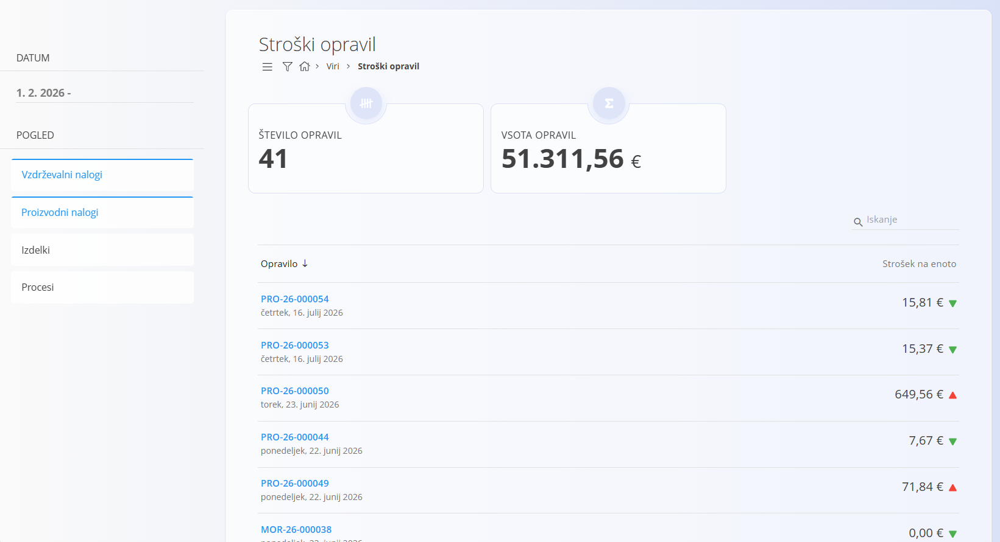

<!-- app_route: /work-items-costs -->
<!-- app_label: Stroški opravil -->
<!-- canonical_source_url: https://tom-pit.github.io/Connected.Docs/sl/Domene/Viri/Pregledi/StroskiOpravil/ -->
<!-- canonical_source_title: Stroški opravil -->

# Stroški opravil

Pogled **Stroški opravil** omogoča analizo stroškov proizvodnih in vzdrževalnih opravil, izdelkov ter verzij procesov. Namenjen je predvsem analizi procesov, [proizvodnih nalogov](../../Proizvodnja/Dokumenti/ProizvodniNalogi.md) in [vzdrževalnih nalogov](../../Vzdrzevanje/Dokumenti/VzdrzevalniNalogi.md) ter razumevanju porazdelitve stroškov in uspešnosti.

Za dostop do **Stroškov opravil** pojdite na **Viri / Stroški opravil** v [navigaciji](../../../Skupno/UI/Navigacija.md).

> [!NOTE]
> Če v filtru **Pogled** izberete **Procese**, zaslon prikazuje [ocenjene stroške verzij procesov](../../Proizvodnja/Analiza/AnalizaStroskaVerzije.md) namesto dejanskih stroškov opravil.

## Seznam stroškov opravil

Seznam prikazuje zapise stroškov, ki ustrezajo izbranim filtrom.

Glede na izbrani **Pogled** vsaka vrstica predstavlja opravilo, izdelek ali verzijo procesa in prikazuje:

- referenco ali naziv,
- datum,
- izračunan strošek na enoto,
- vizualne indikatorje spremembe stroška glede na prejšnje vrednosti, kjer so na voljo.

S filtrom **Pogled** izberite eno ali več vrst analize stroškov:

- **Vzdrževalni nalogi** – prikazuje dejanske stroške vzdrževalnih opravil,
- **Proizvodni nalogi** – prikazuje dejanske stroške proizvodnih opravil,
- **Izdelki** – prikazuje izdelke in njihov izračunan strošek na enoto,
- **Procesi** – prikazuje verzije procesov in njihov ocenjeni strošek na enoto.

Hkrati lahko izberete več pogledov.

S filtrom **Datum** omejite zapise, prikazane na seznamu.

Kliknite element, da odprete ustrezno analizo stroškov.

## Stroški izdelka

Ko v filtru **Pogled** izberete **Izdelki**, seznam prikazuje izdelke in njihov izračunan **strošek na enoto**.

Kliknite izdelek, da odprete pogled **Stroški izdelka**.

Na voljo so naslednji ključni kazalniki:

- **Povprečna cena na kos v zadnjem nalogu** – strošek na enoto iz zadnjega proizvodnega naloga za izbrani izdelek.
- **Povprečna cena na kos v zadnjem mesecu** – povprečni strošek na enoto, izračunan na podlagi proizvodnih nalogov v zadnjem mesecu.
- **Povprečna cena na kos v zadnjem letu** – povprečni strošek na enoto, izračunan na podlagi proizvodnih nalogov v zadnjem letu.

Pod kazalniki je prikazana tabela proizvodnih opravil, povezanih z izbranim izdelkom, ki prikazuje:

- **Opravilo**
- **Strošek na enoto**

S filtrom **Datum** omejite zapise, prikazane v tabeli.

> [!NOTE]
> Filter **Datum** vpliva samo na tabelo. Trije kazalniki povprečnega stroška se izračunajo glede na svoja vnaprej določena obdobja in nanje izbrano časovno obdobje ne vpliva.

## Stroški procesov

Ko v filtru **Pogled** izberete **Procesi**, seznam prikazuje verzije procesov in njihov izračunan **strošek na enoto**.

Vsaka vrstica predstavlja verzijo procesa in lahko vključuje indikator trenda, ki prikazuje, ali se je izračunani strošek glede na prejšnjo vrednost povečal ali zmanjšal.

Klik na verzijo procesa odpre podrobno [**Analizo stroška verzije**](../../Proizvodnja/Analiza/AnalizaStroskaVerzije.md).

## Podrobnosti stroškov opravila

Izbira opravila odpre podroben pogled s celovito analizo stroškov.

### Pregled stroškov

Na vrhu zaslona so prikazani ključni kazalniki:

- **Strošek na enoto**
- **Trend stroška** v primerjavi s prejšnjimi vrednostmi
- **Porazdelitev stroškov** med materiali in delom
- **Kazalniki uspešnosti**, kot so najboljši in najslabši prispevki

Prikažejo se tudi vsi povezani dokumenti (npr. proizvodni ali vzdrževalni nalogi) za referenco.

### Materiali

Ta razdelek prikazuje vse materiale, uporabljene pri izdelavi, vključno z:

- nazivom in tipom materiala,
- porabljeno količino,
- skupnim stroškom,
- deležem celotnega stroška.

Kliknite material, da prikažete dodatne informacije o uporabljenem materialu, vključno z njegovo **serijsko številko**.

Če je serijska številka na voljo, jo kliknite, da odprete ustrezen [**pregled zaloge po serijski številki**](../../Logistika/Pregledi/Zaloga.md#pogled-zaloge-po-serijski-številki), kjer si lahko ogledate zapis zaloge in sledite konkretnemu uporabljenemu materialu.

### Delo

Razdelek **Delo** prikazuje čas, ki so ga uporabniki porabili za opravilo, vključno z:

- uporabnikom,
- zabeleženim trajanjem,
- izračunanim stroškom dela,
- deležem celotnega stroška.

Stroški dela se izračunajo na podlagi nastavitev postavk virov.

### Stroški

V tem razdelku so prikazani vsi dodatni [stroški](../../Nabava/Upravljanje/Stroski.md), povezani z opravilom. Če stroški niso zabeleženi, je razdelek prikazan kot prazen.

## Opombe o uporabi

- Stroški opravil so **samo za branje** in jih sistem v celoti izračuna.
- Natančnost podatkov je odvisna od pravilne konfiguracije:
  - postavk virov,
  - cen materialov,
  - beleženja dela.
- Ta pogled najpogosteje uporabljajo vodje proizvodnje in analitiki.

## Meni

Meni omogoča dodatna dejanja, ki so na voljo na tej strani.

Na voljo so naslednja dejanja:

- **Izvoz v PDF**
- **Ponovno izračunaj** – ponovno izračuna stroške izbranega opravila ali verzije procesa na podlagi trenutnih materialov, virov in stroškov.

Za več informacij o dejanjih v meniju glejte [**Dejanja menija**](../../../Skupno/Koncepti/MeniDejanja.md).