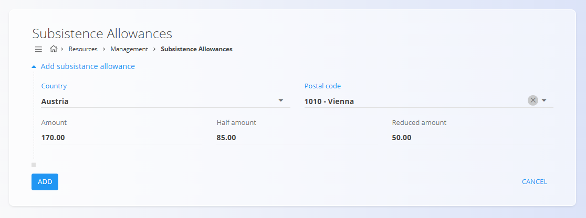

<!-- app_route: /management/resources/subsistence-allowances -->
<!-- app_label: Dnevnice -->
<!-- canonical_source_url: https://github.com/Tom-PIT/Connected.Docs/blob/main/sl/Domene/Viri/Upravljanje/Dnevnice.md -->
<!-- canonical_source_title: Dnevnice -->

# Dnevnice

Dnevnice določajo **dnevne zneske**, ki se izplačujejo zaposlenim ob službenih poteh.
Najpogosteje se uporabljajo v dokumentih [**Potni nalogi**](../Dokumenti/PotniNalogi.md) za samodejni izračun prehranskih in drugih dnevnih nadomestil glede na destinacijo.

Za dostop do **Dnevnic** pojdite na **Viri / Upravljanje / Dnevnice** v [**navigaciji**](../../../Skupno/UI/Navigacija.md).

## Shema

| Polje | Opis |
|------|------|
| **Država** | Država, za katero velja dnevnica. |
| **Poštna številka** | Neobvezna poštna številka ali referenca mesta (na primer: *1010 – Dunaj*). |
| **Znesek** | Polni dnevni znesek dnevnice. |
| **Znesek polovične** | Znižani znesek, ki se običajno uporablja pri delnih dnevih potovanja. |
| **Znesek znižane** | Dodatno znižan znesek dnevnice, odvisen od zakonskih ali internih pravil podjetja. |

## Pregled

Zaslon **Dnevnice** prikazuje seznam vseh definiranih dnevnic.
Vsak vnos predstavlja državo (in po potrebi mesto ali poštno številko) s pripadajočimi zneski dnevnic.

Seznam omogoča iskanje in hitro navigacijo.

Klik na vnos ga odpre za urejanje.

## Dejanja

### Ustvariti dnevnico

Za ustvarjanje nove dnevnice:

1. Kliknite [**akcijski gumb**](../../../Skupno/UI/AkcijskiGumb.md).
2. Izberite **Državo**.
3. Po želji določite **Poštno številko** ali mesto.
4. Vnesite **Znesek**, **Polovični znesek** in **Znižani znesek**.
5. Kliknite **Dodaj** za shranjevanje.

### Urejati dnevnico

Kliknite obstoječo dnevnico, da jo odprete v načinu urejanja, kjer lahko prilagodite vrednosti glede na spremembe predpisov ali pravil podjetja.

Spremembe začnejo veljati takoj in se uporabljajo pri izračunu dnevnic v dokumentih, povezanih s službenimi potovanji.

### Izbrisati dnevnico

Kliknite obstoječo dnevnico, da jo odprete v načinu urejanja, nato kliknite **Izbriši**.

Po potrditvi brisanja se dnevnica odstrani s seznama in ne bo več na voljo za izbiro v potnih nalogih.

## Uporaba v drugih modulih

Dnevnice se primarno uporabljajo v:

- **[Potni nalogi](../Dokumenti/PotniNalogi.md)** — samodejni izračun dnevnic med službenimi potmi

To zagotavlja dosledno in centralizirano upravljanje pravil za povračila stroškov službenih poti v celotnem sistemu.