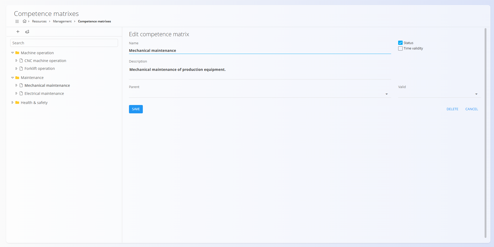
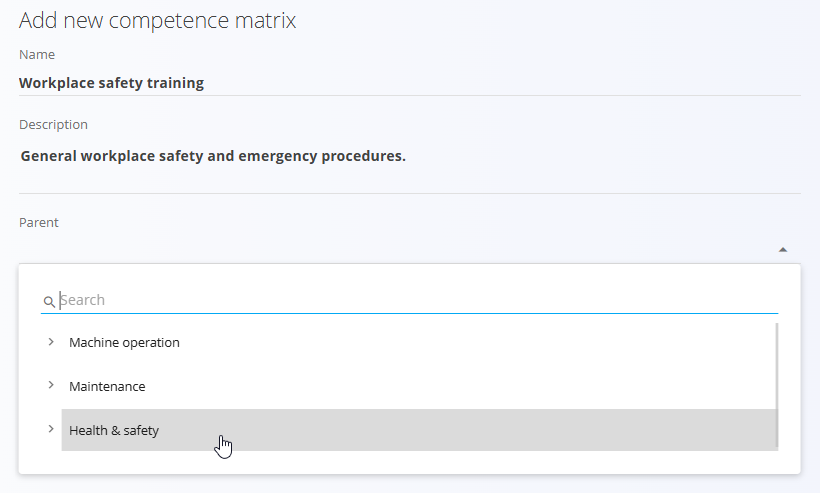
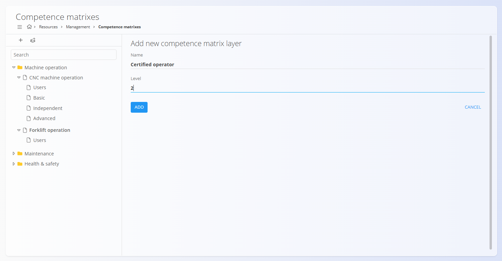

<!-- app_route: /management/resources/competence-matrix -->
<!-- app_label: Matrike kompetenc -->
<!-- canonical_source_url: https://github.com/Tom-PIT/Connected.Docs/blob/main/sl/Domene/Viri/Upravljanje/MatrikeKompetenc.md -->
<!-- canonical_source_title: Matrike kompetenc -->

# Matrike kompetenc

Matrike kompetenc se uporabljajo za definiranje, strukturiranje in spremljanje kompetenc zaposlenih v celotni organizaciji. Omogočajo hierarhično modeliranje znanj, določanje ravni usposobljenosti (plasti) ter povezovanje uporabnikov s posameznimi kompetencami.

Za dostop do **Matrik kompetenc** pojdite na **Viri / Upravljanje / Matrike kompetenc** v [**navigaciji**](../../../Skupno/UI/Navigacija.md).

## Shema

| Polje | Opis |
|------|------|
| **Naziv** | Naziv kompetence ali skupine kompetenc (na primer: *Upravljanje viličarja*, *Usposabljanje za varnost pri delu*). |
| **Opis** | Neobvezen opis, ki pojasnjuje namen ali obseg kompetence. |
| **Nadrejeni** | Neobvezna nadrejena kompetenca, ki se uporablja za gradnjo hierarhičnih struktur (na primer združevanje kompetenc pod *Varnost in zdravje pri delu*). |
| **Status** | Označuje, ali je kompetenca aktivna in na voljo za uporabo. |
| **Časovna veljavnost** | Ko je omogočena, omogoča določitev datuma veljavnosti kompetence (za certifikate ali časovno omejena usposabljanja). |
| **Veljavno** | Datum poteka veljavnosti kompetence, kadar je omogočena časovna veljavnost. |

### Plast matrike kompetenc

| Polje | Opis |
|------|------|
| **Naziv** | Naziv ravni usposobljenosti (na primer: *Osnovno*, *Samostojno*, *Napredno*, *Certificiran upravljavec*). |
| **Nivo** | Številčni vrstni red plasti. Nižje vrednosti praviloma predstavljajo nižjo raven usposobljenosti. |

## Pregled

Leva stran zaslona prikazuje **drevesno strukturo** vseh matrik kompetenc. Kompetence je mogoče organizirati v kategorije in podkompetence.

Izbira kompetence na desni strani prikaže pogled **Uporabniki**, kjer je mogoče uporabnike dodeliti izbrani kompetenci.

## Ustvarjanje matrike kompetenc

Za ustvarjanje nove matrike kompetenc:

1. Kliknite gumb **+** v zgornji levi orodni vrstici.
2. Vnesite **Naziv** kompetence.
3. Po potrebi vnesite **Opis**.
4. (Neobvezno) Izberite **Nadrejeni** kompetenco, da jo umestite v hierarhijo.

   

5. Omogočite **Stanje**, če naj bo kompetenca aktivna.
6. Omogočite **Časovno veljavnost**, če kompetenca poteče po določenem datumu.
7. Kliknite **Dodaj** za shranjevanje.

## Dodajanje plasti (ravni usposobljenosti)

Plasti predstavljajo **ravni usposobljenosti** znotraj kompetence (na primer *Osnovno*, *Samostojno*, *Napredno*).

Za dodajanje plasti:

1. V drevesu izberite obstoječo matriko kompetenc.
2. V orodni vrstici kliknite gumb **Dodaj nov nivo v matriko kompetenc**.
3. Vnesite **Naziv**.
4. Določite **Nivo** (številčni vrstni red).
5. Kliknite **Dodaj** za shranjevanje.

> [!NOTE]
> Vse kompetence ne zahtevajo plasti.
> Plasti se običajno uporabljajo tam, kjer so pomembne **napredovalne ali certifikacijske ravni**.

## Dodeljevanje uporabnikov kompetencam

Ko je izbrana kompetenca, plošča **Uporabniki** prikaže vse razpoložljive uporabnike.

- Izberite enega ali več uporabnikov, ki jih želite dodeliti kompetenci.
- Kliknite **Shrani**, da potrdite dodelitve.

Dodeljeni uporabniki se štejejo kot usposobljeni za to področje, po potrebi tudi na določeni ravni usposobljenosti, če so plasti definirane.

## Hierarhije in struktura

Matrike kompetenc podpirajo **vgnezdene strukture**, ki omogočajo modeliranje realnih skupin znanj.

Primeri:
- *Varnost in zdravje pri delu*  
  - Usposabljanje za varnost pri delu  
  - Postopki v sili
- *Upravljanje strojev*  
  - Upravljanje CNC strojev  
    - Osnovno  
    - Samostojno  
    - Napredno
- *Upravljanje viličarja*  
  - Certificiran upravljavec

Takšna struktura omogoča jasno organizacijo kompetenc in lažje upravljanje v večjem obsegu.

## Brisanje

Matrike kompetenc in njihove plasti je mogoče izbrisati v njihovih pogledih za urejanje.

Izbrisane kompetence:
- so odstranjene iz hierarhije,
- niso več na voljo za dodeljevanje uporabnikom,
- ne vplivajo na zgodovinske zapise.

> [!WARNING]
> Brisanje uporabljajte previdno, zlasti kadar so kompetence že dodeljene uporabnikom.