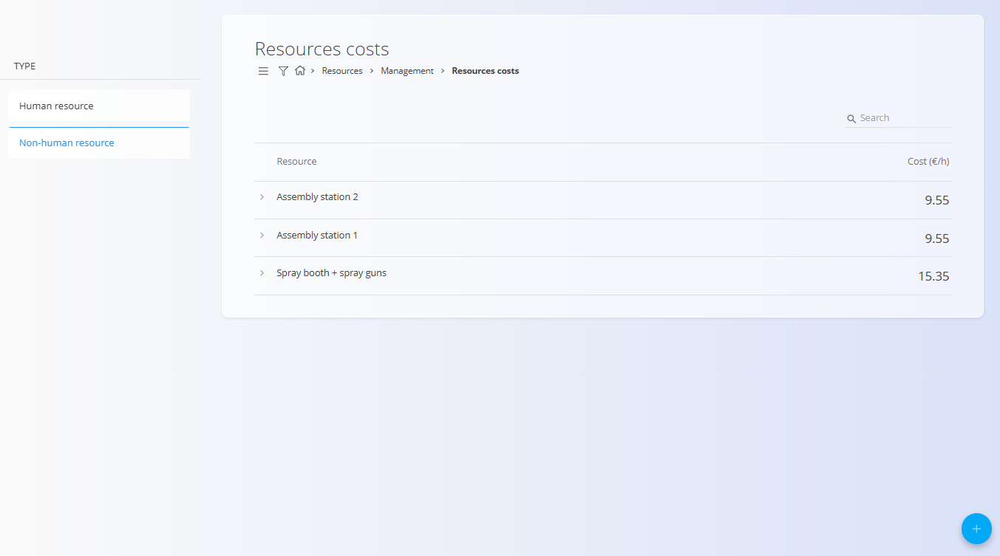
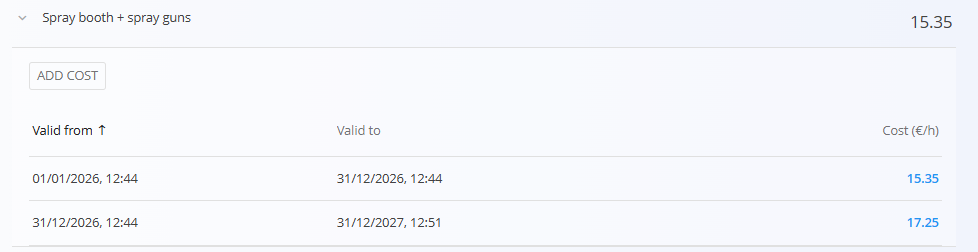

<!-- app_route: /resources/resource-costs -->
<!-- app_label: Postavke virov -->
<!-- canonical_source_url: https://github.com/Tom-PIT/Connected.Docs/blob/main/sl/Domene/Viri/Upravljanje/PostavkeVirov.md -->
<!-- canonical_source_title: Postavke virov -->

# Postavke virov

Določite **urne stroškovne postavke za vire** (človeške in nečloveške). Te postavke se uporabljajo za izračun proizvodnih in operativnih stroškov ter za ocenjevanje stroškov opravljenega dela.

Za dostop do **Postavk virov** pojdite na **Viri / Upravljanje / Postavke virov** v [**navigaciji**](../../../Skupno/UI/Navigacija.md).

## Shema

| Polje | Opis |
|------|------|
| **Vir** | Vir, za katerega je definirana postavka. |
| **Postavka (€/h)** | Urna postavka, dodeljena viru. |
| **Veljavno od** | Datum in čas, od katerega je postavka veljavna. |
| **Veljavno do** | Datum in čas, do katerega je postavka veljavna. Če je polje prazno, je postavka veljavna neomejeno. |

## Seznamski pogled

Seznam prikazuje vse vire, ki imajo definirane postavke. Vsaka vrstica predstavlja en vir.

Razširite vir za prikaz njegove **zgodovine postavk** in hitrih dejanj.

### Filtri

Uporabite filtre na levi strani za zoženje nabora virov:
- **Tip vira** — Človeški vir / Nečloveški vir

## Dejanja

### Dodaj novo postavko

Za dodajanje nove postavke za vir uporabite [**akcijski gumb**](../../../Skupno/UI/AkcijskiGumb.md). Izpolnite polja in kliknite **Dodaj**.

### Dodaj postavko

1. Razširite obstoječi vir in kliknite **Dodaj postavko**.
2. Izpolnite polja, opisana v razdelku [**Shema**](#shema).
3. Kliknite **Dodaj** za shranjevanje.

### Uredi postavko

1. Kliknite **vrednost postavke** v seznamu zgodovine, da jo odprete za urejanje.
2. Prilagodite vrednost ali obdobje veljavnosti in kliknite **Shrani**.

## Posebna vedenja / validacije

- Obdobja veljavnosti za posamezen vir se **ne smejo prekrivati**.
- Če polje **Velja do** ni nastavljeno, se postavka obravnava kot časovno neomejena.
- Vrednosti postavk uporabljajo analitika in pogledi, kot je [**Stroški opravil**](../Pregledi/StroskiOpravil.md).

## Brisanje

Postavke je mogoče odstraniti s klikom na **Izbriši** v pogledu za urejanje.
