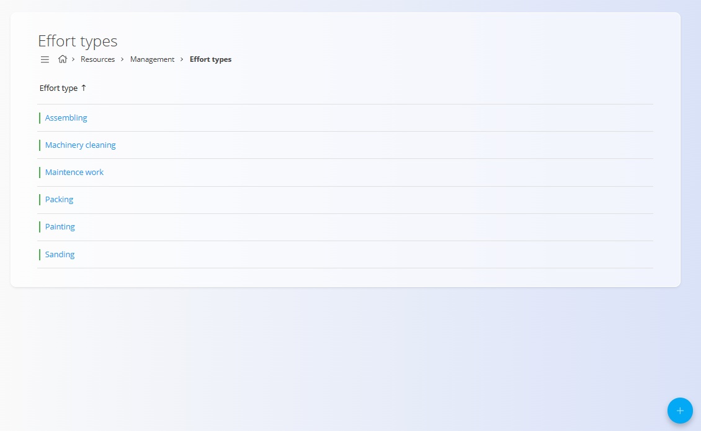
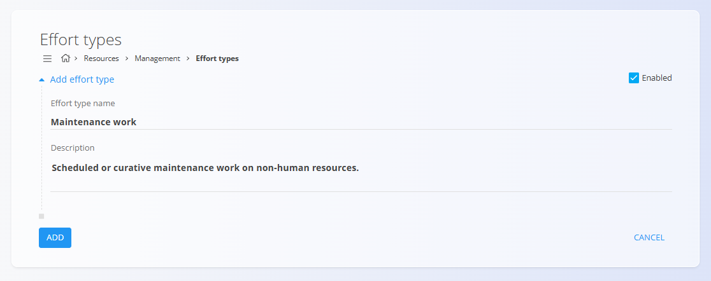

<!-- app_route: /management/resources/effort-types -->
<!-- app_label: Tipi dela -->
<!-- canonical_source_url: https://github.com/Tom-PIT/Connected.Docs/blob/main/sl/Domene/Viri/Upravljanje/TipiDela.md -->
<!-- canonical_source_title: Tipi dela -->

# Tipi dela

Tipi dela določajo **kategorije dela**, ki jih je mogoče izbrati pri beleženju napora na opravilih, proizvodnih izvedbah ali vzdrževalnih aktivnostih. Pomagajo standardizirati poročanje časa in izboljšujejo kasnejšo analizo porabe časa.

Za dostop do **Tipov dela** pojdite na **Viri / Upravljanje / Tipi dela** v [navigaciji](../../../Skupno/UI/Navigacija.md).

## Shema

| Polje | Opis |
|------|------|
| **Naziv tipa dela** | Naziv tipa dela, kot je prikazan uporabnikom pri beleženju napora (na primer: *Sestavljanje*, *Barvanje*, *Vzdrževalna dela*). |
| **Uredi tip dela** | Neobvezen opis, ki pojasnjuje, kaj tip dela predstavlja. Namenjen je predvsem notranji razjasnitvi in administraciji. |
| **Omogočeno** | Določa, ali je tip dela aktiven in na voljo za izbiro v obrazcih za beleženje napora. |

## Seznamski pogled

Seznamski pogled prikazuje vse definirane tipe dela v sistemu.

- Omogočeni tipi dela so na voljo za izbiro pri beleženju napora.
- Onemogočeni tipi dela ostanejo shranjeni, vendar jih ni mogoče izbrati.
- Klik na tip dela ga odpre v načinu urejanja.

## Ustvariti nov tip dela

Kliknite [akcijski gumb](../../../Skupno/UI/AkcijskiGumb.md), da ustvarite nov tip dela.

Pri ustvarjanju ali urejanju tipa dela lahko:

- Nastavite **naziv**, ki bo prikazan uporabnikom
- Dodate neobvezen **opis**
- Omogočite ali onemogočite tip dela

## Urejati tip dela

Kliknite element na seznamu, da uredite obstoječi tip dela. Spreminjate lahko naziv, opis in stanje omogočenosti.

Spremembe shranite s klikom na **Shrani**. Če želite spremembe zavreči, kliknite **Prekliči**.

## Uporabljati tipe dela pri evidentiranju dela

Tipi dela se uporabljajo pri evidentiranju dela na nalogah in izvajanjih.

Pri dodajanju dela uporabnik izbere tip dela iz spustnega seznama, ki je ustvarjen na podlagi te konfiguracije.

To zagotavlja enotno kategorizacijo evidentiranega časa v celotnem sistemu ter omogoča natančnejše poročanje in analizo.

## Izbrisati tip dela

Kliknite element na seznamu, da odprete zaslon za urejanje, nato kliknite **Izbriši**, da odstranite tip dela.

> [!NOTE]
> Izbrisani tipi dela niso več na voljo za nove vnose časa, ne vplivajo pa na obstoječe zgodovinske podatke.