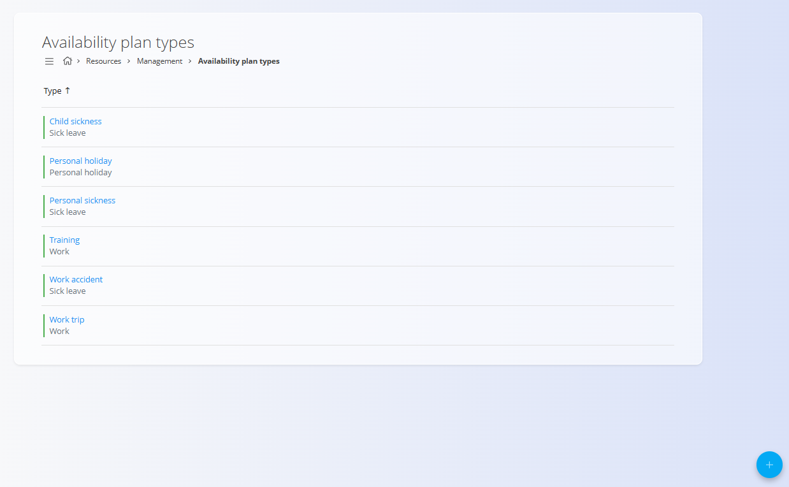
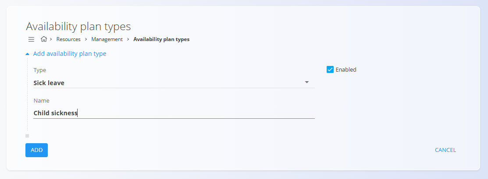

# Tipi planov razpoložljivosti

Tipi planov razpoložljivosti določajo **kategorije razpoložljivosti in odsotnosti**, ki jih je mogoče dodeliti virom. Služijo kot osnova za [plane razpoložljivosti](../Pregledi/PlaniRazpolozljivosti.md).

Za dostop do **Tipov planov razpoložljivosti** pojdite na **Viri / Upravljanje / Tipi planov razpoložljivosti** v [**navigaciji**](../../../Skupno/UI/Navigacija.md).

## Shema

| Polje | Opis |
|------|------|
| **Tip** | Določa splošno kategorijo plana razpoložljivosti. Tipične vrednosti vključujejo **Delo**, **Odsotnost**, **Osebni dopust** in **Bolniška odsotnost**. |
| **Naziv** | Opisno ime, ki se prikazuje uporabnikom pri izbiri tipa razpoložljivosti (na primer: *Nega otroka*, *Poškodba pri delu*). |
| **Omogočeno** | Označuje, ali je tip plana razpoložljivosti aktiven in ga je mogoče izbrati v drugih delih sistema. |

## Seznamski pogled

Seznamski pogled prikazuje vse konfigurirane tipe planov razpoložljivosti.

Za vsak vnos so prikazane naslednje informacije:

- **Naziv**
- **Tip** 
- **Indikator stanja**

Klik na element v seznamu odpre njegov **zaslon za urejanje**.

**Akcijski gumb** omogoča ustvarjanje novega tipa plana razpoložljivosti.

## Ustvarjanje in urejanje tipov planov razpoložljivosti

Kliknite [**akcijski gumb**](../../../Skupno/UI/AkcijskiGumb.md), da ustvarite nov vnos, ali kliknite element na seznamu za urejanje obstoječega.

Spremembe se po shranjevanju uveljavijo takoj in vplivajo na vse zaslone, kjer je mogoče izbirati tipe razpoložljivosti.

## Brisanje

Tipe planov razpoložljivosti je mogoče izbrisati na **zaslonu za urejanje**.

Pred brisanjem sistem prikaže potrditveno pogovorno okno:

> *Ste prepričani da želite izbrisati tip plana razpoložljivosti?*

Če je tip plana razpoložljivosti že uporabljen v planih razpoložljivosti ali časovnih evidencah, je lahko brisanje omejeno glede na konfiguracijo sistema.

---