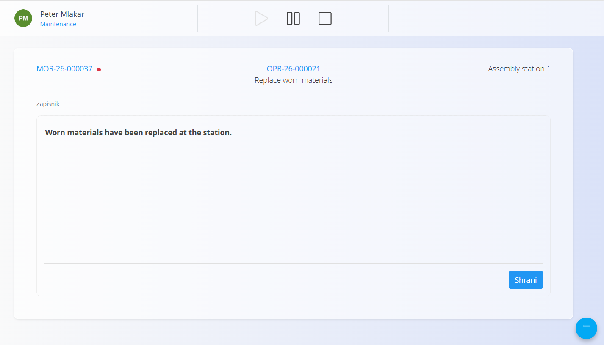
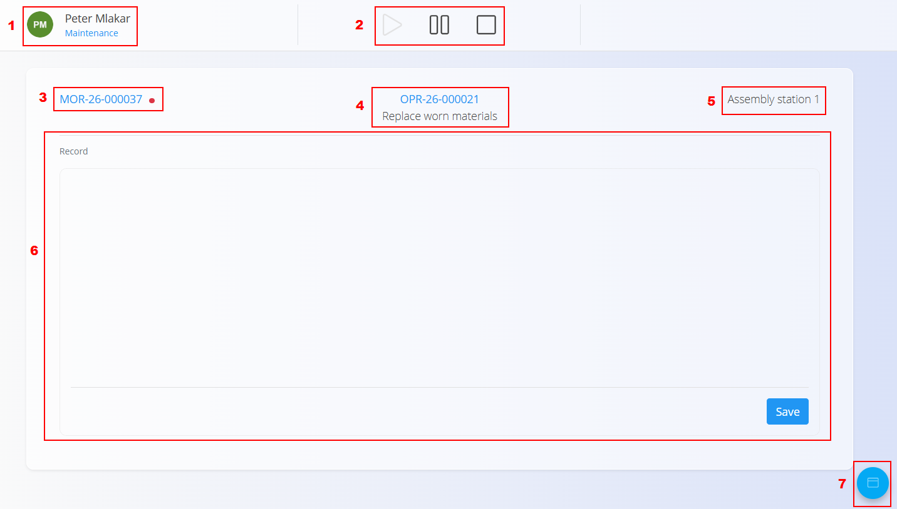
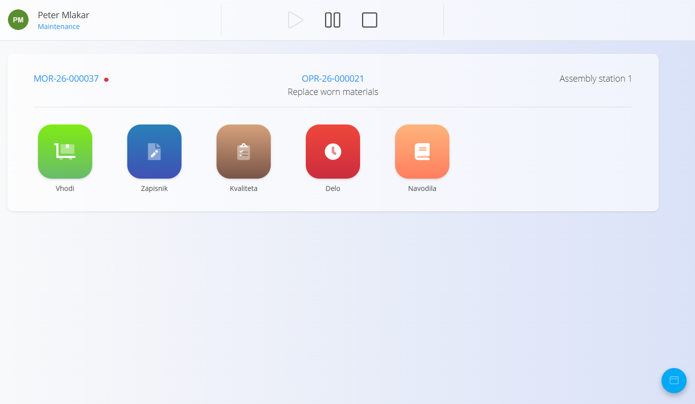
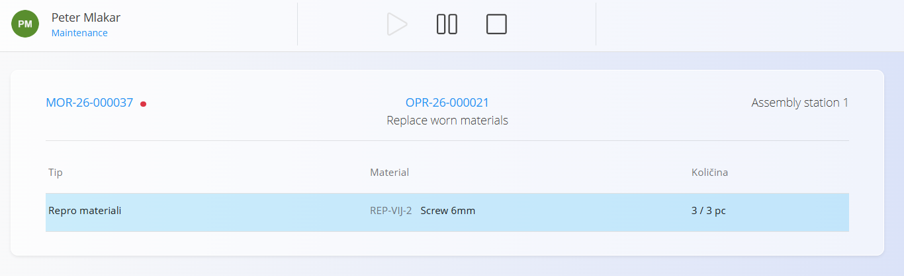
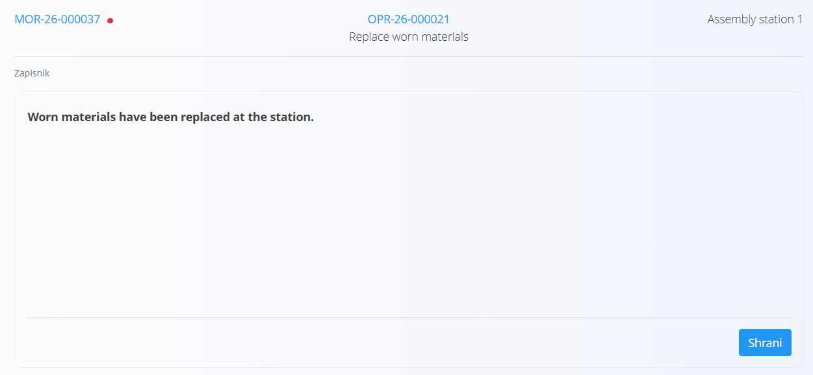

# Izvedba vzdrževanja

Zaslon **Izvedba vzdrževanja** je namenjen izvajanju in beleženju dela na vzdrževalnih nalogih.

Omogoča izvajanje vzdrževalnih operacij, beleženje opravljenega dela, izvajanje kontrol kakovosti, beleženje dela in ogled navodil.

Za dostop do strani pojdite na **Vzdrževanje / Izvedba** v [navigaciji](../../../Skupno/UI/Navigacija.md).

> [!NOTE]
> Zaslon **Izvedba** samodejno prikaže aktivne vzdrževalne naloge, dodeljene **organizacijski enoti**, izbrani na vrhu zaslona.
>
> Če želite delati z vzdrževalnimi nalogi druge organizacijske enote, spremenite izbrano organizacijsko enoto.

## Pregled zaslona izvedbe

Zaslon **Izvedba vzdrževanja** prikazuje vse kontrole in informacije, potrebne za izvajanje trenutne vzdrževalne operacije.

1. **Uporabnik in organizacijska enota** – prikazuje trenutno prijavljenega uporabnika in organizacijsko enoto.
2. **Kontrole izvedbe** – omogočajo začetek, premor ali zaključek trenutne operacije.
3. **Vzdrževalni nalog** – prikazuje trenutni vzdrževalni nalog. Kliknite ga, če želite izbrati drug aktiven vzdrževalni nalog. Če ima vzdrževalni nalog visoko prioriteto, je prikazana rdeča oznaka.
4. **Operacija** – prikazuje trenutno operacijo in njeno ime.
5. **Oprema** – prikazuje opremo, povezano z vzdrževalnim nalogom.
6. **Območje izvedbe** – prikazuje trenutno izbrano aktivnost izvedbe, na primer **Zapisnik** ali **Vhodi**.
7. **Akcijski gumb** – odpre razpoložljive aktivnosti izvedbe.

### Izbira vzdrževalnega naloga

Kliknite **vzdrževalni nalog**, prikazan v zgornjem levem kotu zaslona **Izvedba vzdrževanja**, če želite preklopiti na drug aktiven vzdrževalni nalog.

Odpre se pogovorno okno z razpoložljivimi aktivnimi vzdrževalnimi nalogi, ki prikazuje:

- **Prioriteto**
- **Kodo**
- **Opremo**

Izberite želeni vzdrževalni nalog in kliknite **Izberi**.

## Začetek vzdrževanja

Kliknite **Začni**, da začnete trenutno vzdrževalno operacijo.

Ko se operacija začne, postane aktivna in začne se beležiti čas izvajanja.

## Premor vzdrževanja

Kliknite **Premor**, da začasno prekinete trenutno vzdrževalno operacijo.

Operacija ostane nedokončana in jo lahko nadaljujete s klikom na **Začni**.

## Aktivnosti izvedbe

Z [akcijskim gumbom](../../../Skupno/UI/AkcijskiGumb.md) v spodnjem desnem kotu preklapljate med aktivnostmi, ki so na voljo med izvedbo vzdrževanja.

Razpoložljive aktivnosti so odvisne od konfiguracije trenutne operacije. Če so operaciji dodeljeni vhodni materiali, se prikaže tudi možnost **Vhodi**.

Razpoložljive aktivnosti lahko vključujejo:

- **Vhodi** – ogled in beleženje materialov, porabljenih med vzdrževanjem
- **Zapisnik** – vnos prostega besedila o opravljenem vzdrževalnem delu
- **Kvaliteta** – ogled in izpolnjevanje kontrolnih listov kakovosti
- **Delo** – ogled in beleženje delovnega časa
- **Navodila** – ogled navodil za trenutno operacijo

### Vhodi

Če so trenutni operaciji dodeljeni vhodni materiali, izberite **Vhodi** za ogled in beleženje materialov, porabljenih med vzdrževanjem.

Za vsak material zaslon prikazuje njegov tip, material in količino porabe.

Količina prikazuje, koliko zahtevanega materiala je že bilo porabljenega glede na načrtovano količino. Na primer **0 / 3 pc** pomeni, da ni bil porabljen še noben od 3 zahtevanih kosov.

Za beleženje porabe:

1. Izberite želeni material.
2. Vnesite količino, porabljeno med vzdrževanjem.
3. Kliknite **Shrani**.

Vnesena količina se prišteje porabi materiala za trenutno operacijo.

### Zapisnik

Izberite **Zapisnik**, da odprete zaslon zapisnika vzdrževanja.

V polje za prosto besedilo vnesite informacije o opravljenem vzdrževalnem delu in kliknite **Shrani**.

Shranjeni zapis je prikazan tudi na ustreznem vzdrževalnem nalogu.

### Kvaliteta

Izberite **Kvaliteta** za ogled in izpolnjevanje kontrolnih listov kakovosti, dodeljenih vzdrževalnemu procesu ali operaciji.

Glede na njihovo konfiguracijo se lahko kontrolni listi kakovosti samodejno odprejo tudi v določenih fazah izvedbe, na primer ob začetku, premoru ali zaključku operacije.

Za več informacij o izpolnjevanju kontrolnih listov kakovosti med izvedbo glejte [**Kvaliteta pri izvedbi proizvodnje**](../../Proizvodnja/Dokumenti/Izvajanje.md#kvaliteta).

### Delo

Izberite **Delo** za ogled in beleženje delovnega časa za trenutno vzdrževalno operacijo.

Beleženje dela deluje enako kot pri izvedbi proizvodnje.

Za več informacij glejte [**Delo pri izvedbi proizvodnje**](../../Proizvodnja/Dokumenti/Izvajanje.md#delo).

### Navodila

Izberite **Navodila** za ogled navodil, povezanih s trenutno vzdrževalno operacijo.

Navodila delujejo enako kot pri izvedbi proizvodnje.

Za več informacij glejte [**Navodila pri izvedbi proizvodnje**](../../Proizvodnja/Dokumenti/Izvajanje.md#navodila).

## Zaključek vzdrževanja

Kliknite **Ustavi**, da zaključite trenutno vzdrževalno operacijo.

Ko je operacija zaključena:

- Zabeleži se čas zaključka.
- Operacija je označena kot **Zaključena**.
- Če so na voljo dodatne operacije, lahko vzdrževanje nadaljujete z naslednjo operacijo.
- Ko so zaključene vse operacije, vzdrževalni nalog preide v stanje **Zaključen**.

> [!NOTE]
> Zaključene operacije ni mogoče ponovno aktivirati na zaslonu **Izvedba vzdrževanja**. Če jo želite ponovno odpreti, odprite ustrezni vzdrževalni nalog in pri operaciji izberite **Ponovno aktiviraj**.