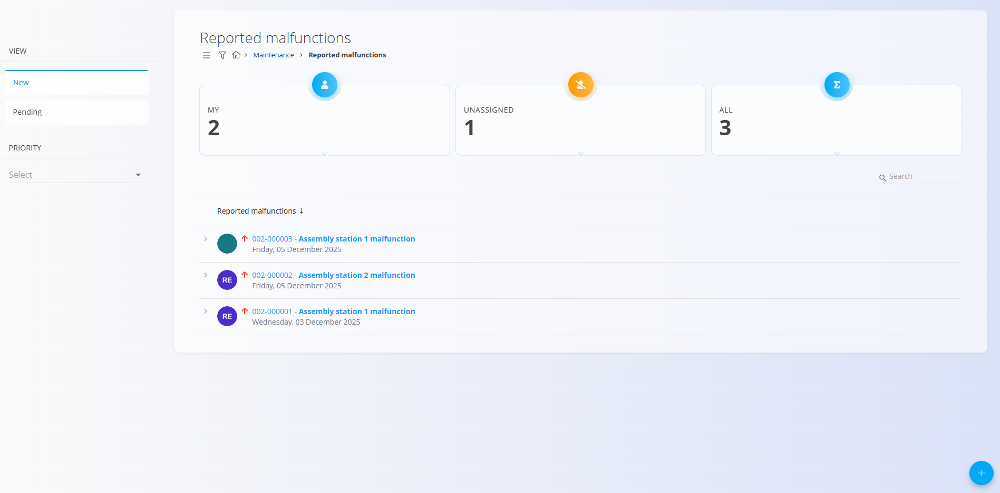
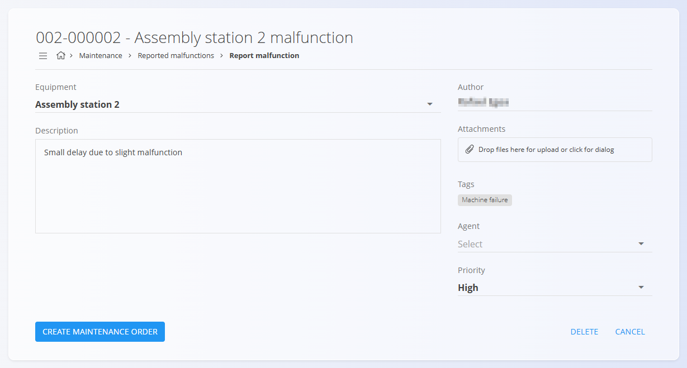

<!-- app_route: /maintenance-orders/tickets -->
<!-- app_label: Prijavljene napake -->
<!-- canonical_source_url: https://github.com/Tom-PIT/Connected.Docs/blob/main/sl/Domene/Vzdrzevanje/Dokumenti/PrijavljeneNapake.md -->
<!-- canonical_source_title: Prijavljene napake -->

# Prijavljene napake

**Prijavljene napake** beležijo težave, zaznane na opremi med proizvodnjo ali obratovanjem.
Predstavljajo vstopno točko za **kurativno vzdrževanje**, saj omogočajo pregled
prijavljenih težav in po potrebi neposredno ustvarjanje vzdrževalnega naloga.

Za dostop do prijavljenih napak pojdite na **Vzdrževanje / Prijavljene napake** v
[navigaciji](../../../Skupno/UI/Navigacija.md).

## Seznam prijavljenih napak

Stran **Prijavljene napake** prikazuje vse prijavljene napake, razvrščene glede
na dodelitev.

### Pregled statusov

Na vrhu strani so prikazane kartice s povzetkom števila prijavljenih napak:

- **Moji** – Napake, dodeljene trenutnemu uporabniku
- **Nedodeljeni** – Napake brez dodeljene osebe
- **Vsi** – Skupno število prijavljenih napak

Klik na kartico ustrezno filtrira seznam.

### Razpoložljivi filtri

- **Pogled**
  - **Nov** — Na novo prijavljene napake
  - **V obdelavi** — Napake v obravnavi
- **Prioriteta** — Filtriranje napak glede na prioriteto

Iskalno polje omogoča filtriranje po kodi napake ali nazivu opreme.

## Urediti prijavljene napake

Klik na napako v seznamu odpre zaslon s podrobnostmi napake.

Pogled podrobnosti vključuje naslednja polja:

- **Oprema** – Oprema, na kateri je bila zaznana napaka
- **Avtor** – Uporabnik, ki je prijavil napako
- **Opis** – Opis napake
- **Priloge** – Datoteke, povezane z napako
- **Oznake** – Kategorizacija napake (npr. *maintenance*)
- **Dodeljeno** – Oseba, odgovorna za obravnavo napake
- **Prioriteta** – Prioriteta napake

Na tem zaslonu lahko vzdrževalne ekipe pregledajo prijavljeno napako in se odločijo o ustreznem korektivnem ukrepu.

## Ustvariti prijavo napake

Za ustvarjanje nove prijave napake kliknite
[akcijski gumb](../../../Skupno/UI/AkcijskiGumb.md).

Izpolnite podatke o napaki in kliknite **PRIJAVI**.
Nova prijava se prikaže v seznamu prijavljenih napak.

## Ustvariti vzdrževalni nalog iz napake

Na zaslonu s podrobnostmi napake kliknite **Ustvari vzdrževalni nalog**, da
ustvarite [**vzdrževalni nalog**](VzdrzevalniNalogi.md) na podlagi prijavljene napake.

To dejanje ustvari **kurativni vzdrževalni nalog** z naslednjimi lastnostmi:

- postopek ustvarjanja je sestavljen iz enega koraka
- nalog se ustvari v stanju **V obdelavi**
- prioriteta se prenese iz prijavljene napake
- oprema je predizpolnjena
- kontekst napake je ohranjen za sledljivost

Ko je vzdrževalni nalog ustvarjen, sledi standardnemu življenjskemu ciklu in je
na voljo v pogledu [**Vzdrževalni nalogi**](VzdrzevalniNalogi.md).