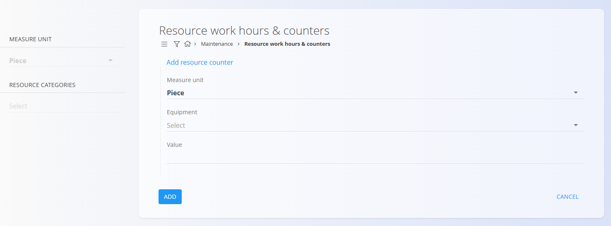
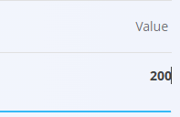

<!-- app_route: /maintenance/resource-counters -->
<!-- app_label: Stanja števcev -->
<!-- canonical_source_url: https://github.com/Tom-PIT/Connected.Docs/blob/main/sl/Domene/Vzdrzevanje/Dokumenti/StanjaStevcev.md -->
<!-- canonical_source_title: Stanja števcev -->

# Stanja števcev

Zaslon **Stanja števcev** se uporablja za spremljanje **vrednosti uporabe** opreme,
kot so število izdelanih kosov, obratovalne ure, razdalja, prostornina ali katera
koli druga merljiva enota.

Te vrednosti se uporabljajo pri **urnikih vzdrževanja na podlagi števcev**
za samodejno ustvarjanje vzdrževalnih nalogov, ko so doseženi določeni pragovi.

Za dostop do tega zaslona pojdite na **Vzdrževanje / Stanja števcev** v
[**navigaciji**](../../../Skupno/UI/Navigacija.md).

## Pregled

Vsaka vrstica predstavlja **števec**, povezan z določeno **opremo** in določeno
**mersko enoto**.

Seznam prikazuje:
- **Oprema** – Oprema, za katero se spremlja uporaba
- **Zadnja sprememba** – Datum in čas zadnje spremembe vrednosti
- **Števec** – Trenutna vrednost števca

Filtri na levi strani omogočajo zoženje seznama po:
- **Merska enota**
- **Kategorije virov**

Iskalno polje omogoča iskanje opreme po nazivu.

## Dodajanje stanja števca

Kliknite [**akcijski gumb**](../../../Skupno/UI/AkcijskiGumb.md), da ustvarite novo
stanje števca.

Vnesite naslednje podatke:
- **Merska enota** – Enota, uporabljena za števec (npr. *Piece*, *Hour*, *Liter*)
- **Oprema** – Oprema, za katero se vodi števec
- **Števec** – Začetna vrednost števca

Kliknite **DODAJ**, da ustvarite novo stanje števca.

> **Opomba**
>
> Za posamezno kombinacijo opreme in merske enote lahko obstaja samo **eno**
> stanje števca.

## Urejanje vrednosti števca

Vrednosti števcev je mogoče posodabljati neposredno v seznamu.

Za urejanje vrednosti:
1. Kliknite **številčno vrednost v stolpcu Števec**
2. Vnesite novo vrednost
3. Potrdite spremembo

Polje **Zadnja sprememba** se samodejno posodobi ob vsaki spremembi vrednosti.

## Uporaba pri planiranju vzdrževanja

Števci se običajno uporabljajo v kombinaciji z
**urniki vzdrževanja na podlagi števcev**.

Ko je vzdrževalni nalog konfiguriran z:
- **Tip urnika** = Števec
- **Vzorec izvedbe** = Na podlagi merske enote in vrednosti

sistem primerja **trenutno vrednost števca** z definiranim intervalom urnika, da
določi, kdaj je treba ustvariti nov vzdrževalni nalog.

### Primer – vzdrževanje na podlagi števca

Naslednji primer prikazuje uporabo števcev za sprožanje vzdrževalnih nalogov:

1. Za opremo je definiran števec:
   - **Oprema**: Spray booth
   - **Merska enota**: Piece
   - **Števec**: 643

2. Ustvarjen je vzdrževalni nalog z urnikom na podlagi števca:
   - **Tip urnika**: Števec
   - **Vsakih**: 200 kosov

3. Sistem primerja vrednost števca z urnikom:
   - Pragovi vzdrževanja: 200, 400, 600, 800 kosov
   - Trenutna vrednost (643) presega 600, zato je naslednje vzdrževanje
     predvideno pri 800 kosih

4. Ko je vrednost števca posodobljena na **800 ali več**, sistem samodejno
   ustvari nov vzdrževalni nalog.

Ta pristop zagotavlja, da se vzdrževanje sproža na podlagi
**dejanske uporabe opreme**, namesto fiksnih časovnih intervalov.

---