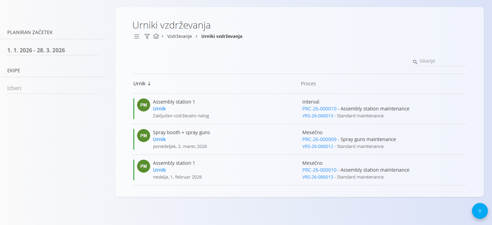
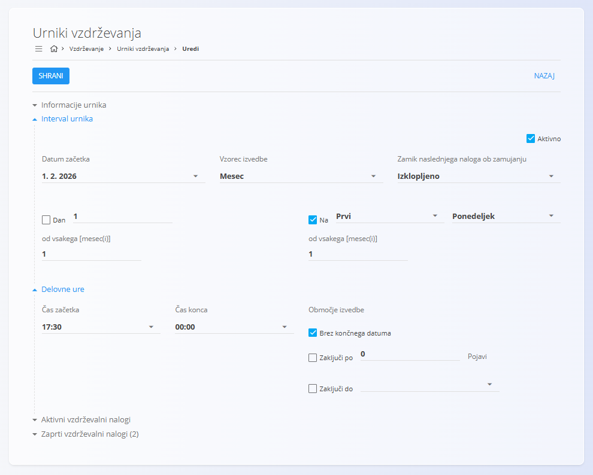

<!-- app_route: /maintenance-orders/schedule -->
<!-- app_label: Urniki vzdrževanja -->
<!-- canonical_source_url: https://tom-pit.github.io/Connected.Docs/sl/Domene/Vzdrzevanje/Dokumenti/UrnikiVzdrzevanja/ -->
<!-- canonical_source_title: Urniki vzdrževanja -->

# Urniki vzdrževanja

**Urniki vzdrževanja** določajo, kako se **planirani vzdrževalni nalogi**
samodejno ustvarjajo skozi čas ali glede na uporabo, na podlagi
definiranega **vzorca izvedbe**.

Urniki vzdrževanja se ustvarijo kot del planiranega vzdrževanja in
zagotavljajo, da se preventivno vzdrževanje izvaja redno, brez ročnega
ustvarjanja nalogov.

Za dostop do urnikov vzdrževanja pojdite na **Vzdrževanje / Urniki vzdrževanja**
v [navigaciji](../../../Skupno/UI/Navigacija.md).

## Povezava z vzdrževalnimi nalogi

Urniki vzdrževanja delujejo v tesni povezavi z vzdrževalnimi nalogi:

- vsak urnik samodejno generira **vzdrževalne naloge v obdelavi**
- ustvarjeni nalogi so vidni v:
  - [**Vzdrževalni nalogi**](VzdrzevalniNalogi.md)
  - [**Koledar vzdrževanja**](KoledarVzdrzevanja.md)
- po zaključku vzdrževalnega naloga urnik nadaljuje z generiranjem
  naslednje izvedbe v skladu s svojo konfiguracijo

To zagotavlja, da je preventivno vzdrževanje neprekinjeno in ne temelji
na ročnem ustvarjanju nalog—ne glede na to, ali je osnovano na času ali
na uporabi.

## Seznam urnikov vzdrževanja

Stran **Urniki vzdrževanja** prikazuje vse obstoječe urnike, ustvarjene iz
planiranih vzdrževalnih nalogov.

Vsak zapis predstavlja **ponavljajočo definicijo vzdrževanja**, ki je
povezana z:
- določeno opremo
- vzdrževalnim procesom in verzijo
- ponavljajočim vzorcem izvedbe (časovni ali števec/uporaba)

Kliknite [akcijski gumb](../../../Skupno/UI/AkcijskiGumb.md), da ustvarite **nov** urnik vzdrževanja ali **kopirate obstoječega**.

Nato lahko določite podrobnosti naloga in izberete, ali se bo vzdrževanje
izvedlo **enkratno** ali pa bo ustvarjen **ponavljajoč urnik vzdrževanja**.

### Prikazane informacije v seznamu

Za vsak urnik seznam prikazuje:
- **Oprema**
- **Urnik** (povezava za urejanje urnika)
- **Naslednji datum izvedbe** (za časovne urnike) ali
  **Naslednji prag izvedbe** (za urnike na podlagi števcev)
- **Vzorec izvedbe**
- **Proces in verzija**

Klik na **Urnik** odpre zaslon za urejanje urnika.

### Razpoložljivi filtri

Za zoženje seznama uporabite filtre na levi strani:

- **Planiran začetek** – filtriranje urnikov po datumskem razponu
- **Ekipe** – filtriranje po dodeljenih ekipah

Iskalno polje omogoča filtriranje po nazivu opreme ali procesu.

## Ustvarjanje urnika vzdrževanja

Kliknite [akcijski gumb](../../../Skupno/UI/AkcijskiGumb.md) in izberite eno od naslednjih možnosti:

- **Nov** – ustvarite nov urnik vzdrževanja.
- **Kopiraj obstoječi** – ustvarite novo verzijo na podlagi obstoječega urnika vzdrževanja.

### Ustvariti nov urnik

Izberite **Nov**, da ustvarite nov urnik vzdrževanja.

Postopek ustvarjanja poteka enako kot pri ustvarjanju vzdrževalnega naloga.

Za podrobna navodila glejte [**Kako ustvariti vzdrževalni nalog**](VzdrzevalniNalogiUstvarjanje.md).

Urnik vzdrževanja se lahko ustvari tudi samodejno, ko je planirani vzdrževalni nalog konfiguriran s **ponavljajočim se vzorcem izvajanja**.

Podprti ponavljajoči se vzorci izvajanja vključujejo:

- vzorce na podlagi **časa** (npr. mesečno, letno, vsakih X dni)
- vzorce na podlagi **števcev oziroma uporabe** (npr. vsakih X kosov, metrov, gramov ali ur) z uporabo ustreznih števcev in merskih enot opreme

> [!NOTE]
> Za konfiguracijo števcev uporabe na virih in opremi glejte [**Stanja števcev**](StanjaStevcev.md).

### Kopirati obstoječi urnik

Izberite **Kopiraj obstoječi**, da ustvarite novo verzijo obstoječega urnika vzdrževanja.

Pri kopiranju urnika:

- se konfiguracija obstoječega urnika prenese v novo verzijo,
- se za novi urnik posodobijo **avtor**, **veljavnost** in **verzija**,
- se prejšnji urnik samodejno deaktivira.

Tako je mogoče spreminjati urnik vzdrževanja in hkrati ohraniti zgodovino njegovih prejšnjih verzij, na primer za pregled, kako je bilo vzdrževanje določene opreme planirano skozi čas.

Ko je urnik ustvarjen, aktivna verzija samodejno generira prihodnje vzdrževalne naloge glede na določeni interval ali prag uporabe.

## Urediti urnik vzdrževanja

Za urejanje urnika vzdrževanja kliknite **Urnik** pri posameznem zapisu
v seznamu urnikov vzdrževanja.

Odpre se zaslon **Uredi urnik vzdrževanja**, kjer lahko prilagodite,
kako in kdaj se ustvarjajo vzdrževalni nalogi.

### Interval urnika

Razdelek **Interval urnika** določa logiko ponavljanja urnika vzdrževanja.

Tukaj lahko nastavite:
- **datum začetka** urnika
- **vzorec izvedbe** (npr. mesečno, letno, intervalno ali na podlagi števcev)
- ali je urnik **aktiven**

Razpoložljiva polja in možnosti se dinamično spreminjajo glede na izbrani
vzorec izvedbe.

### Delovni čas

Razdelek **Delovni čas** določa časovno okno, v katerem so ustvarjeni
vzdrževalni nalogi planirani za začetek in zaključek.

To omogoča uskladitev vzdrževalnih aktivnosti z operativnimi ali
izmensko-organizacijskimi omejitvami.

### Obseg izvajanja

Razdelek **Obseg izvajanja** določa, kako dolgo je urnik veljaven, na primer:
- izvajanje brez omejitve
- zaključek po določenem številu izvedb
- zaključek na določen datum

### Povezani vzdrževalni nalogi

Na dnu zaslona urnik prikazuje:
- **Aktivne vzdrževalne naloge**, ustvarjene iz tega urnika
- **Zaprte vzdrževalne naloge**, ki predstavljajo zaključene izvedbe

To omogoča sledljivost med urnikom in vsemi vzdrževalnimi nalogi, ki so
bili ustvarjeni na njegovi osnovi.

Kliknite **Shrani**, da uveljavite spremembe urnika.

> [!NOTE]
> Spremembe urnika vzdrževanja vplivajo **samo na prihodnje vzdrževalne naloge**.  
> Že ustvarjeni vzdrževalni nalogi se ne spreminjajo.
