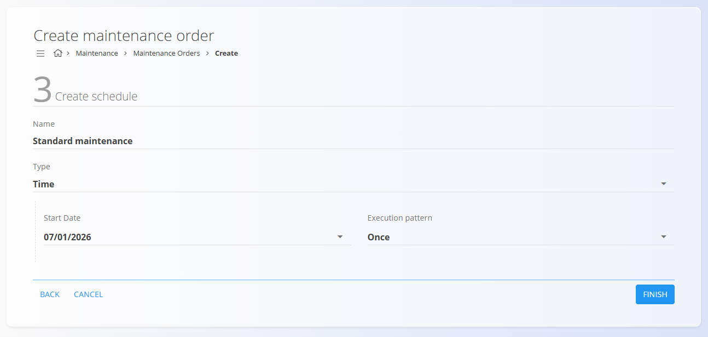
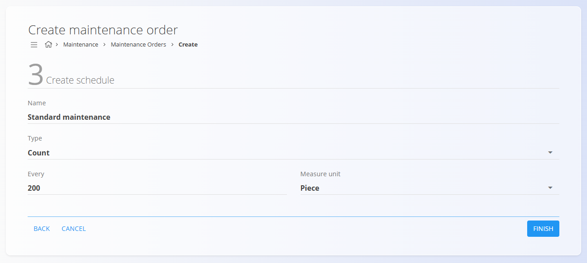

<!-- app_route: /maintenance-orders/create -->
<!-- app_label: Ustvari nov vzdrževalni nalog -->
<!-- canonical_source_url: https://github.com/Tom-PIT/Connected.Docs/blob/main/sl/Domene/Vzdrzevanje/Dokumenti/VzdrzevalniNalogiUstvarjanje.md -->
<!-- canonical_source_title: Dodati nov vzdrževalni nalog -->

## Kako dodati nov vzdrževalni nalog

Kliknite [akcijski gumb](../../../Skupno/UI/AkcijskiGumb.md), da ustvarite nov vzdrževalni nalog.

Čarovnik za ustvarjanje je sestavljen iz **treh korakov**, podobno kot pri proizvodnih nalogih.

## Koraki konfiguracije

### Korak 1 — Izberi tip naloga in entiteto

Izberite:
- **Tip naloga**
- **Entiteta** – Oprema, ki bo vzdrževana

> [!NOTE]
> Pri ročnem ustvarjanju vzdrževalnega naloga je tip naloga vedno **Preventiva**.
>
> **Kurativni** vzdrževalni nalogi se ustvarijo iz **prijavljenih okvar**.

Nato iz seznama izberite konkretno opremo.

### Korak 2 — Izberi proces

- Izberite **vzdrževalni [proces](../../Proizvodnja/Upravljanje/Procesi.md)**
- Izberite **verzijo procesa**, ki določa vzdrževalne operacije.

> [!NOTE]
> Če v tem koraku ni razpoložljivih procesov, preverite:
> - Ali ima proces dodeljeno oznako **Vzdrževanje**
> - Ali so v operacijah procesa definirani **nečloveški viri**
> - Ali ima proces vsaj eno **aktivno verzijo**

### Korak 3 — Ustvari urnik

Določite, kako in kdaj se bo vzdrževalni nalog izvajal. Na voljo sta dva načina razporejanja:

- **Čas** — Razporeditev vzdrževanja za določen datum ali ponavljajoči interval

  

- **Števec** — Razporeditev vzdrževanja glede na uporabo ali števce

  

> [!NOTE]
> Urniki na podlagi uporabe temeljijo na števcih virov in opreme
> (npr. kosi, metri, grami, ure).
> Za nastavitev glejte **[Stanja števcev](StanjaStevcev.md)**

Če je izbran **vzorec ponavljajoče izvedbe** (npr. *Mesečno*, *Vsakih X dni* ali *Letno*),
se samodejno ustvari **vzdrževalni urnik**, ki bo generiral vzdrževalne naloge
v skladu z določenim vzorcem.

Kliknite **Zaključi**, da ustvarite vzdrževalni nalog v stanju **V obdelavi**.
