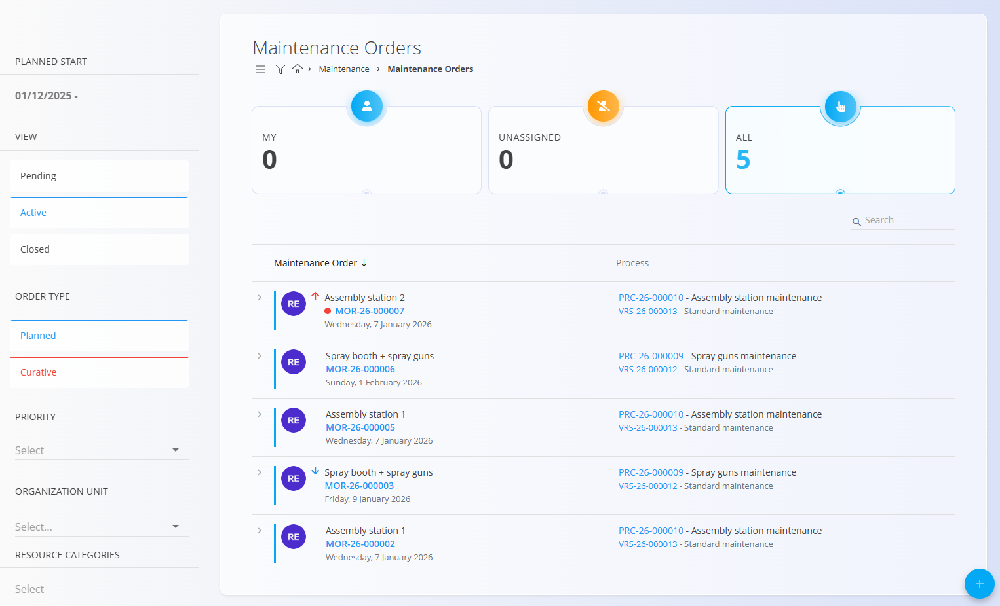
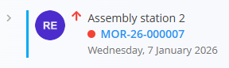
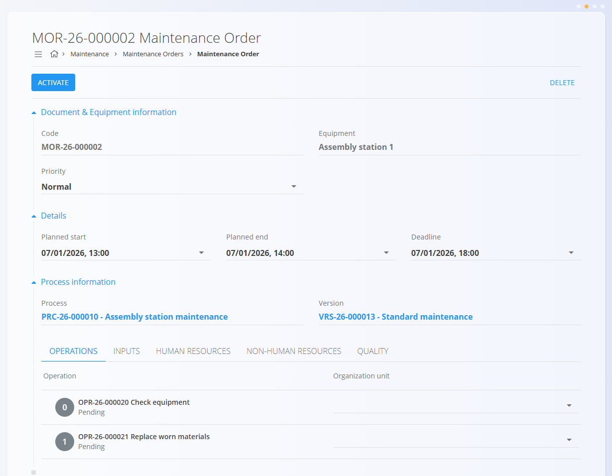
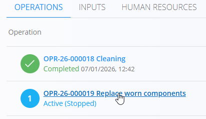

<!-- app_route: /maintenance-orders/list -->
<!-- app_label: Vzdrževalni nalogi -->
<!-- canonical_source_url: https://github.com/Tom-PIT/Connected.Docs/blob/main/sl/Domene/Vzdrzevanje/Dokumenti/VzdrzevalniNalogi.md -->
<!-- canonical_source_title: Vzdrževalni nalogi -->

# Vzdrževalni nalogi

Vzdrževalni nalogi določajo delo, ki je potrebno za izvajanje **planiranega ali kurativnega vzdrževanja** opreme, na podlagi izbranega **vzdrževalnega procesa** in njegove verzije.  
Prehajajo skozi življenjski cikel **V obdelavi → Aktiven → Zaprt** ter vključujejo operacije, vire, vhode in kontrolne sezname kakovosti, kot so definirani v izbranem procesu.

> [!NOTE]
> **Predpogoji**
>
> Pred ustvarjanjem vzdrževalnega naloga se prepričajte, da so nastavljeni:
> - Vsaj en [**vzdrževalni proces**](../../Proizvodnja/Upravljanje/Procesi.md) z aktivno verzijo
> - Definicije opreme
> - Dodeljene [**organizacijske enote**](../../Proizvodnja/Upravljanje//OrganizacijskeEnote.md)
> - Po potrebi dodatne nastavitve, kot so [**viri**](../../Proizvodnja/Upravljanje//Viri.md),
>   [**kontrolni listi**](../..//Proizvodnja/Upravljanje/KontrolneListe.md) in
>   [**merske enote**](../../../Skupno/Upravljanje/MerskeEnote.md), odvisno od poteka vzdrževanja

Za dostop do vzdrževalnih nalogov pojdite na **Vzdrževanje / Vzdrževalni nalogi** v
[**navigaciji**](../../../Skupno/UI/Navigacija.md).

## Seznam vzdrževalnih nalogov

Stran **Vzdrževalni nalogi** prikazuje vse vzdrževalne naloge, združene po statusu.  
Za zoženje seznama uporabite filtre na levi strani.

### Pregled statusov

Na vrhu strani so prikazane kartice s povzetkom števila nalogov:

- **Moji** – Nalogi, dodeljeni trenutnemu uporabniku
- **Nedodeljeni** – Nalogi brez dodeljenega vira
- **Vsi** – Skupno število vzdrževalnih nalogov

Klik na kartico ustrezno posodobi seznam.

### Vizualni indikatorji v seznamu

Vzdrževalni nalogi lahko vsebujejo vizualne indikatorje za hiter pregled stanja:

- **Rdeča pika** – Kurativni vzdrževalni nalog
- **Oznaka zamude** – Označuje, da je nalog v zamudi
- **Puščice prioritete**
  - Rdeča puščica navzgor – Visoka prioriteta
  - Brez puščice – Normalna prioriteta
  - Modra puščica navzdol – Nizka prioriteta

### Razpoložljivi filtri

- **Planiran začetek** – Filtriranje nalogov po razponu planiranega začetka
- **Pogled** – Filtriranje po statusu življenjskega cikla:
  - **V obdelavi** — Ustvarjen in pripravljen za aktivacijo
  - **Aktiven** — Trenutno v izvajanju
  - **Zaprt** — Zaključen vzdrževalni nalog
- **Tip naloga**
  - **Preventiva** — Planirano preventivno vzdrževanje
  - **Kurativa** — Korektivno vzdrževanje
- **Prioriteta**
- **Organizacijska enota**
- **Kategorije virov**

Iskalno polje omogoča filtriranje po kodi vzdrževalnega naloga ali nazivu opreme.

## Ustvarjanje vzdrževalnega naloga

Za ustvarjanje vzdrževalnega naloga uporabite [vodeni čarovnik](VrdrzevalniNalogiUstvarjanje.md).

## V obdelavi vzdrževalni nalogi

Novo ustvarjen vzdrževalni nalog se začne v stanju **V obdelavi**.

V tem stanju je nalog mogoče:
- pregledati
- urejati (oprema, prioriteta, planirani datumi, proces in verzija)
- izbrisati
- pripraviti za izvedbo

Iz tega stanja lahko:
- pregledate operacije
- pregledate zahtevane vire
- dodate priloge ali opombe

Ko je nalog pripravljen za izvedbo, kliknite **Aktiviraj**.

### Brisanje vzdrževalnih nalogov

Izbrisati je mogoče samo vzdrževalne naloge v stanju **V obdelavi**.
Ko je nalog aktiviran, izbris ni več mogoč.

## Aktivni vzdrževalni nalogi

Po aktivaciji vzdrževalni nalog preide v stanje **Aktiven**.

Nalog prikazuje:
- opremo in prioriteto
- planiran začetek in konec
- proces in verzijo
- vse operacije, določene z izbranim procesom

### Izvajanje operacij

Operacije se izvajajo v skladu z definicijo procesa.

Na voljo sta dva načina izvajanja:

- **Hitro zaključevanje** – Kliknite **Zaključi** neposredno na vzdrževalnem nalogu
- **Podrobno izvajanje (priporočeno)** – Kliknite operacijo, da odprete zaslon izvajanja

   

Klik na operacijo odpre **zaslon izvajanja operacije**, kjer lahko izvajalec:
- pregleda [navodila](../../Znanje/BazaZnanja/BazaZnanja.md)
- evidentira [vhode](../../Proizvodnja/Upravljanje/Vhodi.md) in [nečloveške vire](../../Proizvodnja/Upravljanje/StvarniViri.md)
- izvede [kontrolne sezname](../../Proizvodnja/Upravljanje/KontrolneListe.md) kakovosti
- beleži delo (začetek/konec, trajanje)
- vnese podatke o izvedbi

Ko je operacija zaključena, kliknite **Zaključi** v zgornjem levem kotu zaslona operacije.

Zaključene operacije so označene z **zelenim indikatorjem**, kar omogoča jasen vizualni pregled.

## Zaprti vzdrževalni nalogi

Ko so vse operacije zaključene, vzdrževalni nalog preide v stanje **Zaprt**.

Zaprti vzdrževalni nalogi:
- so samo za branje
- vsebujejo celotno zgodovino izvedbe
- služijo kot evidenca vzdrževanja za opremo

V seznamu so vidni pod pogledom **Zaprt**.