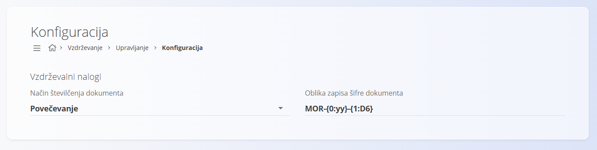

<!-- app_route: /management/maintenance/configuration -->
<!-- app_label: Konfiguracija vzdrževanja -->
<!-- canonical_source_url: https://tom-pit.github.io/Connected.Docs/sl/Domene/Vzdrzevanje/Upravljanje/KonfiguracijaVzdrzevanja/ -->
<!-- canonical_source_title: Konfiguracija vzdrževanja -->

# Konfiguracija vzdrževanja

Konfigurirajte nastavitve **Vzdrževanja**, ki vplivajo na številčenje dokumentov. Vse spremembe se samodejno shranijo.

Za dostop do te strani pojdite na **Vzdrževanje / Upravljanje / Konfiguracija** v [navigaciji](../../../Skupno/UI/Navigacija.md).

## Nastavitve številčenja dokumentov

Izberite model in obliko številčenja dokumentov vzdrževalnih nalogov.

| Polje | Opis |
|-------|------|
| **Model številčenja dokumentov** | • **Povečevanje vsako leto:** zaporedje se vsako leto ponastavi.   • **Povečevanje:** globalno zaporedje, ki se nikoli ne ponastavi. |
| **Oblika kode dokumenta** | Vzorec, ki določa strukturo kode (npr. PREFIX-YEAR-NUMBER). |