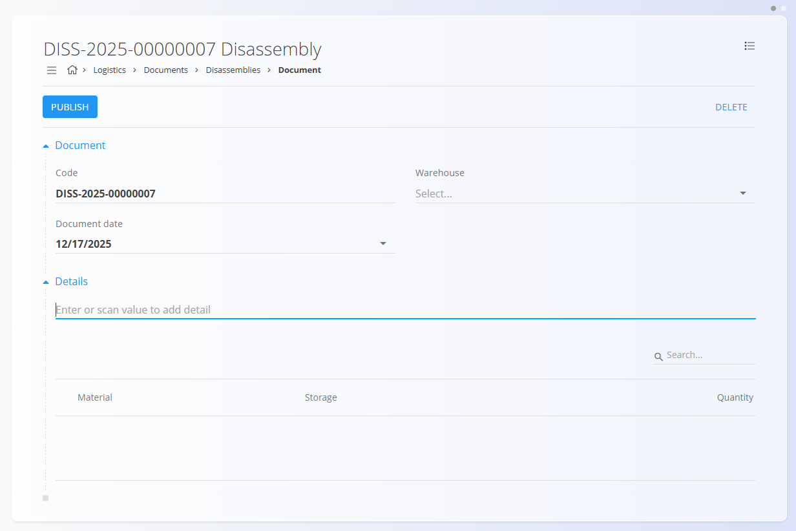
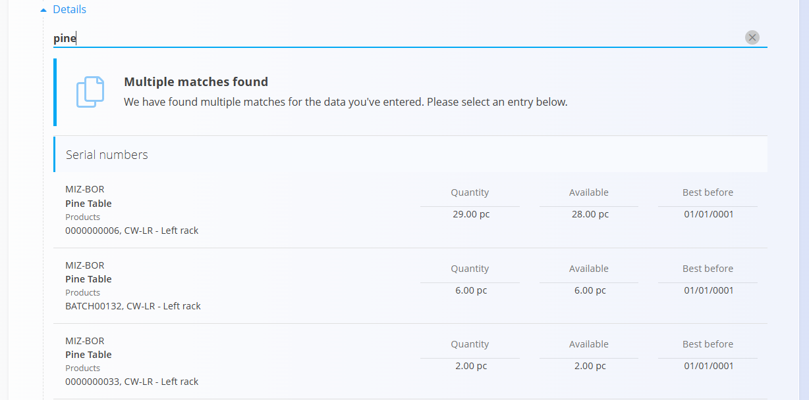
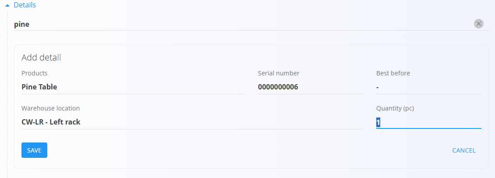
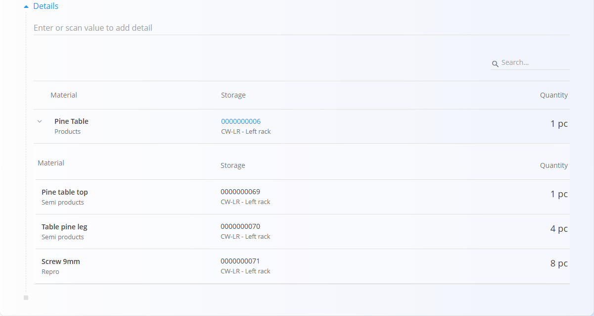

# Demontaže

Dokument **Demontaža** se uporablja za razstavljanje [**garnitur** (združenih materialov)](../../Sredstva/Materiali/Garniture.md) na njihove posamezne komponente. Omogoča sledljivost, pravilno posodabljanje zaloge ter razpoložljivost delov za nadaljnjo uporabo v proizvodnji, nabavi ali prodaji.

Demontažo uporabite, kadar prejmete ali skladiščite **garniture**, vendar morate njihove sestavne dele porabiti ali prodajati ločeno. Ob objavi demontaže se zaloga garniture zmanjša, zaloga posameznih komponent pa se poveča glede na strukturo, definirano na garnituri.

> [!TIP]
> Za celovit prikaz si oglejte video vodič **[Demontaže](https://www.youtube.com/watch?v=0BWXVj_RUlY)**.

> [!NOTE]
> - Demontaža ob objavi vpliva na zalogo: komponente postanejo razpoložljive, količina garniture pa se ustrezno zmanjša.
> - Za ustvarjanje demontaže mora biti najprej definirana struktura garniture v šifrantu **[Garniture](../../Sredstva/Materiali/Garniture.md)**.

Za dostop do **Demontaž** pojdite na **Logistika / Dokumenti / Demontaže** v [navigaciji](../../Skupno/UI/Navigacija.md).

### Primer uporabe

Prejmete garniture pohištva, na primer jedilni komplet (ena miza in štirje stoli), zapakiran kot ena garnitura. Če želite elemente uporabljati ali prodajati ločeno, ustvarite demontažo za to garnituro in jo objavite. Količina garniture se zmanjša, posamezni deli (miza in stoli) pa se pojavijo na zalogi in so pripravljeni za izdajo.

## Shema

### Razdelek dokumenta

| Polje | Opis |
|------|------|
| [**Šifra**](../../Skupno/UI/SifreDokumentov.md) | Sistemsko generiran enolični identifikator dokumenta demontaže. |
| **Datum dokumenta** | Datum dokumenta demontaže. |
| [**Skladišče**](../Upravljanje/Skladisca.md) | Skladišče, v katerem se izvede demontaža (obvezno). |
| **Postavke** | Seznam garnitur, ki se demontirajo (obvezno). |

### Razdelek postavk

| Polje | Opis |
|------|------|
| **Izdelki** | Združen material (npr. garnitura pohištva), ki se demontira (obvezno). Glejte **[Garniture](../../Sredstva/Materiali/Garniture.md)**. |
| **Količina** | Število garnitur za demontažo (obvezno). |
| **Serijska številka** | Serijska številka artikla, če je uporabljena. |
| **Datum do** | Datum roka uporabe za pokvarljive garniture ali komponente, če je uporaben. |
| [**Skladiščna lokacija**](../Upravljanje/Lokacije.md) | Lokacija (polica / regal), kjer se demontaža izvaja ali kamor se deli shranijo. |

## Upravljanje

## Seznam in filtri

Seznam **Demontaž** prikazuje obstoječe dokumente z indikatorji stanja (*Osnutek / Objavljeno*). Iskalnik in filtri omogočajo iskanje po skladišču, datumu ali kodi dokumenta.

## Ustvarjanje dokumenta demontaže

Demontažo ustvarite za razstavljanje garnitur na posamezne dele.

1. Pojdite na **Logistika / Dokumenti / Demontaže**.
2. Kliknite [**akcijski gumb**](../../Skupno/UI/AkcijskiGumb.md), da ustvarite osnutek demontaže.

   

3. Izpolnite razdelek **Dokument**.

4. V razdelek **Postavke** vnesite ali skenirajte **serijsko številko**, **EAN** ali **ime materiala**.  
   - Sistem prikaže **vse ujemajoče materiale in serijske številke**.  
   - Če obstaja več ujemanj, izberite pravilno postavko s seznama.

   

5. Vnesite **Količino** garnitur za demontažo.

   

6. Kliknite **Shrani**, da potrdite dodano postavko. Po potrebi ponovite postopek za dodatne garniture.  
   - Po shranjevanju lahko razširite vrstico in si ogledate seznam komponent, ki bodo demontirane, skupaj z izračunanimi količinami.

   

7. Kliknite **Objavi**, da zaključite demontažo. Dokument se prikaže med **Potrjeni**.

> [!IMPORTANT]
> Ob objavi se zaloga posodobi: garnitura se odstrani (zmanjša za demontirano količino), komponente pa postanejo razpoložljive (povečanje glede na strukturo garniture). Lokacije se upoštevajo, če so določene.

### Alternativna pot (iz prevzema)

Če ste že objavili **[Prevzem](Prevzemi.md)**, lahko demontažo ustvarite neposredno iz njega:
- odprite objavljen prevzem,
- uporabite **Povezave dokumentov → + Demontiraj**.

S tem se ustvari osnutek demontaže, predizpolnjen na podlagi prejetih paketov, kar je uporabno za beleženje demontaž že ob samem prevzemu.

## Urejanje

1. Kliknite **Šifro** dokumenta, da ga odprete.
2. V stanju *Osnutek* lahko urejate glavo dokumenta in postavke.
3. Kliknite **Shrani**, da potrdite spremembe.

## Meni

V zgornjem desnem kotu kliknite **meni (ikona hamburger)** za tiskanje **nalepk serijskih številk**, če je tiskalnik konfiguriran.

## Brisanje

- Osnutke demontaž lahko izbrišete s klikom na **Izbriši** v urejanju.
- Objavljenih dokumentov demontaže praviloma **ni mogoče izbrisati**.

---
