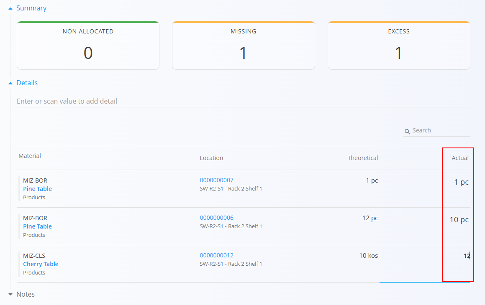

# Inventure

Dokument **Inventura** se uporablja za preverjanje in popravljanje zalog na določeni skladiščni lokaciji. Sistem primerja **teoretično zalogo**, zabeleženo v sistemu, z **dejansko zalogo**, ki je fizično prisotna na lokaciji. Če se ugotovijo razlike, lahko količine posodobite in dokument objavite, s čimer se zaloga ustrezno prilagodi.

Inventura se izvaja **po lokacijah** in prikaže vse materiale, shranjene na izbrani lokaciji, skupaj z indikatorji manjkajočih ali presežnih količin. Za razumevanje nastanka zaloge lahko neposredno odprete:
- **[Pogled zaloge po lokacijah](../Pregledi/PogledZalogePoLokacijah.md)**
- **[Pogled zaloge po serijski številki](../Pregledi/PogledZalogePoSerijskiStevilki.md)**

Minimalni in maksimalni pragovi, prikazani v povzetkih, se nastavijo v šifrantu  
**[Meje zaloge](../Šifranti/MejeZaloge.md)**.

> [!TIP]
> Za celovit prikaz si oglejte video vodič  
> **[Inventura](https://www.youtube.com/watch?v=Rc4qqTdxKn8)**.

Za dostop do **Inventur** pojdite na  
**Logistika / Dokumenti / Inventure** v [navigaciji](../../Skupno/UI/Navigacija.md).

## Shema

### Razdelek dokumenta

| Polje | Opis |
|------|------|
| [**Koda**](../../Skupno/UI/KodeDokumentov.md) | Sistemom generiran enolični identifikator inventurnega dokumenta. |
| **Datum dokumenta** | Datum, ko je inventura izvedena ali zabeležena. |
| [**Skladišče**](../Šifranti/Skladišča.md) | Skladišče, v katerem se izvaja inventura. |
| [**Lokacija**](../Šifranti/Lokacije.md) | Konkretna lokacija znotraj skladišča, ki se preverja. |

### Razdelek postavk

| Polje | Opis |
|------|------|
| [**Material**](../../Sredstva/Domena/Materiali.md) | Material, shranjen na izbrani lokaciji ([izdelek](../../Sredstva/Šifranti/Izdelki.md), [polizdelek](../../Sredstva/Šifranti/Polizdelki.md), [surovina](../../Sredstva/Šifranti/Surovine.md) ali [repro material](../../Sredstva/Šifranti/ReproMateriali.md)). |
| **Lokacija** | Lokacija, na kateri se inventura izvaja. |
| **Teoretično** | Količina, ki je trenutno zabeležena v sistemu. |
| **Dejansko** | Fizično preverjena količina (urejanje dovoljeno). |

## Seznam inventurnih dokumentov

Stran **Inventure** prikazuje vse inventurne dokumente.  
Seznam lahko filtrirate z levim stranskim menijem, ki vključuje:

- **Datume dokumentov**
- **Pogled**
  - *Osnutki* — dokumenti, ki še niso objavljeni  
  - *Objavljeni* — potrjene inventurne prilagoditve
- **Avtorja**
- **Skladišče**

Barvni indikator ob dokumentu prikazuje njegovo stanje:

- **Zelena** — objavljeno  
- **Siva** — osnutek

S klikom na dokument odprete njegov podroben pregled.

## Dejanja

Kliknite [**akcijski gumb**](../../Skupno/UI/AkcijskiGumb.md) za ustvarjanje novega inventurnega dokumenta.

### Ustvarjanje inventurnega dokumenta

1. Kliknite **Novo**, da ustvarite novo inventuro.

   

2. Po izbiri **skladišča** in **lokacije** sistem samodejno naloži vse materiale, zabeležene na tej lokaciji.

3. V razdelku **Povzetek** so prikazani:
   - **Nerazporejeno** — število materialov, ki še niso preverjeni  
   - **Manjka** — število materialov, pri katerih je dejanska količina manjša od teoretične  
   - **Presežek** — število materialov, pri katerih je dejanska količina večja od teoretične  

4. V razdelku **Postavke** ima stolpec **Dejansko** privzeto vrednost **0**.  
   Vnesite dejanske fizične količine. Ko je vrednost drugačna od teoretične, se to samodejno odrazi v razdelkih **Manjka** in **Presežek** v **Povzetku**.

   

5. Ko so vsi materiali preverjeni in so vnesene dejanske vrednosti, razdelek **Nerazporejeno** postane zelen in prikaže **0**.
6. Kliknite **Objavi**, da potrdite inventuro. S tem se zaloga v sistemu posodobi in uskladi z dejanskim stanjem.

Novo ustvarjen inventurni dokument se prikaže med **Osnutki**. Po objavi se premakne med **Objavljene** in zaloga se ustrezno popravi.

> [!NOTE]
> Vrednosti v razdelkih **Manjka** in **Presežek** prikazujejo število **različnih materialov** z odstopanji, ne pa števila manjkajočih ali presežnih kosov.

## Opombe

V razdelku **Opombe** lahko zabeležite dodatne komentarje ali ugotovitve, povezane z inventurnim postopkom.

## Meni

Znotraj inventurnega dokumenta **meni (ikona hamburger)** ponuja naslednje možnosti:

- **Tiskanje**
- **Izvoz (PDF)**

Možnosti so na voljo tako za *osnutke* kot za *objavljene* dokumente.

## Brisanje

S klikom na **Izbriši** lahko odstranite **osnutek** inventurnega dokumenta.  
Objavljenih inventurnih dokumentov **ni mogoče izbrisati ali razveljaviti**.

---
