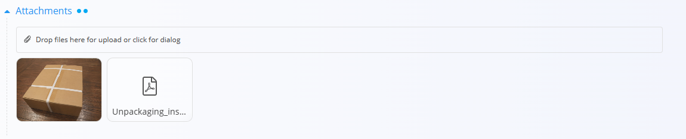
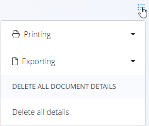
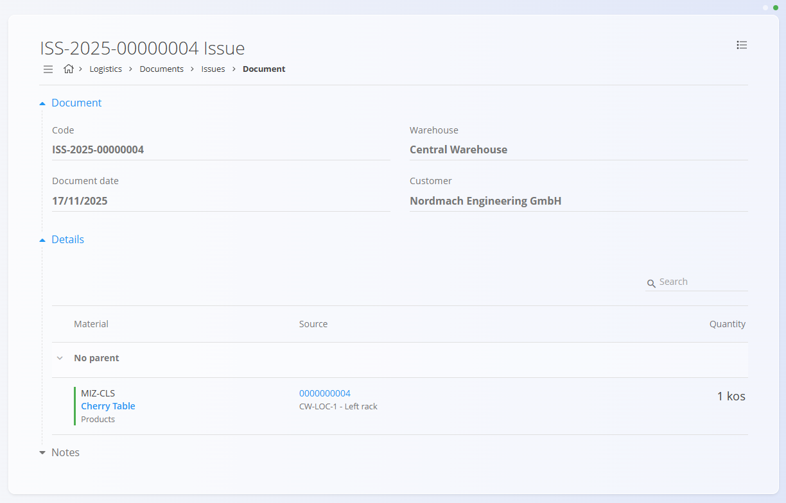

# Izdajnice

Dokument **Izdajnica** se uporablja za evidentiranje blaga, ki zapušča skladišče, na primer ob dobavi kupcu. Ko končni izdelki, materiali ali pakirani artikli zapustijo skladišče v okviru prodajne ali interne izdaje, izdajnica zajame vse relevantne podatke. Primeri vključujejo:
- izdajo **pohištva kupcu**
- **dobavo rezervnih delov**
- **izdajo pakiranega blaga** v okviru prodajnega naročila

Med postopkom izdaje poiščete ali skenirate postavke, ki jih želite izdati, potrdite pravilne serijske številke ali serije ter vnesete količine. To zagotavlja natančno posodobitev zaloge in popolno sledljivost vsake izdaje.

> [!TIP]
> Za celovit prikaz si oglejte video vodič  
> **[Izdajnice](https://www.youtube.com/watch?v=SrVyblBiLmQ)**.

Za dostop do **Izdajnic** pojdite na  
**Logistika / Dokumenti / Izdajnice** v [navigaciji](../../Skupno/UI/Navigacija.md).

## Shema

### Razdelek dokumenta

| Polje | Opis |
|------|------|
| [**Koda**](../../Skupno/UI/KodeDokumentov.md) | Sistemom generiran enolični identifikator izdajnice. |
| **Datum dokumenta** | Datum ustvarjanja izdajnice. |
| [**Skladišče**](../Šifranti/Skladišča.md) | Skladišče, iz katerega se blago izdaja (obvezno). |
| **Kupec** | Kupec, ki prejme blago, izbran iz [Poslovnega imenika](../../Skupno/Šifranti/PoslovniImenik.md) (obvezno). |
| **Opombe** | Dodatne opombe, povezane z dokumentom. |

### Razdelek postavk

| Polje | Opis |
|------|------|
| [**Material**](../../Sredstva/Domena/Materiali.md) | Izdani material ([izdelek](../../Sredstva/Šifranti/Izdelki.md), [polizdelek](../../Sredstva/Šifranti/Polizdelki.md), [surovina](../../Sredstva/Šifranti/Surovine.md) ali [repro material](../../Sredstva/Šifranti/ReproMateriali.md)). |
| **Serijska številka** | Izbrana serijska številka izdanega materiala. |
| **Rok uporabe** | Datum poteka (če ima material določen rok uporabe). |
| [**Skladiščna lokacija**](../Šifranti/Lokacije.md) | Trenutna skladiščna lokacija izbrane postavke. |
| **Količina (kos)** | Količina, ki se izdaja. |

## Seznam izdajnic

Stran **Izdajnice** prikazuje vse izdajnike dokumente. Dokument lahko poiščete z iskalnikom ali uporabite filtre v levem stranskem meniju:

- **Datumi dokumentov**
- **Pogled:**  
  - *Osnutki* — dokumenti, ki še niso objavljeni  
  - *Objavljeni* — dokončni in zaklenjeni dokumenti
- **Avtor**
- **Skladišče**

Barvni indikator ob dokumentu prikazuje njegovo stanje:

- **Zelena** — objavljeno  
- **Siva** — osnutek

S klikom na dokument odprete njegov podroben pregled.

## Dejanja

Kliknite [**akcijski gumb**](../../Skupno/UI/AkcijskiGumb.md), da ustvarite novo izdajniško dokumentacijo.

### Ustvarjanje izdajnice

1. Kliknite **akcijski gumb** za ustvarjanje osnutka dokumenta, nato izberite **Skladišče** in **Kupca**.

   

2. V razdelek postavk vnesite ali skenirajte **serijsko številko**, **EAN kodo** ali **ime materiala**.  
   - Sistem prikaže **vse ujemajoče materiale in serijske številke**.
3. Iz seznama rezultatov izberite ustrezno postavko.
4. Sistem samodejno izpolni vse znane podatke (material, serijska številka, lokacija, rok uporabe).

   

5. Vnesite **količino**, ki jo želite izdati — to je edino polje, ki ga lahko ročno urejate.
6. Kliknite **Shrani**, da dodate postavko v dokument. Po potrebi dodajte nove postavke (ponovite korak 2).
7. Kliknite **Objavi**, da dokument dokončno potrdite.

Novo ustvarjena izdajna se prikaže v pogledu **Osnutki**. Po objavi se premakne med **Objavljene** dokumente.

## Priloge

Na vrhu vsakega dokumenta je na voljo razdelek **Priloge**.

Naložite lahko poljubne datoteke, kot so dobavnice, transportni dokumenti, fotografije ali druga spremljajoča dokumentacija. Priloge so trajno shranjene skupaj z dokumentom.

## Opombe

Vsak dokument vsebuje razdelek **Opombe**, kamor lahko vnesete dodatne komentarje ali informacije, povezane s transakcijo. Opombe se shranijo skupaj z dokumentom in so vidne tako v osnutku kot v objavljeni različici.

## Meni

V izdajnem dokumentu **meni (ikona hamburger)** v zgornjem desnem kotu ponuja različne možnosti, odvisno od stanja dokumenta.

### Osnutek izdajnice

- Tiskanje  
- Izvoz (PDF)  

### Objavljena izdajnice

- Tiskanje  
- Izvoz (PDF)  
- [**Ustvari storno**](Reversals.md)

## Pregled izdajnice

Ko kliknete izdajni dokument:

- vidite razdelek **Dokument** (glava dokumenta)  
- vidite vse **Postavke** izdanega blaga  
- osnutke lahko urejate  
- dokumente lahko tiskate ali izvozite  
- objavljeni dokumenti so samo za branje (razen ustvarjanja storna)

## Brisanje

Osnutke je mogoče izbrisati le, če **ne vsebujejo nobenih postavk**.

Če osnutek še vsebuje postavke:

1. Kliknite serijsko številko materiala, da odprete zaslon **Uredi postavko**.  
2. Kliknite **Izbriši** v oknu urejanja.  
3. Postopek ponovite za vse preostale postavke.

Ko dokument ne vsebuje več nobene postavke, lahko kliknete **Izbriši**, da odstranite osnutek.

> [!NOTE]
> Objavljenih dokumentov **ni mogoče izbrisati** — mogoče jih je samo **stornirati**.

---
