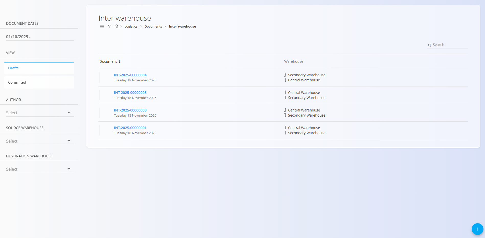
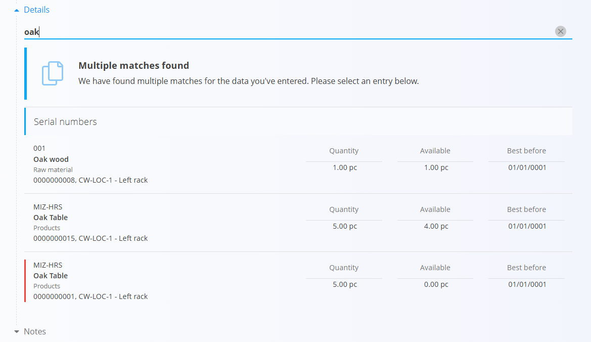

# Med-skladiščni promet

Dokument **Med-skladiščni promet** se uporablja za prenos materialov iz enega skladišča v drugo. Uporaben je, kadar je potrebno zalogo premakniti med lokacijami — na primer prenos artiklov iz **glavnega skladišča** v **centralno skladišče** ali prenos **komponent** v oddaljeno skladišče.

Postopek prenosa omogoča skeniranje ali iskanje materialov, izbiro ciljnega [skladišča](../Šifranti/Skladišča.md) in [lokacije](../Šifranti/Lokacije.md) ter prilagajanje količin, ki se prenašajo. Ob objavi dokumenta se stanje zaloge samodejno posodobi v obeh skladiščih, kar zagotavlja pravilne količine na vsaki lokaciji.

> [!TIP]
> Za celovit prikaz si oglejte video vodič  
> **[Med-skladiščni promet](https://www.youtube.com/watch?v=xtyKDh7_qgI)**.

Za dostop do dokumentov **Med-skladiščnega prometa** pojdite na  
**Logistika / Dokumenti / Med-skladiščni promet** v [navigaciji](../../Skupno/UI/Navigacija.md).

## Shema

### Razdelek dokumenta

| Polje | Opis |
|------|------|
| [**Koda**](../../Skupno/UI/KodeDokumentov.md) | Sistemom generiran enolični identifikator dokumenta med-skladiščnega prometa. |
| **Datum dokumenta** | Datum, ko je prenos zabeležen. |
| [**Izvorno skladišče**](../Šifranti/Skladišča.md) | Skladišče, iz katerega bodo materiali odstranjeni. |
| [**Ciljno skladišče**](../Šifranti/Skladišča.md) | Skladišče, v katerem bodo materiali prevzeti. |
| **Opombe** | Dodatne opombe, povezane z dokumentom. |

### Razdelek postavk

| Polje | Opis |
|------|------|
| [**Material**](../../Sredstva/Domena/Materiali.md) | Material, ki se prenaša ([izdelek](../../Sredstva/Šifranti/Izdelki.md), [polizdelek](../../Sredstva/Šifranti/Polizdelki.md), [surovina](../../Sredstva/Šifranti/Surovine.md) ali [repro material](../../Sredstva/Šifranti/ReproMateriali.md)). |
| **Serijska številka** | Serijska številka enote, ki se prenaša. |
| **Rok uporabe** | Datum poteka (za materiale z rokom uporabe). |
| [**Izvorna lokacija**](../Šifranti/Lokacije.md) | Skladiščna lokacija v izvor­nem skladišču. |
| [**Ciljna lokacija**](../Šifranti/Lokacije.md) | Skladiščna lokacija, kamor bo material shranjen. |
| **Količina (kos)** | Količina, ki se prenaša. |

## Seznam dokumentov med-skladiščnega prometa

Stran **Med-skladiščni promet** prikazuje vse dokumente prenosa. Dokument lahko poiščete z iskalnikom ali uporabite filtre v levem stranskem meniju:

- **Datumi dokumentov**
- **Pogled**  
  - *Osnutki* — dokumenti, ki še niso objavljeni  
  - *Objavljeni* — potrjeni in zaključeni prenosi
- **Avtor**
- **Izvorno skladišče**
- **Ciljno skladišče**

Barvni indikator ob dokumentu prikazuje njegovo stanje:

- **Zelena** — objavljeno  
- **Siva** — osnutek

S klikom na dokument odprete njegov podroben pregled.

## Dejanja

Kliknite [**akcijski gumb**](../../Skupno/UI/AkcijskiGumb.md), da ustvarite nov dokument med-skladiščnega prometa.

### Ustvarjanje dokumenta med-skladiščnega prometa

1. Kliknite **Novo**, nato izberite **Izvorno skladišče** in **Ciljno skladišče**.

   

2. V razdelku **Postavke** skenirajte ali vnesite **serijsko številko**, **EAN** ali **ime materiala**.  
   - Če obstaja samo eno ujemanje → podatki se samodejno izpolnijo.  
   - Če obstaja več ujemanj → prikaže se seznam za izbiro:

   

3. Izberite pravilno postavko, sistem pa samodejno izpolni vsa polja.
4. Po potrebi prilagodite **Ciljno lokacijo** ali **Količino**.

   

5. Kliknite **Shrani**, da shranite postavko. Po potrebi dodajte nove postavke (ponovite korak 2).
6. Kliknite **Shrani** v zgornjem levem kotu, da shranite dokument.
7. Ko je fizični prenos v ciljnem skladišču zaključen, odprite osnutek in kliknite **Objavi**, da potrdite premik zaloge.

Novo ustvarjen dokument se prikaže med **Osnutki**. Po objavi se premakne med **Objavljene** in zaloga se takoj posodobi.

## Opombe

Vsak dokument vsebuje razdelek **Opombe**, kamor lahko vnesete dodatne komentarje ali informacije o transakciji. Opombe se shranijo skupaj z dokumentom in so vidne tako v osnutku kot v objavljeni različici.

## Meni

V dokumentu med-skladiščnega prometa **meni (ikona hamburger)** v zgornjem desnem kotu ponuja:

- **Tiskanje**
- **Izvoz (PDF)**

Možnosti so na voljo tako za *osnutke* kot za *objavljene* dokumente.

## Brisanje

Osnutke je mogoče izbrisati na zaslonu za urejanje, vendar le, če **ne vsebujejo nobenih postavk**.

Če osnutek še vsebuje postavke:

1. Kliknite serijsko številko materiala, da odprete zaslon **Uredi postavko**.  
2. Kliknite **Izbriši** v oknu urejanja.  
3. Postopek ponovite za vse preostale postavke.

Ko dokument ne vsebuje več nobene postavke, lahko kliknete **Izbriši**, da odstranite osnutek.

Objavljenih dokumentov **ni mogoče izbrisati**.

---
