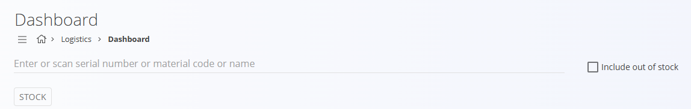

# Nadzorna plošča

**Nadzorna plošča** omogoča hiter pregled trenutnega stanja zaloge za vse materiale. Poudari pomembna stanja, kot so materiali, ki so **pod minimalno zalogo**, **nad maksimalno zalogo**, **brez zaloge** ali **blokirani**. Tako lahko hitro zaznate morebitne težave in pravočasno ukrepate.

Z nadzorne plošče lahko neposredno poiščete kateri koli material in odprete njegov **pogled zaloge**, kjer si ogledate količine, lokacije, premike in podrobnosti serijskih številk.  
Minimalne in maksimalne pragove nastavite v šifrantu **[Meje zaloge](../Sifranti/MejeZaloge.md)**.

> [!TIP]
> Za celovit prikaz si oglejte video vodič **[Pregled nadzorne plošče](https://www.youtube.com/watch?v=mEU18GmypkY)**.

Za dostop do **Nadzorne plošče** pojdite na **Logistika / Nadzorna plošča** v [navigaciji](../../Skupno/UI/Navigacija.md).

## Indikatorji zaloge

Nadzorna plošča prikazuje štiri glavne indikatorje. S klikom na posamezen indikator se spodnji seznam filtrira in prikaže samo materiale, ki ustrezajo izbranemu stanju. Če noben indikator ni izbran, nadzorna plošča prikaže nedavno ustvarjene logistične dokumente.

### Pod minimumom  
Materiali, katerih količina zaloge je nižja od določene **minimalne zaloge**.

Minimalne vrednosti se nastavijo v **[Mejah zaloge](../Sifranti/MejeZaloge.md)**.

### Nad maksimumom  
Materiali, katerih količina zaloge presega določeno **maksimalno zalogo**.

Maksimalne vrednosti se nastavijo v **[Mejah zaloge](../Sifranti/MejeZaloge.md)**.

### Brez zaloge  
Materiali, ki trenutno nimajo **nobene razpoložljive zaloge**.

### Pod blokirano mejo  
Materiali, katerih količina zaloge je **nižja od blokiranega praga**.

## Iskanje in skeniranje

Material lahko poiščete z vnosom:
- **serijske številke**
- **kode materiala**
- **imena materiala**

Možnost **Vključi materiale brez zaloge** razširi rezultate tudi na materiale s količino 0.

Pritisnite Enter ali kliknite gumb **Zaloga**, da prikažete rezultate. Če je iskalno polje prazno, vas gumb neposredno preusmeri na pregled **[Zaloge](Zaloga.md)**.

Prikaže se seznam rezultatov z naslednjimi stolpci:

- **Material**
- **Zaloga**
- **Blokirano**
- **Rezervirano**

## Seznam materialov

Pod indikatorji nadzorna plošča prikaže seznam materialov, ki ustrezajo izbranemu indikatorju. Seznam vključuje:

- vrsto materiala  
- ime materiala / izdelka  
- trenutno zalogo ali min/max vrednosti  

Iskalno polje na desni strani omogoča dodatno filtriranje prikazanih materialov.

> [!NOTE]
> S klikom na material odprete njegov **[Pogled zaloge po materialu](Zaloga.md#pogled-zaloge-po-materialu)**.

---
