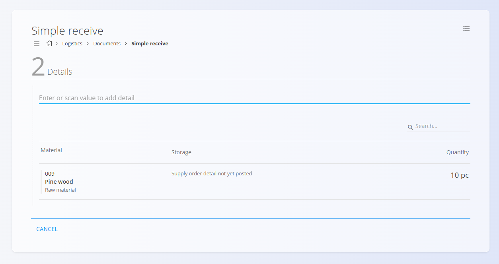
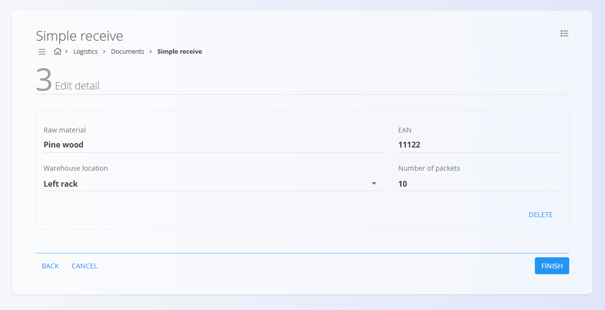

# Poenostavljen prevzem

Postopek **Poenostavljen prevzem** omogoča hiter način evidentiranja prihajajočih materialov na podlagi obstoječega [nabavnega naloga](../../Nabava/Dokumenti/NabavniNalogi.md).

Uporabnika vodi skozi tri jasne korake: izbiro glave dokumenta, potrditev materialov za prevzem ter urejanje posamezne postavke pred zaključkom.

Poenostavljen prevzem je primeren za hitre skladiščne operacije, kjer materiali prispejo **točno tako, kot so bili naročeni**, brez potrebe po naprednih funkcijah prevzema.

Za dostop do **Poenostavljenega prevzema** pojdite na **Logistika / Dokumenti / Poenostavljen prevzem** v [**navigaciji**](../../Skupno/UI/Navigacija.md).

## Pregled

Poenostavljen prevzem je sestavljen iz treh korakov:

1. **Dokument** — izbor skladišča, dobavitelja in dobavnega naloga  
2. **Postavke** — potrditev prihajajočih materialov iz dobavnega naloga  
3. **Uredi postavko** — pregled in dopolnitev posamezne vrstice materiala  

Vsak zaključen poenostavljen prevzem v sistemu ustvari standardni dokument  
[**Prevzem**](Prevzemi.md).

## Ustvarjanje poenostavljenega prevzema

### Korak 1 — Dokument

V prvem koraku uporabnik izbere podatke glave prevzemnega dokumenta.

Polja vključujejo:

- **Skladišče** — kamor bodo materiali prevzeti  
- **Dobavitelj** — samodejno predlagan, če je povezan z dobavnim nalogom  
- **Dobavni nalog** — vnos ali skeniranje številke dobavnega naloga  
  (npr. *SOR-2025-00000018*)

Kliknite **Naprej** za nadaljevanje.

### Korak 2 — Postavke

V tem koraku sistem prikaže vse **pričakovane materiale in količine** iz izbranega dobavnega naloga.

Uporabnik mora sedaj **skenirati ali ročno vnesti šifro pakiranja**  
(EAN / črtno šifro) prejetega artikla.

- Če skenirana koda ustreza **več postavkam dobavnega naloga**
  (npr. isti material v različnih serijah ali naročilih),
  sistem prikaže **vse ustrezne postavke**.
- Uporabnik mora **izbrati pravilno postavko**, ki ustreza prejetemu pakiranju.

Ko je izbrana pravilna postavka, se postopek samodejno nadaljuje v  
**Korak 3 — Uredi postavko**.

### Korak 3 — Uredi postavko

V zadnjem koraku uporabnik dopolni podatke za vsako materialno postavko.

Za vsako prejeto postavko lahko pregledate ali prilagodite:

- **Skladiščno lokacijo**  
- **Količino v paketu**

Postavko lahko tudi **izbrišete**, če je ne želite prevzeti.

Ko so vse podrobnosti potrjene, kliknite **Konec** za dokončanje poenostavljenega prevzema.

## Zaključek prevzema

Po kliku na **Konec**:

- sistem ustvari standardni dokument [**Prevzem**](Prevzemi.md)  
- vse potrjene količine se knjižijo na zalogo  
- dobavni nalog se posodobi s prevzetimi količinami  

Za naprednejše postopke prevzema (serijske številke, rok uporabe, pakiranje, priloge, storna itd.) glejte dokumentacijo [**Prevzemi**](Prevzemi.md).
