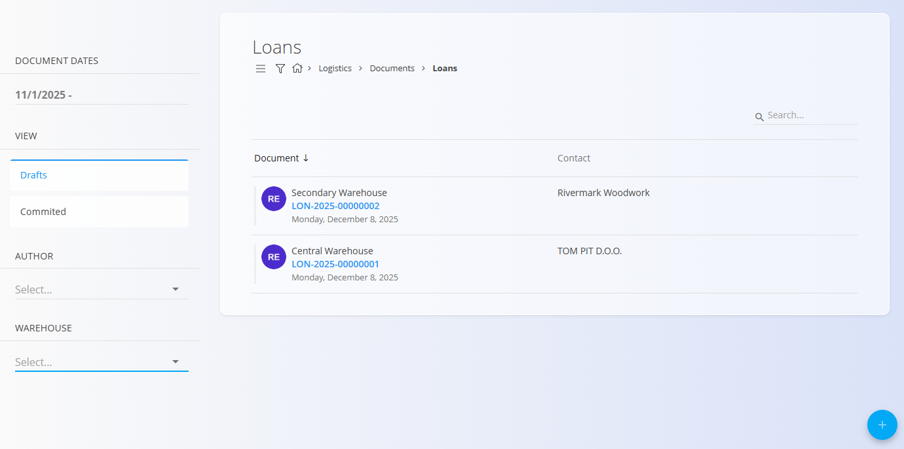
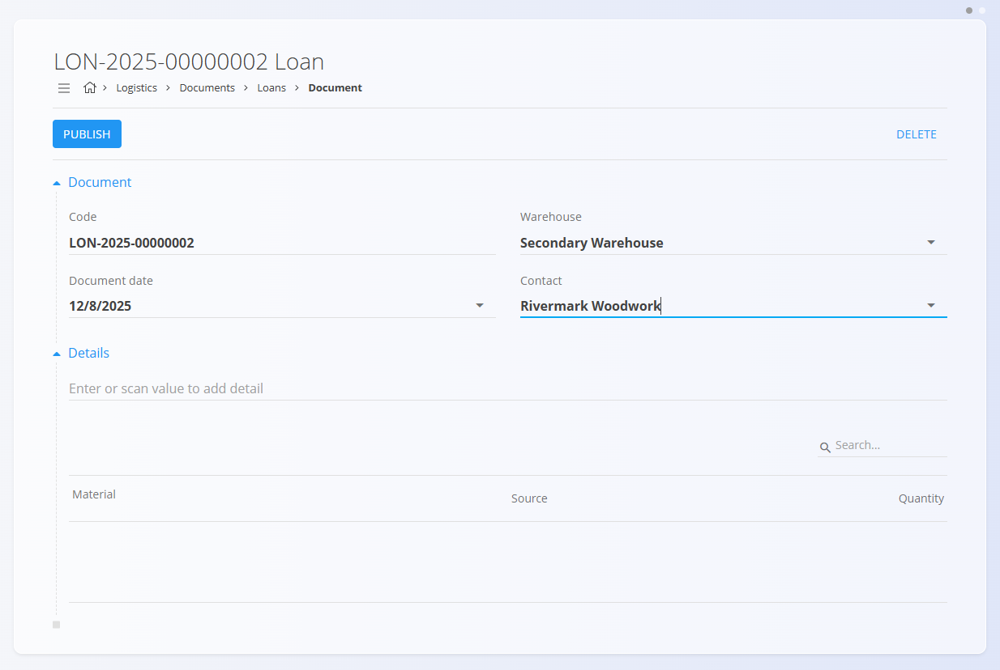
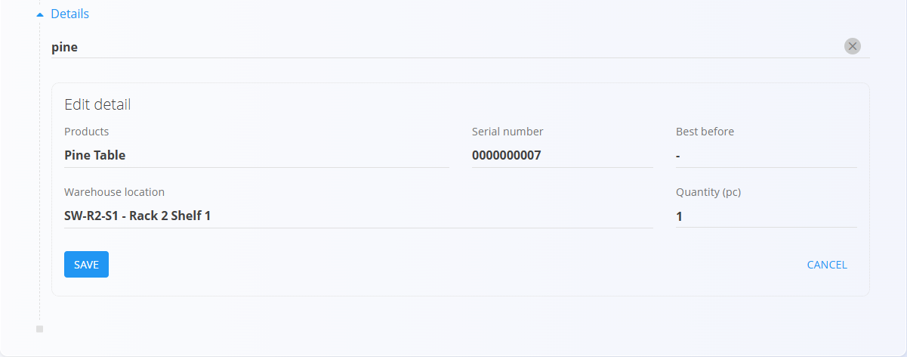
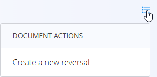

# Posoje

Dokument **Posoja** se uporablja za beleženje materialov ali opreme, ki so **začasno posojeni** — na primer oprema, posojena stranki, orodje, uporabljeno izven lokacije, ali izdelki, dani v preizkus.  
Ko so materiali posojeni, postanejo **rezervirani** in niso na voljo za druge operacije, dokler posoja ni **stornirana (vrnjena)**.

> [!TIP]
> Za celovit prikaz si oglejte video vodič **[Posoje](https://www.youtube.com/watch?v=V0QfOaBJ4Rk)**.

Za dostop do **Posoj** pojdite na **Logistika / Dokumenti / Posoje** v [navigaciji](../../Skupno/UI/Navigacija.md).

## Shema

### Razdelek dokumenta

| Polje | Opis |
|------|------|
| [**Koda**](../../Skupno/UI/KodeDokumentov.md) | Sistemsko generiran enolični identifikator dokumenta posoje. |
| **Datum dokumenta** | Datum, ko je dokument posoje ustvarjen. |
| [**Skladišče**](../Šifranti/Skladišča.md) | Skladišče, iz katerega se material posodi (obvezno). |
| **Kontakt** | Stranka ali partner, ki prejme material, izbran iz [Poslovnega imenika](../../Skupno/Šifranti/PoslovniImenik.md) (obvezno). |
| **Opombe** | Neobvezne opombe, povezane s posojo. |

### Razdelek postavk

| Polje | Opis |
|------|------|
| [**Material**](../../Sredstva/Domena/Materiali.md) | Posojen material (izdelek, surovina, polizdelek, repro material itd.). |
| **Serijska številka** | Izbrana serijska številka za serijsko vodene materiale. |
| **Rok uporabe** | Datum poteka, če je določen. |
| [**Skladiščna lokacija**](../Šifranti/Lokacije.md) | Lokacija, iz katere se material vzame. |
| **Količina (kos)** | Količina, ki se posodi. Pred shranjevanjem jo je potrebno urediti. |

## Seznam dokumentov posoje

Stran **Posoje** prikazuje vse dokumente posoje. Seznam lahko filtrirate z iskalnikom ali z levim stranskim menijem:

- **Datumi dokumentov**
- **Pogled**
  - *Osnutki* — dokumenti, ki še niso objavljeni  
  - *Objavljeni* — potrjeni in zaključeni dokumenti
- **Avtor**
- **Skladišče**

Barvni indikator ob dokumentu prikazuje njegovo stanje:
- **Zelena** — objavljeno  
- **Siva** — osnutek

S klikom na dokument odprete njegov podroben pregled.

## Dejanja

Kliknite [**akcijski gumb**](../../Skupno/UI/AkcijskiGumb.md) za ustvarjanje novega dokumenta posoje.

### Ustvarjanje nove posoje

1. Kliknite **akcijski gumb** in ustvarite nov osnutek posoje.  
   Izberite **Skladišče** in **Kontakt**.

   

2. V razdelku **Postavke** vnesite ali skenirajte **serijsko številko**, **EAN** ali **ime materiala**.

   Sistem prikaže:
   - **natančna ujemanja**
   - **vse materiale, ki ustrezajo vnosu**
   - če obstaja več ujemanj, se prikaže **izbirni seznam**

   

3. Izberite pravilno postavko.  
   Sistem samodejno izpolni znane podatke (material, serijska številka, lokacija).

4. Vnesite **količino**, ki jo želite posoditi.  
   Količino je potrebno urediti v obrazcu postavke:

   

5. Kliknite **Shrani**, da dodate postavko.  
   Po potrebi postopek ponovite za dodatne postavke.

6. Kliknite **Objavi**, da dokument potrdite.  
   Objavljen dokument se prikaže v pogledu *Objavljeni*.

Po objavi dokumenta postanejo vsi posojeni materiali **rezervirani** in niso več na voljo za druge procese.

## Vračilo posoje (storno)

Ko so posojeni materiali vrnjeni, ustvarite **storno** iz menija dokumenta.

V zgornjem desnem kotu odprite **meni (ikona hamburger)** in izberite:

- **Ustvari novo storno**

S tem se ustvari dokument, ki materiale vrne nazaj na zalogo.  
Za več podrobnosti glejte **[Storno](Storno.md)**.

## Pregled dokumenta posoje

Ko odprete dokument posoje:

- razdelek **Dokument** prikazuje glavo dokumenta  
- razdelek **Postavke** prikazuje vse posojene materiale  
- osnutke je mogoče urejati  
- objavljeni dokumenti so samo za branje (razen ustvarjanja storna)  
- tiskanje in izvoz sta na voljo v meniju

## Brisanje

Osnutke dokumentov posoje je mogoče izbrisati **le, če ne vsebujejo nobenih postavk**.

Postopek:
1. Odprite vsako postavko  
2. Kliknite **Izbriši** v urejanju postavke  
3. Ko so vse postavke odstranjene, kliknite **Izbriši** na dokumentu

> [!NOTE]
> Objavljenih dokumentov posoje **ni mogoče izbrisati** — mogoče jih je samo **stornirati**.

---
