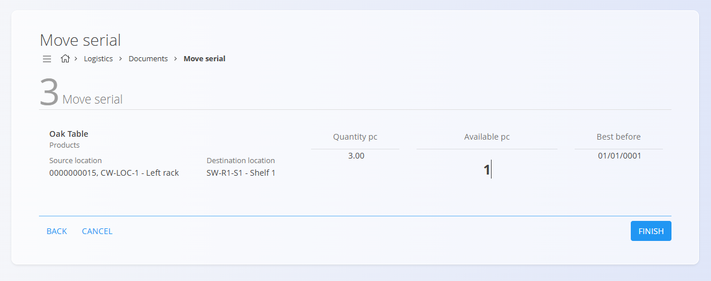

# Premakni serijsko številko

Funkcija **Premakni serijsko številko** omogoča hiter premik posamezne zalogovne enote (določene s serijsko številko) iz ene skladiščne lokacije na drugo. Namenjena je hitrim in pogostim premikom v skladišču — na primer pri reorganizaciji regalov, pripravi blaga za komisioniranje ali popravljanju napačno shranjenih postavk.

Za razliko od celotnega dokumenta  
[**Med-skladiščni promet**](MedSkladiscniPromet.md) se **Premakni serijsko številko** osredotoča izključno na premik **ene serijsko vodene enote** znotraj skladiščne strukture.

Za boljši pregled trenutnega stanja in zgodovine premikov lahko odprete:
- [**Pogled zaloge po materialu**](Pregledi/Zaloga.md#pogled-zaloge-po-materialu)
- [**Pogled zaloge po serijski številki**](Pregledi/Zaloga.md#pogled-zaloge-po-serijski-stevilki)

> [!TIP]
> Za celovit prikaz si oglejte video vodič  
> **[Premakni serijsko številko](https://www.youtube.com/watch?v=dy1u6sKmdMg)**.

Za dostop do **Premika serijske številke** pojdite na  
**Logistika / Dokumenti / Premakni serijsko številko** v [navigaciji](../../Skupno/UI/Navigacija.md).

---

## Premikanje serijske številke

Postopek sledi vodenemu delovnemu toku s tremi koraki:

1. Identifikacija serijske številke  
2. Izbira ciljne lokacije  
3. Potrditev in izvedba premika  

Vsak zaključen premik se samodejno zabeleži in prikaže v  
**Med-skladiščni promet → Objavljeni**.

### Korak 1 — Skeniraj ali vnesi serijsko številko

Vnesite ali skenirajte **serijsko številko**, **EAN** ali vpišite **ime materiala**.

- Če obstaja **samo ena ujemajoča se postavka** → sistem samodejno nadaljuje.
- Če obstaja **več ujemanj** → prikaže se zaslon za izbiro.

**Primer (več ujemanj):**

Kliknite **Naprej** za nadaljevanje.

### Korak 2 — Izberi ciljno lokacijo

Vnesite ciljno lokacijo z vnosom njenega **imena**, **kode** ali dela besedila.

Če obstaja več ujemajočih se lokacij, morate izbrati pravilno:

Kliknite **Naprej** za nadaljevanje.

### Korak 3 — Potrdi premik

Na zadnjem zaslonu so prikazani naslednji podatki:

- **Material**, ki se premika  
- **Izvorna lokacija**  
- **Ciljna lokacija**  
- **Količina (kos)** — skupno število kosov na izvorni lokaciji  
- **Razpoložljivo (kos)** — količina, ki je trenutno na voljo za premik (urejanje dovoljeno)  
- **Rok uporabe**

Po potrebi prilagodite vrednost **Razpoložljivo (kos)** in kliknite **Zaključi**.

Po zaključku:

- premik se takoj zabeleži,  
- vrnete se na **Korak 1**, kjer lahko nadaljujete s skeniranjem novih postavk,  
- zaključen premik je viden v **Med-skladiščni promet → Objavljeni**.

**Primer zabeleženega premika:**

---
