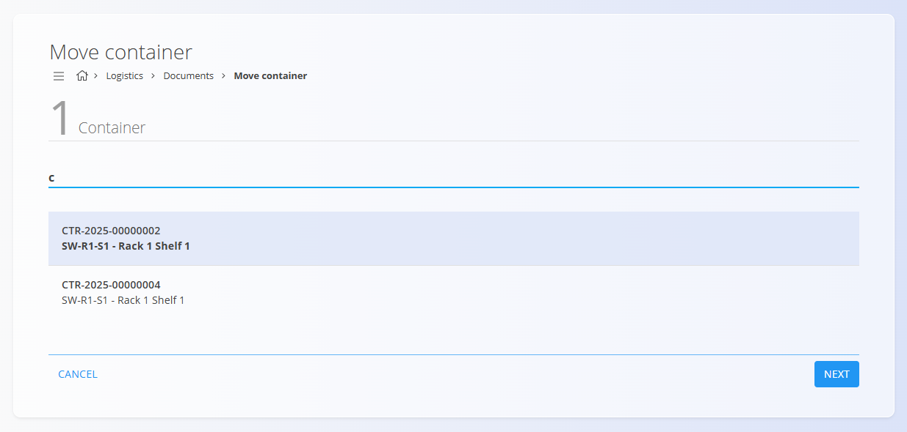
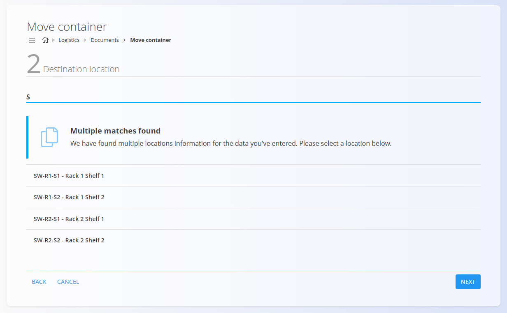

# Premik vsebnika

Zaslon **Premik vsebnika** omogoča poenostavljen delovni tok za premik **enega vsebnika** iz ene skladiščne lokacije na drugo. Namenjen je hitrim operacijam (skeniraj in potrdi) brez uporabe seznamov dokumentov ali [akcijskega gumba](../../Skupno/UI/AkcijskiGumb.md).

Ta postopek je podoben funkciji **[Premakni serijsko številko](PremakniSerijskoStevilko.md)**, vendar se uporablja za **vsebnike** (npr. palete ali škatle), ki vsebujejo enega ali več materialov.

> [!NOTE]
> Premik vsebnika posodobi zalogo tako, da se **vse postavke znotraj vsebnika** premaknejo z izvorne lokacije na ciljno lokacijo.

> [!TIP]
> Za celovit prikaz si oglejte video vodič **[Premik vsebnika](https://www.youtube.com/watch?v=r_H76lJd7XY)**.

Za dostop do **Premika vsebnika** pojdite na **Logistika / Dokumenti / Premik vsebnika** v [**navigaciji**](../../Skupno/UI/Navigacija.md).

## Predpogoji

- Definirane morajo biti skladiščne **[Lokacije](../Upravljanje/Lokacije.md)**.
- **[Vsebnik](Vsebniki.md)** mora biti registriran in imeti skenirljiv identifikator (črtna koda / EAN / koda).

## Koraki

### Korak 1 — Identifikacija vsebnika

Skenirajte črtno šifro vsebnika ali vnesite **šifro vsebnika**. Uporabniški vmesnik prikaže podatke o vsebniku in njegovo trenutno lokacijo.

- Če je najdenih več ujemanj, izberite pravilen vsebnik.
- Če trenutna lokacija ni znana, jo lahko nastavite ročno.

### Korak 2 — Izbira ciljne lokacije

Izberite **ciljno lokacijo**. To lahko storite na dva načina:
- skenirate oznako ciljne lokacije ali
- ročno vnesete lokacijo.

> [!TIP]
> - Uporabljajte standardizirane oznake lokacij za hitrejše skeniranje.
> - Preverite razpoložljivost lokacije, če vaš proces upošteva kapacitetna pravila. Za več informacij glejte **[Meje zaloge](../Upravljanje/MejeZaloge.md)**.

### Korak 3 — Potrditev premika

Preglejte povzetek (vsebnik, izvorna in ciljna lokacija) in kliknite **Konec**. Sistem zabeleži premik vsebnika in vseh postavk, ki jih vsebuje.

Po potrditvi:
- lokacija vsebnika se spremeni na ciljno,
- vse postavke znotraj vsebnika so v pregledih zaloge prikazane na končni lokaciji,
- vse podrobnosti premika si lahko ogledate na strani **[Med-skladiščni promet](MedSkladiscniPromet.md)**.
