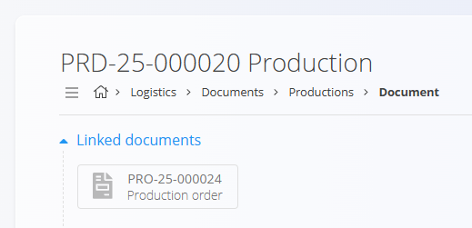
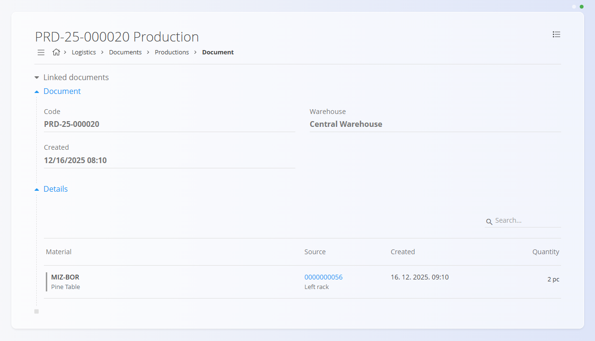
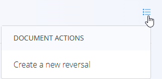

# Proizvodnje

Dokument **Proizvodnja** beleži postavke, ki so bile proizvedene med izvajanjem **proizvodnega naloga**. Dokumenti proizvodnje se ustvarijo **samodejno** v modulu [**Izvajanje**](../../Proizvodnja/Dokumenti/Izvajanje.md), ko proizvodni delavec zabeleži proizvedene količine. Proizvodnje povečujejo zalogo proizvedenih izdelkov in zagotavljajo sledljivost tega, kar je bilo izdelano.

Za vnos proizvedenih količin na proizvodni strani glejte **[Izvajanje](../../Proizvodnja/Dokumenti/Izvajanje.md)** (Izhodi). Izhodi so tesno povezani s to stranjo: beleženje proizvedenih postavk v proizvodnji ustvari ustrezen dokument proizvodnje v logistiki. Za določanje izhodov v procesih glejte **[Izhodi](../../Proizvodnja/Šifranti/Izhodi.md)**.

Za dostop do **Proizvodnje** pojdite na **Logistika / Dokumenti / Proizvodnje** v [navigaciji](../../Skupno/UI/Navigacija.md).

## Shema

### Razdelek dokumenta

| Polje | Opis |
|------|------|
| [**Koda**](../../Skupno/UI/KodeDokumentov.md) | Sistemsko generiran enolični identifikator dokumenta proizvodnje. |
| **Ustvarjeno** | Datum in čas, ko je bil dokument ustvarjen. |
| [**Skladišče**](../Šifranti/Skladišča.md) | Skladišče, v katerem so bile knjižene proizvedene postavke. |

### Razdelek postavk

| Polje | Opis |
|------|------|
| [**Material**](../../Sredstva/Domena/Materiali.md) | Proizvedena postavka (najpogosteje [izdelek](../../Sredstva/Šifranti/Izdelki.md) ali [polizdelek](../../Sredstva/Šifranti/Polizdelki.md)). |
| **Količina** | Zabeležena proizvedena količina za posamezno postavko. |

## Seznam dokumentov proizvodnje

Stran **Proizvodnje** prikazuje vse dokumente proizvodnje, ustvarjene prek izvajanja. Seznam lahko filtrirate z:

- **Datumi dokumentov**
- **Pogled**
  - *Osnutki* — proizvodnja v teku (še se beleži v izvajanju)
  - *Objavljeni* — zaključen dokument proizvodnje
- **Avtor**
- **Skladišče**

## Dejanja

Dokumentov proizvodnje **ni mogoče ustvariti ročno** na tej strani (ni [**akcijskega gumba**](../../Skupno/UI/AkcijskiGumb.md)). Ustvarijo se v modulu [**Izvajanje**](../../Proizvodnja/Dokumenti/Izvajanje.md) med beleženjem izhodov za proizvodni nalog.

Delovni tok:
- Ko proizvodni delavec začne beležiti izhode, se samodejno ustvari **osnutek** dokumenta proizvodnje.
- Ko je postopek **Izvajanja** zaključen, se dokument premakne v stanje **Objavljeno** in je na voljo za pregled.

## Pregled dokumenta proizvodnje

Dokument proizvodnje vsebuje:

### Povezani dokumenti

Če je bil izhod zabeležen za proizvodni nalog, razdelek **Povezani dokumenti** prikaže povezavo do povezanega **[Proizvodnega naloga](../../Proizvodnja/Dokumenti/ProizvodniNalogi.md)**.

### Dokument in postavke

Razdelek **Postavke** prikazuje vse proizvedene postavke z njihovimi zabeleženimi količinami.

## Meni

Objavljene dokumente proizvodnje je mogoče popraviti s pomočjo storna. Odprite **meni dokumenta** in izberite:

- **Ustvari novo storno**

S tem se ustvari dokument storna, ki izniči zalogovni in (odvisno od konfiguracije sistema) tudi finančni učinek knjiženja proizvodnje. Za več informacij glejte **[Storno](Storno.md)**.

## Brisanje

Dokumentov proizvodnje **ni mogoče izbrisati** iz sistema, saj je potrebno zagotoviti sledljivost proizvedenih postavk. Dokumente je mogoče samo **stornirati**, kot je opisano zgoraj.

---
