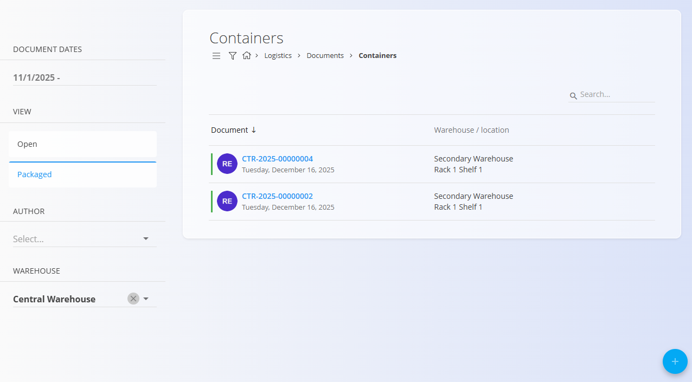
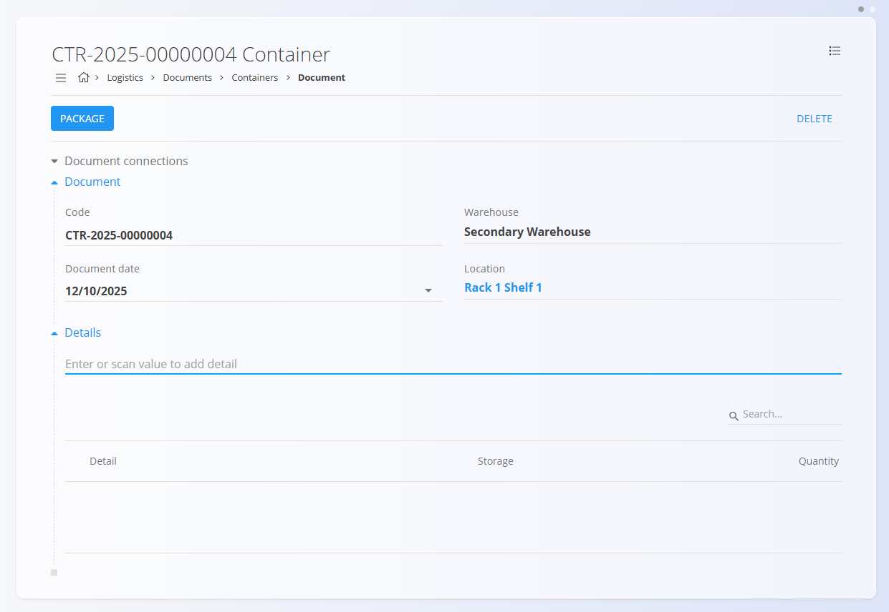
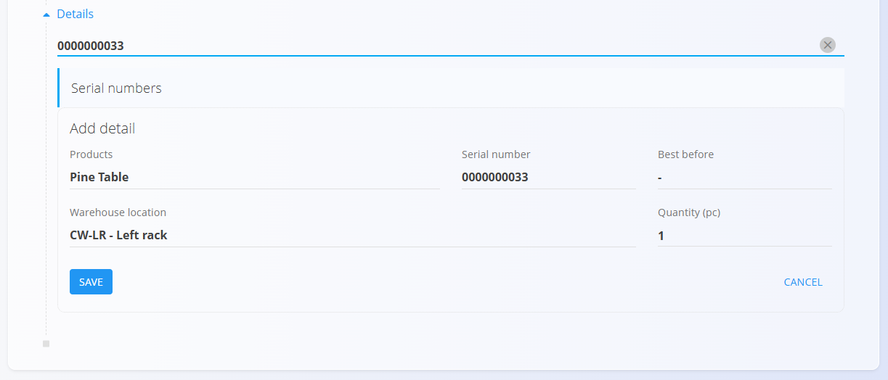
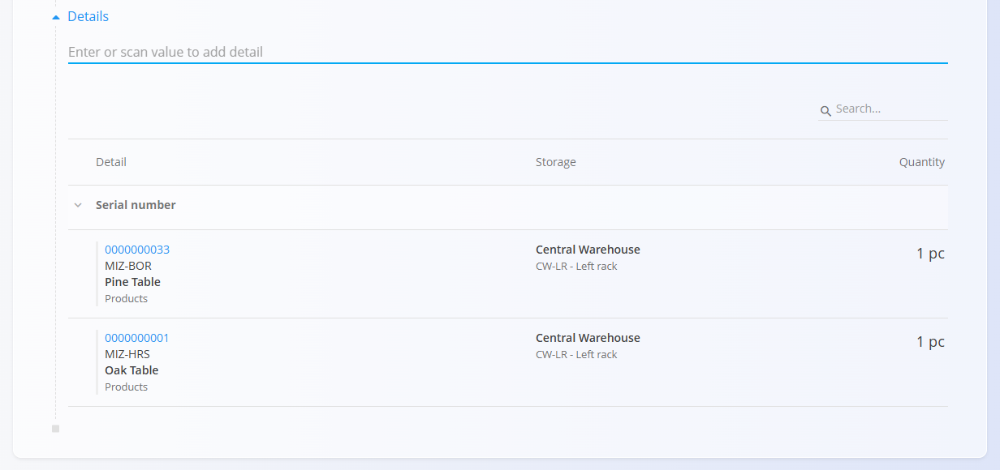
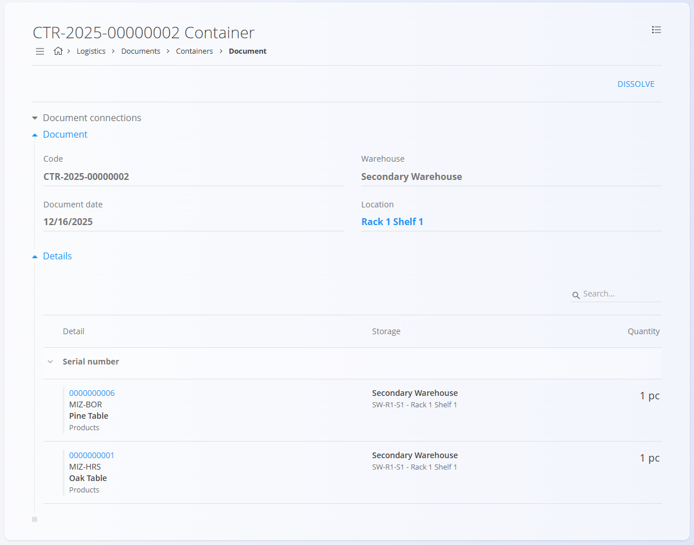

# Vsebniki

**Vsebnik** združuje eno ali več postavk pod eno serijsko šifro (pogosto **SSCC – Serial Shipping Container Code**). To omogoča pakiranje, premikanje in skeniranje celotnega sklopa hkrati, brez potrebe po odpiranju vsebnika. Postavke, ki so dodane v vsebnik, so **rezervirane za ta vsebnik** in jih ni mogoče uporabiti v drugih transakcijah, dokler vsebnik ni razpuščen ali dokler posamezne postavke niso odstranjene.

> [!TIP]
> Za celovit prikaz si oglejte video vodič **[Vsebniki](https://www.youtube.com/watch?v=2V9K1jTsyQI)**.

Za dostop do **Vsebnikov** pojdite na **Logistika / Dokumenti / Vsebniki** v [navigaciji](../../Skupno/UI/Navigacija.md).

## Shema

### Razdelek dokumenta

| Polje | Opis |
|------|------|
| [**Šifra**](../../Skupno/UI/SifreDokumentov.md) | Sistemsko generiran enolični identifikator vsebnika SSCC (v obliki: CTR-LLLL-NNNNNNNN). |
| [**Skladišče**](../Sifranti/Skladisca.md) | Skladišče, v katerem se vsebnik nahaja. |
| **Datum dokumenta** | Datum, ko je bil dokument vsebnika ustvarjen. |
| [**Lokacija**](../Sifranti/Lokacije.md) | Skladiščna lokacija (npr. regal / polica). |

### Razdelek postavk

| Polje | Opis |
|------|------|
| [**Material**](../../Sredstva/Domena/Materiali.md) | Zapakirana postavka (izdelek, polizdelek, surovina ali repro material). |
| **Serijska številka** | Serijska ali lot številka zapakirane postavke. |
| **Datum do** | Datum poteka, če se sledi roku uporabe. |
| **Skladiščna lokacija** | Lokacija postavke po vrstici (če je relevantno). |
| **Količina** | Količina zapakirane postavke. |

## Seznam dokumentov vsebnikov

Stran **Vsebniki** prikazuje vse dokumente vsebnikov. Na voljo so filtri:
- **Datumi dokumentov**
- **Pogled** (Osnutki, Zapakirano)
- **Skladišče**
- **Avtor**

## Dejanja

Vsebniki se ustvarjajo ročno na tej strani.

1. Kliknite [**akcijski gumb**](../../Skupno/UI/AkcijskiGumb.md) za ustvarjanje novega dokumenta vsebnika.
2. Določite **Skladišče** in **Lokacijo**.

   

3. Ustvari se **osnutek** vsebnika. Po potrebi uredite **Datum dokumenta**.

   

4. V polje **Postavke** vnesite ali skenirajte **serijsko številko**, **EAN** ali **ime materiala**. Sistem prikaže vse ujemajoče se materiale in serijske številke. Če je več ujemanj, izberite pravilno postavko.

   

5. **Izberite pravilno količino** in kliknite **Shrani**, da shranite postavko. Po potrebi postopek ponovite.

   

6. Ko ste pripravljeni, kliknite **Zapakiraj**, da rezervirate vsebino in omogočite nadaljnje logistične operacije.

Zapakiran vsebnik je pripravljen za uporabo, stanje pa se spremeni v **Zapakirano**. V meniju lahko natisnete ali izvozite nalepke z **SSCC šifro vsebnika**.

> [!NOTE]
> Postavke v **zapakiranem** vsebniku so rezervirane in jih ni mogoče posamezno obdelovati (izdaja / prevzem / premik). Za sprostitev vsebine je potrebno vsebnik **razpustiti** ali odstraniti posamezno postavko.

### Uporaba vsebnikov

- **Komisioniranje / izdaja:** skenirajte šifro vsebnika v **[Izdajnicah](Izdajnice.md)**, da dodate celotno vsebino naenkrat
- **Prevzem / uskladiščenje:** skenirajte v **[Prevzemih](Prevzemi.md)** za vnos celotnega sklopa v zalogo
- **Premiki:** uporabite **[Med-skladiščni promet](MedSkladiscniPromet.md)** ali **[Premakni serijsko številko](PremakniSerijskoStevilko.md)** in skenirajte vsebnik za skupni premik
- **Pregled zaloge:** uporabite **[Zaloga](Zaloga.md)** ali **[Pogled zaloge po lokacijah](../Pregledi/PogledZalogePoLokacijah.md)** za preverjanje prisotnosti in lokacije vsebnika

## Pregled vsebnika

- Glava prikazuje šifro vsebnika, skladišče, datum in lokacijo
- Postavke prikazujejo zapakirane materiale, serijske številke, lokacije in količine
- **Povezave dokumentov** (če obstajajo) prikazujejo povezane logistične transakcije

> [!TIP]
> - Kliknite **Lokacijo**, da odprete **[Pogled zaloge po lokacijah](../Pregledi/PogledZalogePoLokacijah.md)**, filtriran na izbrano lokacijo.  
> - Kliknite serijsko številko materiala, da odprete **[Pogled zaloge po serijski številki](Zaloga.md#pogled-zaloge-po-serijski-stevilki)**.

## Meni

V **meniju dokumenta** so na voljo naslednje možnosti:

- **Tiskanje** (če je konfigurirano) — natisne nalepko vsebnika (SSCC)
- **Izvoz** — izvozi nalepko vsebnika (SSCC) v PDF

## Brisanje

- Osnutke vsebnikov je mogoče prosto izbrisati
- Zapakiranih vsebnikov **ni mogoče izbrisati**; za sprostitev vsebine uporabite **Razpusti**

---
