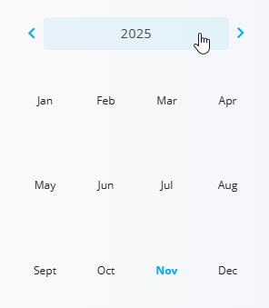

# Zaloga

Stran **Zaloga** nudi celovit pregled količin materialov v celotnem sistemu. Prikazuje, koliko materiala je na voljo, blokiranega ali rezerviranega, ter omogoča hitro iskanje posameznih materialov s pomočjo iskanja ali razvrščanja seznama. Od tu lahko odprete podrobne poglede zaloge, da razumete, kje je material shranjen, kako se uporablja in kako se je skozi čas premikal.

Na voljo so **[Pogled zaloge po materialu](#pogled-zaloge-po-materialu)**, **[Pogled zaloge po lokacijah](#pogled-zaloge-po-lokacijah)** in **[Pogled zaloge po serijski številki](#pogled-zaloge-po-serijski-stevilki)**, ki omogočajo podrobnejši vpogled v količine, lokacije, premike in zgodovino skladiščenja. Minimalne in maksimalne pragove, prikazane v povezanih povzetkih, lahko nastavite v šifrantu **[Meje zaloge](../Upravljanje/MejeZaloge.md)**. **[Nadzorna plošča](NadzornaPlosca.md)** prav tako ponuja bližnjice do težav z zalogo, kot so pomanjkanje, presežki ali materiali brez zaloge.

> [!TIP]
> Za celovit prikaz si oglejte video vodič **[Pregled zaloge](https://www.youtube.com/watch?v=gjAKnavIWnY)**.

Za dostop do **Zaloge** pojdite na **Logistika / Zaloga** v [**navigaciji**](../../Skupno/UI/Navigacija.md).

## Filtri in navigacija

Leva stranska vrstica vsebuje več filtrov.

### **Koledarski filter**
Izberete lahko določen datum za prikaz stanja zaloge, kot je bilo na ta dan.

S klikom na ime meseca se odpre hiter pogled za izbiro meseca in leta:

### **Filter vrste materiala**
Seznam lahko filtrirate po:

- [Izdelki](../../Sredstva/Materiali/Izdelki.md)  
- [Polizdelki](../../Sredstva/Materiali/Polizdelki.md)  
- [Repro materiali](../../Sredstva/Materiali/ReproMateriali.md)  
- [Surovine](../../Sredstva/Materiali/Surovine.md)

### **Filter oznak**
Seznam lahko dodatno zožite z izbiro oznak materialov.

## Seznam zaloge

Glavni seznam prikazuje vse materiale v **abecednem vrstnem redu**.  
Razvrščanje lahko prilagodite:

- po **imenu materiala** (A–Z ali Z–A)  
- po **količini**

Na vrhu je na voljo iskalno polje za hitro iskanje določenih materialov.

Vsaka vrstica prikazuje:
- **šifro in ime materiala**
- **količino**
- **oznako vrste materiala**

S klikom na material se odpre podrobni pogled zaloge.

## Pogled zaloge po materialu

S klikom na **ime materiala** se odpre podroben razčlenjen prikaz, kje je material shranjen, vključno z razpoložljivimi, rezerviranimi in blokiranimi količinami na vseh **[lokacijah](../Upravljanje/Lokacije.md)**. Od tu lahko odprete tudi **[Pogled zaloge po serijski številki](#pogled-zaloge-po-serijski-stevilki)** za pregled posameznih serij ali enot.

> [!TIP]
> Za celovit prikaz si oglejte video vodič **[Pogled zaloge po materialu](https://www.youtube.com/watch?v=GUdnV6bZwoI)**.

Ta pogled vključuje:
- **skupno zalogo**
- **rezervirano zalogo**
- **Na voljo zalogo**
- **vizualno lestvico**, ki prikazuje zalogo glede na min/max meje  
- **razčlenitev po skladiščnih mestih**, vključno z:
  - skladiščem in lokacijo  
  - serijskimi številkami (če obstajajo)  
  - količinami  
- razdelek **Histogram**, ki prikazuje spremembe zaloge skozi izbrana časovna obdobja

Na voljo je tudi iskalno polje za filtriranje znotraj izbranega materiala.

## Pogled zaloge po lokacijah

Zaslon **Pogled zaloge po lokacijah** prikazuje vse materiale, shranjene na določeni **[skladiščni lokaciji](../Upravljanje/Lokacije.md)**, skupaj z njihovimi skupnimi, rezerviranimi in razpoložljivimi količinami. Uporaben je, kadar želite preveriti, kaj je fizično shranjeno na določenem regalu, polici ali skladiščnem območju.

Do tega pogleda lahko dostopate na dva načina:
- prek **Logistika / Pregledi / Pogled zaloge po lokacijah**
- s klikom na **ime lokacije** v drugih pogledih zaloge (npr. v pogledu zaloge po materialu)

Za več podrobnosti glejte **[Pogled zaloge po lokacijah](../Pregledi/PogledZalogePoLokacijah.md)**.

## Pogled zaloge po serijski številki

Material ima lahko več **serijskih številk**, ki predstavljajo različne serije, datume proizvodnje ali **[skladiščne lokacije](../Upravljanje/Lokacije.md)**. S klikom na posamezno serijsko številko se odpre njen namenski pogled, kjer lahko preverite premike, zgodovino skladiščenja in priloge.

> [!TIP]
> Za celovit prikaz si oglejte video vodič **[Pogled zaloge po serijski številki](https://www.youtube.com/watch?v=_vzXNsGg5N4)**.

Ta pogled prikazuje:
- **material in serijsko številko** – konkretno enoto, ki jo pregledujete  
- **Graf zaloge** – vizualni prikaz skupne in razpoložljive količine  
- **Dodelitve** – seznam vseh lokacij, kjer je ta serijska številka prisotna, skupaj s količinami  
- **Priponke** – datoteke, povezane s to serijsko številko (npr. poročila o kakovosti ali fotografije)  
- **Dnevnik** – časovnico vseh premikov in transakcij, povezanih s to serijsko številko

Zaslon **Pogled zaloge po serijski številki** je samo za branje in je namenjen podrobnemu sledenju in sledljivosti posamezne serijske številke.

---
