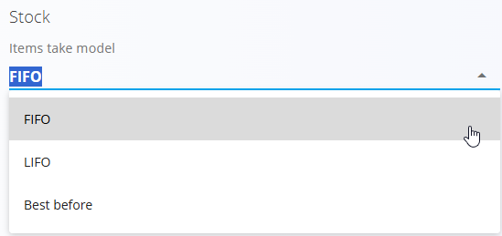

# Konfiguracija logistike

Konfiguracija **Logistike** omogoča nastavitev vedenja zaloge, oblik zapisa serijskih številk in številčenja dokumentov. Vse spremembe se **samodejno shranijo**.

Za dostop do te strani pojdite na **Logistika / Upravljanje / Konfiguracija** v [navigaciji](../../Skupno/UI/Navigacija.md).

## Nastavitve zaloge

| Polje | Opis |
|------|------|
| **Način jemanja artiklov** | Pravilo za porabo zaloge:   • **FIFO:** najprej se porabi najstarejša zaloga   • **LIFO:** najprej se porabi najnovejša zaloga   • **Rok uporabe:** najprej se porabi zaloga z najzgodnejšim rokom uporabe |
| **Format serijske številke** | Oblika zapisa, ki se uporabi, ko sistem samodejno generira serijske številke. Na primer **{0:D10}** ustvari 10-mestno številko z vodilnimi ničlami: **0000000001**, **0000000002**, itd. |

> [!TIP]
> Uporabite dosleden format serijskih številk za lažje skeniranje in sledenje.

## Nastavitve številčenja dokumentov

Izberite model številčenja in format za logistične dokumente (Prevzemi, Izdaje, Medskladiščni prenosi itd.).

| Polje | Opis |
|------|------|
| **Model številčenja dokumentov** | • **Naraščajoče po letih:** zaporedje se vsako leto ponastavi   • **Naraščajoče:** globalno zaporedje, ki se nikoli ne ponastavi |
| **Format kode dokumenta** | Vzorec, ki določa strukturo kode dokumenta (npr. PREDPONA-LETO-ŠTEVILKA). |

---
