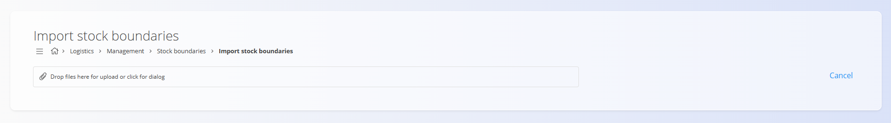

# Meje zaloge

Ta šifrant predstavlja **meje zaloge** za posamezne materiale ali izdelke v sistemu. Vsak zapis določa **minimalno** in **maksimalno** dovoljeno količino zaloge za izbran tip materiala, kar pomaga zagotavljati optimalne zalogovne ravni ter preprečuje pomanjkanje ali presežke zaloge.

> [!TIP]
> Za celovit prikaz si oglejte video vodič  
> **[Meje zaloge](https://www.youtube.com/watch?v=rcbxvffOBdM)**.

## Shema

| Polje | Opis |
|-------|------|
| **Entiteta** | Material ali izdelek, za katerega veljajo meje zaloge. Prikazan je s kodo in imenom. |
| **Min** | Minimalna dovoljena količina zaloge za izbran material ali izdelek. Ko količina pade pod to vrednost, sistem stanje poudari na **[Nadzorni plošči](../Dokumenti/NadzornaPlosca.md)**. |
| **Max** | Maksimalna dovoljena količina zaloge za izbran material ali izdelek. Ko je ta vrednost presežena, sistem stanje poudari na **[Nadzorni plošči](../Dokumenti/NadzornaPlosca.md)**. |

## Upravljanje

Za dostop do šifranta **Meje zaloge** pojdite na  
**Logistika / Upravljanje / Meje zaloge** v [navigaciji](../../Skupno/UI/Navigacija.md).

### Seznam mej zaloge

Uporabniški vmesnik prikazuje seznam vseh materialov in njihovih določenih mej zaloge. Na levi strani uporabite izbirnik **Vrsta materiala** za filtriranje po kategorijah, filter **Oznake** pa omogoča dodatno zoženje prikazanih zapisov.

Vsak zapis prikazuje **Entiteto**, **Min** in **Max** količino zaloge.  
Če vrednost za **Min** ali **Max** ni določena, sistem privzeto prikaže **0**.

Meje zaloge lahko urejate **neposredno v seznamu** — kliknite številsko vrednost v stolpcu **Min** ali **Max**, vnesite novo vrednost, sprememba pa se samodejno shrani.


Vsaka količina zaloge, ki pade **pod minimalno** ali preseže **maksimalno** vrednost, je vizualno označena na **[Nadzorni plošči](../Dokumenti/NadzornaPlosca.md)**.

## Dejanja

Kliknite [**akcijski gumb**](../../Skupno/UI/AkcijskiGumb.md), da se prikaže dejanje **Uvoz**.

### Uvoz

Dejanje **Uvoz** omogoča množično ustvarjanje ali posodabljanje zapisov mej zaloge z uporabo **CSV** datoteke. Pripravite datoteko z zahtevanimi polji (**Entiteta**, **Min**, **Max**) in jo naložite za samodejno zapolnitev seznama.



Kliknite **Prekliči**, da se vrnete na seznam brez uvoza.

#### Primer strukture CSV

```csv
Material Code;Material type;Min;Max;
M-0001;1;10;100;
M-0002;2;0;250;
M-0003;3;50;0;
M-0004;4;20;80;
```

## Meni 

Meni v zgornjem desnem kotu ponuja možnost **Izvoz v CSV**, ki izvozi vse vidne zapise v CSV datoteko za poročanje, analizo ali varnostno kopijo.

---