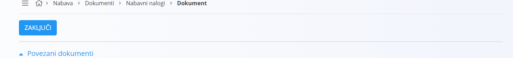
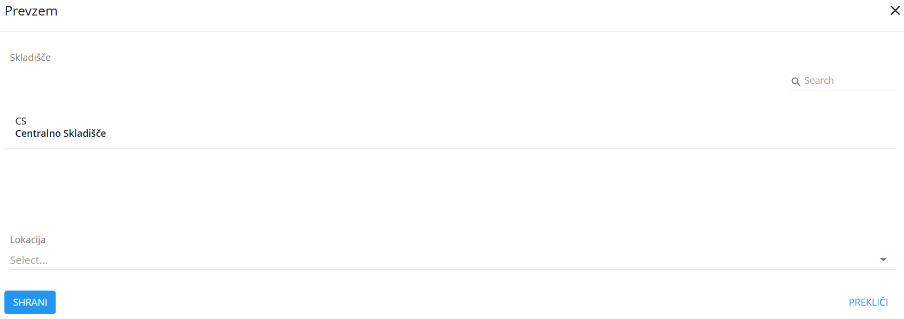
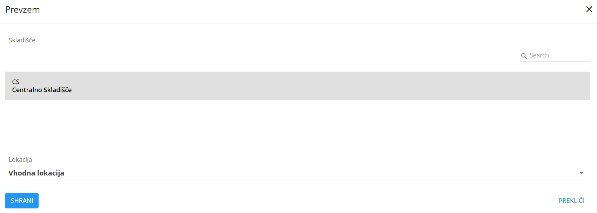
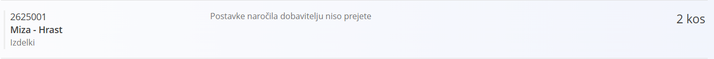

# Nabavni nalog

Dokument Nabavni nalog je poslovni dokument, ki predstavlja temeljno orodje za izvajanje nabavnega procesa v podjetju. Gre za uradno zahtevo oziroma naročilo, ki ga podjetje pošlje dobavitelju z namenom, da pridobi blago ali storitve pod dogovorjenimi pogoji. V njem so natančno določeni podatki o naročenih [materialih](../../Splosno/Materiali.md), količinah, cenah, dobavnih rokih, plačilnih pogojih in drugih bistvenih elementih, ki zagotavljajo jasno in pregledno komunikacijo med kupcem (vami) in dobaviteljem.

Vloga nabavnega naloga je večplastna. Na eni strani podjetju omogoča sledljivost in kontrolo nabavnega procesa, saj vsako naročilo postane evidentirano in povezano z notranjimi potrebami (na primer potrebami proizvodnje, skladišča ali posameznih oddelkov). Na drugi strani pa služi kot pravna osnova v odnosu z dobaviteljem, saj potrjuje naročilo in omogoča kasnejše preverjanje ustreznosti dobavljenega blaga glede na naročene količine in dogovorjene pogoje.

Nabavni nalog je tudi ključna povezava med več različnimi digitalnimi vsebinami v sistemu. Povezuje se s šifranti [materialov](../../Splosno/Materiali.md), s [poslovnim imenikom](../../Splosno/Sifranti/PoslovniImenik.md) dobaviteljev ter s [skladiščnimi](../../Skladisce/Dokumenti/README.md) dokumenti, kjer se naročeno blago evidentira ob prevzemu. Na ta način zagotavljamo integriran in pregleden potek celotnega nabavnega procesa, od naročila do dobave in kasnejše uporabe materialov.

> [!TIP]  
> Prerekviziti za uporabo tega dokumenta so:  
>  
> - [Dobavitelji](../../Splosno/Sifranti/PoslovniImenik.md)  
>  
> Poskrbite za omenjene prerekvizite, preden začnete z uporabo teh dokumentov.

## Življenjski cikel

Nabavni nalog ima, tako kot vsak drug dokument v sistemu, vnaprej določen življenjski cikel. Življenjski cikel predstavljajo stanja oziroma status, v katerem se dokument v posameznem trenutku nahaja. Dokument lahko ima v istem trenutku en in samo en status.

Nabavni nalog pozna naslednje statuse:

- **Osnutek**
- **Na voljo**
- **V zaključevanju**
- **Zaključen**

Ko dokument ustvarite, ima samodejno nastavljen `Status` na **Osnutek**. Vse dokler dokument pripravljate, bo ostal v tem statusu.

> [!IMPORTANT]
> Večino polj lahko urejate samo dokler je dokument v statusu **Osnutek**. Po objavi večino polj iz glave in postavk ne morete več spreminjati.

Trenuten status dokumenta lahko vidite v skrajnem desnem zgornjem kotu.

Prehod med statusi izvajate s pomočjo gumbov v [orodni vrstici](#orodna-vrstica).

## Naslovna vrstica

## Orodna vrstica

Orodna vrstica se nahaja tik pod naslovno vrstico. Vsebuje gumbe, prikaz katerih pa je odvisen od trenutnega statusa dokumenta.

### Objavi

Gumb objavi je viden, v kolikor je dokument v statusu **Osnutek**. Klik na gumb izvede prehod statusa dokumenta v **Na voljo**. Bodite pozorni na morebitna sporočila o manjkajočih podatkih in jih ustrezno dopolnite, saj sistem ne bo izvedel prehoda, dokler podatki ne bodo ustrezno izpolnjeni.

### Zaključi

## Povezani dokumenti

Sekcija omogoča [povezovanje](../../Koncepti/PovezaniDokumenti.md) različnih dokumentov z nabavnim nalogom, s ciljem zagotavljanja [materialne sledljivosti](../../Koncepti/MaterialnaSledljivost.md).

### Prazen prevzem

Kreiranje praznega prevzema pomeni, da boste ustvarili [prevzemni](../../Skladisce/Dokumenti/Prevzem.md) dokument neposredno iz nabavnega naloga. Dokumenta bosta povezana in z nabavnim nalogom se vam ni potrebno več ukvarjati, saj za njegov življenjski cikel skrbi prevzem. Ko je prevzemni dokument zaključen, je samodejno zaključen tudi nabavni nalog. Ustvarjanje prevzema iz nabavnega naloga ima še eno prednost; na seznamu postavk vidite, katere [materiale](../../Splosno/Materiali.md) morate po nabavnem nalogu sprejeti.

Klik na **Prazen prevzem** odpre [modalno okno](../../Splosno/UporabniskiVmesnik/ModalnoOkno.md).

Na uporabniškem vmesniku so izpisana [skladišča](../../Skladisce/Sifranti/Skladisce.md). Kliknite na skladišče, v katero želite blago prevzeti. Po kliku na skladišče se osveži seznam [skladiščnih lokacij](../../Skladisce/Sifranti/SkladiscneLokacije.md). 

Izberite privzeto lokacijo, v katero boste blago prejemali in kliknite **Shrani**. Sistem ustvari nov [prevzemni dokument](../../Skladisce/Dokumenti/Prevzem.md), izpolni ustrezna polja, naredi povezavo in v seznamu postavk virtualno napolni seznam. Na ta način lahko vidite, katero blago še morate prevzeti oziroma katere postavke prevzema še niso skladne z nabavnim nalogom.

Za podrobnejšo razlago o prevzemu materiala si preberite poglavje o [prevzemnem dokumentu](../../Skladisce/Dokumenti/Prevzem.md).

> [!TIP]
> Ko je povezan prevzemni dokument zaključen, se nabavni nalog samodejno zaključi, v kolikor so vse postavke bile prevzete. V kolikor niso bile prevzete vse postavke, lahko ponovno ustvarite prevzemni dokument. V tem primeru bodo na seznamu postavk samo postavke, ki niso bile zaprte na prvem prevzemu.

### Polni prevzem

### Prevzem

### Dodaj Opravilo

### Projekt

### Kopiraj nabavni nalog

## Priponke

## Dokument

Ta sekcija obravnava glavo dokumenta in ponuja naslednja vnosna polja:

|Polje|Opis
|---|---
|**Šifra**| Unikatna šifra dokumenta, ki enolično identificira dokument.
|**Datum dokumenta**|Datum, ko je bil dokument ustvarjen. Praviloma takrat, ko je bilo naročilo dobavitelju oddano.
|**Rabat**| Popust, ki je bil dan s strani dobavitelja na celotno naročilo.
|**Šifra ponudbe**| V kolikor je dobavitelj najprej poslal ponudbo oziroma odgovoril na [povpraševanje](Povprasevanje.md), to polje vsebuje število dobaviteljevega dokumenta.
|**Dobavitelj**|Dobavitelj, pri kateremu se blago naroča.
|**Datum dobave**|Datum, ko bo dobavitelj blago dostavil.
|**Stroškovno mesto**| Stroškovno mesto, na katerega bo računovodstvo stroške dobave knjižilo.

## Dostava

Ni nujno, da želimo, da je naročeno blago dostavljeno na sedež podjetja. V kolikor želimo, da se blago dostavi na specifičen naslov

## Vsebina na vrhu

## Postavke

### Materiali

### Stroški

## Vsebina na dnu
