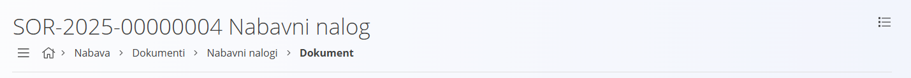
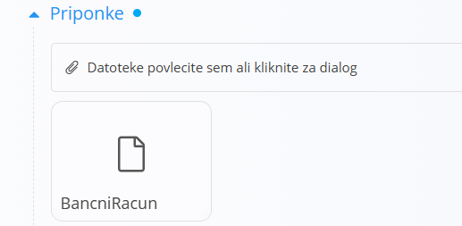
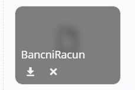
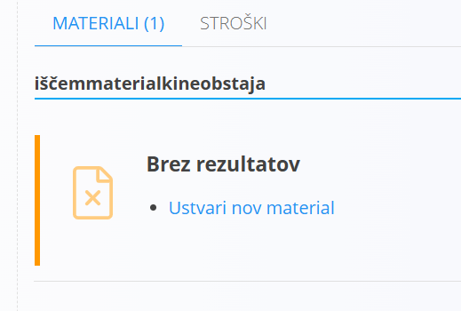
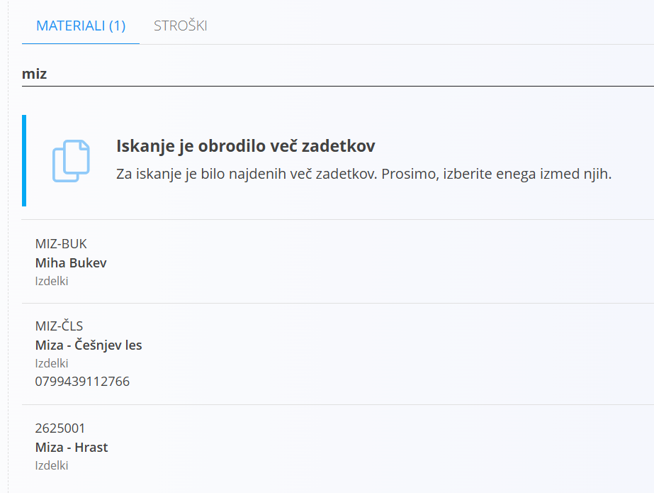
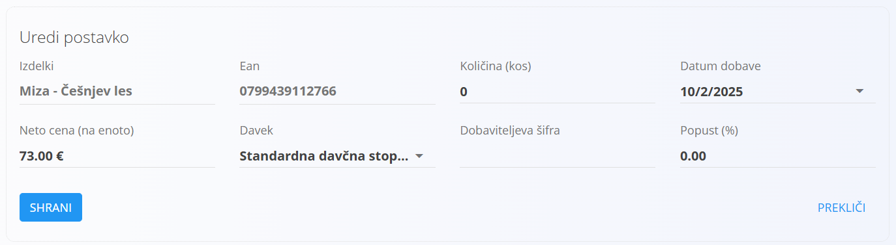

# Nabavni nalog

Dokument Nabavni nalog je poslovni dokument, ki predstavlja temeljno orodje za izvajanje nabavnega procesa v podjetju. Gre za uradno zahtevo oziroma naročilo, ki ga podjetje pošlje dobavitelju z namenom, da pridobi blago ali storitve pod dogovorjenimi pogoji. V njem so natančno določeni podatki o naročenih [materialih](../../Splosno/Materiali.md), količinah, cenah, dobavnih rokih, plačilnih pogojih in drugih bistvenih elementih, ki zagotavljajo jasno in pregledno komunikacijo med kupcem (vami) in dobaviteljem.

Vloga nabavnega naloga je večplastna. Na eni strani podjetju omogoča sledljivost in kontrolo nabavnega procesa, saj vsako naročilo postane evidentirano in povezano z notranjimi potrebami (na primer potrebami proizvodnje, skladišča ali posameznih oddelkov). Na drugi strani pa služi kot pravna osnova v odnosu z dobaviteljem, saj potrjuje naročilo in omogoča kasnejše preverjanje ustreznosti dobavljenega blaga glede na naročene količine in dogovorjene pogoje.

Nabavni nalog je tudi ključna povezava med več različnimi digitalnimi vsebinami v sistemu. Povezuje se s šifranti [materialov](../../Splosno/Materiali.md), s [poslovnim imenikom](../../Splosno/Sifranti/PoslovniImenik.md) dobaviteljev ter s [skladiščnimi](../../Skladisce/Dokumenti/README.md) dokumenti, kjer se naročeno blago evidentira ob prevzemu. Na ta način zagotavljamo integriran in pregleden potek celotnega nabavnega procesa, od naročila do dobave in kasnejše uporabe materialov.

> [!TIP]  
> Prerekviziti za uporabo tega dokumenta so:  
>  
> - [Dobavitelji](../../Splosno/Sifranti/PoslovniImenik.md)  
> - [Stroškovna mesta](../../Splosno/Sifranti/StroskovnoMesto.md)  
> - [Vnaprej določena besedila](../../Splosno/Sifranti/VnaprejDolocenoBesedilo.md)  
>  
> Poskrbite za omenjene prerekvizite, preden začnete z uporabo teh dokumentov.

## Življenjski cikel

Nabavni nalog ima, tako kot vsak drug dokument v sistemu, vnaprej določen življenjski cikel. Življenjski cikel predstavljajo stanja oziroma status, v katerem se dokument v posameznem trenutku nahaja. Dokument lahko ima v istem trenutku en in samo en status.

Nabavni nalog pozna naslednje statuse:

- **Osnutek**
- **Na voljo**
- **V zaključevanju**
- **Zaključen**

Ko dokument ustvarite, ima samodejno nastavljen `Status` na **Osnutek**. Vse dokler dokument pripravljate, bo ostal v tem statusu.

> [!IMPORTANT]
> Večino polj lahko urejate samo dokler je dokument v statusu **Osnutek**. Po objavi večino polj iz glave in postavk ne morete več spreminjati.

Trenuten status dokumenta lahko vidite v skrajnem desnem zgornjem kotu.

Prehod med statusi izvajate s pomočjo gumbov v [orodni vrstici](#orodna-vrstica).

## Naslovna vrstica

Naslovna vrstica podaja opisne informacije o dokumentu. 

Na vrhu naslovne vrstice je naziv dokumenta, ki je sestavljen in **Šifre** in statičnega besedila **Nabavni nalog**. Pod nazivov se nahajata dva gumba:

- Navigacija
- Začetna stran

Klik na **Navigacija** odpre pano na levi strani zaslona s kontekstno navigacijo, ki pripazuje sorodne uporabniške vmesnike.

Klik na **Začetna stran** pa vas preusmeri na vstopni uporabniški vmesnik, ki privzeto prikazuje navigacijo do vsebin.

Desno od gumbov je izpisana pot do dokumenta. Vsa besedila, razen zadnjega, ki je izpisan krepko in označuje dejanski dokument, ki je trenutno odprt, so bližnjice, s pomočjo katerih lahko hitro navigirate do nadrejenih vsebin.

## Orodna vrstica

Orodna vrstica se nahaja tik pod naslovno vrstico. Vsebuje gumbe, prikaz katerih pa je odvisen od trenutnega statusa dokumenta.

### Objavi

Gumb **Objavi** je viden, v kolikor je dokument v statusu **Osnutek**. Klik na gumb odpre potrditveno okno z besedilom **Ali ste prepričani, da želite objaviti dokument?**. Potrditev okna izvede prehod statusa dokumenta v **Na voljo**. Bodite pozorni na morebitna sporočila o manjkajočih podatkih in jih ustrezno dopolnite, saj sistem ne bo izvedel prehoda, dokler podatki ne bodo ustrezno izpolnjeni.

### Zaključi

Gumb **Zaključi** je viden, v kolikor je dokument v statusu **Na voljo**. Klik na gumb izvede prehod statusa dokumenta v **Zaključen**.

Nabavni nalog lahko ročno zaključimo. V kolikor nabavni nalog nima povezanih dokumentov, lahko dokument zaključimo kadarkoli. V kolikor pa ima nabavni nalog povezane dokumente, se bo zaključil samodejno, ko bodo zaprte vse postavke preko povezanih dokumentov. V primeru, da želimo ročno zaključiti dokument, ki ima povezane dokumente in postavke še niso zaprte, bo sistem javil napako.

V primeru, da povezanih dokumentov ni, klik na gumb odpre potrditveno okno z besedilom **Ali ste prepričani, da želite zaključiti nabavni nalog?**. S potrditvijo okna se nabavni nalog zaključi. Po zaključku dokumenta je večino funkcij onemogočenih.

### Aktiviraj

Gumb **Aktiviraj** je viden, v kolikor je dokument v statusu **Zaključen**. Klik na gumb odpre potrditveno okno z besedilom **Ali ste prepričani, da želite aktivirati nabavni nalog?**. Potrditev okna izvede prehod statusa dokumenta v **Na voljo**. 

### Izbriši

Nabavni nalog lahko tudi permanentno izbrišete, vendar samo dokler je v `Statusu` **Osnutek**. Klik na gumb odpre potrditveno okno z besedilom **Ali ste prepričani, da želite izbrisati nabavni nalog?** S potrditvijo okna se nabavni nalog permanentno izbriše iz sistema.

## Povezani dokumenti

Sekcija omogoča [povezovanje](../../Koncepti/PovezaniDokumenti.md) različnih dokumentov z nabavnim nalogom, s ciljem zagotavljanja [materialne sledljivosti](../../Koncepti/MaterialnaSledljivost.md).

- [Prazen prevzem](NabavniNalogPrazenPrevzem.md)
- Polni prevzem
- Prevzem
- Dodaj Opravilo
- Projekt
- Kopiraj nabavni nalog

## Priponke

Sekcija priponke omogoča dodajanje datotek dokumentu. V kolikor dokument že vsebuje priponke, je desno od besedila moder indikator.

Datoteko dodamo tako, da bodisi kliknemo na vnosno polje **Datoteke povlecite sem ali kliknite za dialog** ali povlecemo datoteko v vnosno polje. Datoteka se po prenosu prikaže v seznamu že obstoječih datotek. 

Datoteko lahko prenesete na svojo napravo tako, da kliknemo ikono s puščico navzdol. Klik na križec pa prikaže potrditveno okno **Ali ste prepričani, da želite odstraniti prilogo?** S potrditvijo okna se datoteka odstrani iz dokumenta.

## Dokument

Ta sekcija obravnava glavo dokumenta in ponuja naslednja vnosna polja:

|Polje|Opis
|---|---
|**Šifra**| Unikatna šifra dokumenta, ki enolično identificira dokument. Šifra se samodejno nastavi od kreiranju dokumenta in je privzeto v obliki **SOR-2025-00000005**.
|**Datum dokumenta**|Datum, ko je bil dokument ustvarjen. Praviloma takrat, ko je bilo naročilo dobavitelju oddano. Datum je ob kreiranju dokumenta samodejno nastavljen na trenutni datum.
|**Rabat**| Popust, ki je bil dan s strani dobavitelja na celotno naročilo.
|**Šifra ponudbe**| V kolikor je dobavitelj najprej poslal ponudbo oziroma odgovoril na [povpraševanje](Povprasevanje.md), to polje vsebuje število dobaviteljevega dokumenta.
|**Dobavitelj**|[Dobavitelj](../../Splosno/Sifranti/PoslovniImenik.md), pri kateremu se blago naroča.
|**Datum dobave**|Datum, ko bo dobavitelj blago dostavil.
|**Stroškovno mesto**| [Stroškovno mesto](../../Splosno/Sifranti/StroskovnoMesto.md), na katerega bo računovodstvo stroške dobave knjižilo.

## Dostava

Ni nujno, da želimo, da je naročeno blago dostavljeno na sedež podjetja. V kolikor želimo, da se blago dostavi na specifičen naslov oziroma drugemu podjetju, na primer kooperantu, izpolnimo polja v tej sekciji

Sekcija je razdeljena na dva zavihka:

- **Podjetje**
- **Naslov**

### Podjetje

Ta zavihek ponuja naslednja vnosna polja:

|Polje|Opis
|---|---
|**Podjetje**|[Podjetje](../../Splosno/Sifranti/PoslovniImenik.md), ki bo prejemnik blaga. Na primer **Tom PIT d.o.o.**. V kolikor ta vrednost ni izpolnjena, bo kot prejemnik navedeno vaše matično podjetje.
|**Poslovna enota**|[Poslovna enota](../../Splosno/Sifranti/PoslovnaEnota.md), na katero bo blago dostavljeno. Na primer **PE Ljubljana**. Poslovna enota je vedno vezana na **Podjetje**, zato morate najprej izbrati **Podjetje** in nato **Poslovno enoto**. V kolikor je izbrano podjetje, poslovna enota pa ne, bo naslov dostave enak izbranemu **Podjetju**.

### Naslov

Naslov dostave lahko določimo eksplicitno, torej takšno, ki ni vezano ne na naše matično podjetje, ne na podatke iz zavihka **Podjetje**. Naslov ima naslednja vnosna polja:

|Polje|Opis
|---|---
|**Naslov**|Naslov, kamor bo blago dostavljeno. Na primer **Vodnikova 2**.
|**Država**|[Država](../../Splosno/Sifranti/Drzava.md), kamor bo blago dostavljeno, na primer **Slovenija**.
|**Pošta**|[Poštna številka](../../Splosno/Sifranti/PostnaStevilka.md), kamor bo blago dostavljeno, na primer **Celje**.

## Vsebina na vrhu

V kolikor želimo, lahko **pred** izpisom postavk dodamo tudi eno ali več [klavzul](../../Splosno/UporabniskiVmesnik/Klavzule.md), ki bodo vključene v tiskano verzijo dokumenta.

## Postavke

Postavke so osrednji del dokumenta, saj boste praviloma največ časa posvetili prav vnosu postavk. Postavke so namreč tisto, kar pravzaprav naročate. Gre za seznam [materialov](../../Splosno/Materiali.md), ki poleg same definicije vsebuje tudi nekatere druge kritične podatke, kot je na primer **Cena**.

### Materiali

Na vrhu zavihka je vnosno polje, ki deluje kot nekakšen iskalnik materialov. Vanj bodisi vpišete vrednost bodisi jo poskenirate. Islanik išče po naslednjih poljih posameznega materiala:

- **Naziv**
- **Šifra**
- **EAN**

Vpišite željeno vrednost in iskalnik se bo potrdil najti vse materiale, ki ustrezajo vašemu kriteriju. Rezultat iskanja bo eden od naslednjih scenarijev:

- noben zapis ne ustreza kriteriju
- najdenih je več zapisov
- najden je natanko en zapis

#### Noben zapis ne ustreza kriteriju

V kolikor iskalnik prav v nobenem materialu ne najde niti ene vrednosti, ki bi ustrezala kriteriju, vas na to opozori.

V opozorilu imate možnost takojšnjega vnosa materiala. Kliknite na **Ustvari nov material** in odpre se [vnosna maska](../../Splosno/UporabniskiVmesnik/VnosnaMaska.md) za dodajanje novega materiala.

> [!IMPORTANT]
> Gre za skrajšan, kompakten uporabniški vmesnik za vnos materialov, ki podpira samo nekaj osnovnih atributov. Za podrobnejši vnos in upravljanje z materiali priporočamo, da uporabljate privzete uporabniške vmesnike, kot je na primer šifrant [Izdelkov](../../Splosno/Sifranti/Izdelek.md).

Vnosna maska ponuja nasldnja vnosna polja:
|Polje|Opis
|---|---
|**Vrsta materiala**|Vrsta [materiala](../../Splosno/Materiali.md), ki ga želite ustvariti, na primer **Izdelek**.
|**Šifra**|Šifra materiala, na primer **IZD-001**. Ta vrednost je že pred izpolnjena z vrednostjo, ki ste jo vpisali v iskalnik.
|**Osnovna merska enota**|[Merska enota](../../Splosno/Sifranti/MerskaEnota.md) za prikaz količin, na primer **kos**.
|**Naziv**|Naziv materiala, na primer **Miza Hrast**. Tudi ta vrednost je pred izpolnjena z vrednostjo, ki ste jo vpisali v iskalnik.

Kliknite **Dodaj** in material bo ustvarjen, uporabniški vmesnik pa bo prešel v vnos postavke na enak način, kot če bi bil najden [natanko en zapis](#najden-je-natanko-en-zapis).

#### Najdenih je več zapisov

V kolikor ste vpisali takšen kriterij, ki ustreza večim materialom, bo iskalnik izpisal vse materiale, za katere misli, da ustrezajo iskalnim kriterijem.

Klik na katerikoli zapis nas preusmeri v urejanje postavke oziroma uporabniški vmesnik preide v isti način, kot če bi bil najden [natanko en zapis](#najden-je-natanko-en-zapis).

#### Najden je natanko en zapis

V kolikor iskalnik najde samo en zapis, nas nemudoma preusmeri v urejanje oziroma vnos zadetka.

V vnosni maski so naslednja vnosna polja:

|Polje|Opis|
|---|---
|**Vrsta**|Vrsta materiala je izpisana nad samim nazivom. V kolikor ste izbrali **Izdelek**, bo na tem mestu pisali **Izdelki**, za polizdelek **Polizdelki** in tako naprej. V samem polju pa je izpisan **Naziv** materiala. To polje je samo za branje in vrednosti ni mogoče spreminjati.
|**Ean**|Ean vrednost materiala, v kolikor jo ima. Tudi to polje je pred izpolnjeno, samo za branje in ga ni mogoče spreminjati.
|**Količina**|Dejanska količina, ki jo naročate. V oklepaju je izpisana osnovna [merska enota](../../Splosno/Sifranti/MerskaEnota.md) materiala.
|**Datum dobave**|Datum, ko bo material dostavljen. To polje je pred izpolnjeno z vrednostjo **Datum dobave** na dokumentu.
|**Neto cena**|Dogovorjena cena, po kateri boste dostavljeno blago plačali. Polje bo pri prvem naročilu materiala izbranemu dobavitelju prazno. Ko pa enkrat vpišete ceno, bo pri naslednjem naročilu privzeto vnešena zadnja cena, ki ste jo vnesli za izbrani material in izbranega dobavitelja.
|**Davek**|Izberete davčno stopnjo, po kateri se obračuna DDV za izbran material.
|**Dobaviteljeva šifra**|V kolikor ima dobavitelj za material šifro in jo poznate, jo vpišete v to polje.
|**Popust**|V kolikor vam je dobavitelj na izbran material odobril poseben popust, ga vpišete v to polje.

Kliknite **Shrani** da material bodisi vnesete bodisi popravite obstoječe vrednosti, v kolikor urejate obstoječo postavko. Kliknite na **Prekliči**, da vas uporabniški vmesnik preusmeri na seznam obstoječih postavk brez shranjevanja. V kolikor gre za dodajanje postavke, bo postavka odstranjena iz seznama.

#### Seznam postavk

#### Urejanje postavke

#### Brisanje postavke

### Stroški

## Vsebina na dnu

V kolikor želimo, lahko **za** izpisom postavk dodamo tudi eno ali več [klavzul](../../Splosno/UporabniskiVmesnik/Klavzule.md), ki bodo vključene v tiskano verzijo dokumenta.
