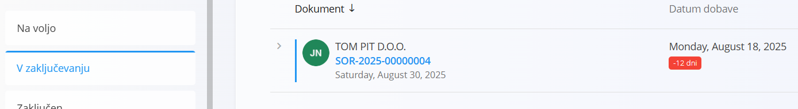
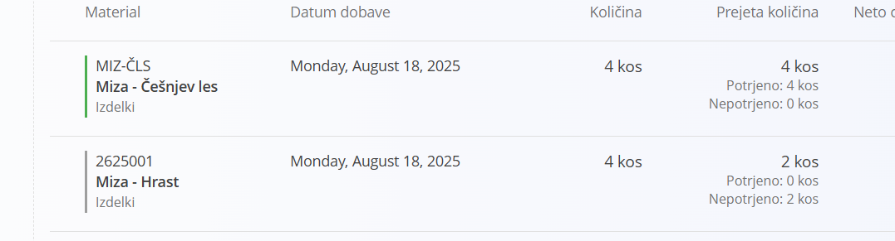
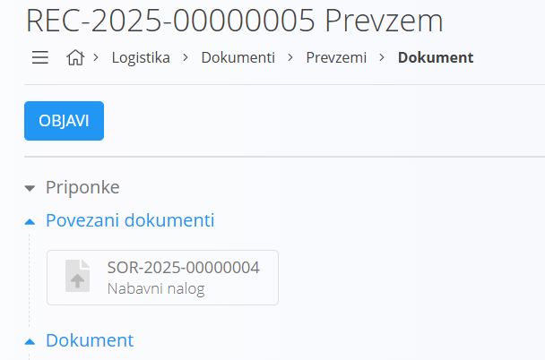
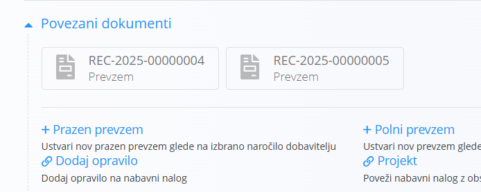
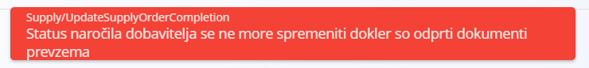

# Kreiranje praznega prevzema iz nabavnega naloga

Kreiranje praznega prevzema [nabavnega naloga](NabavniNalog.md) omogoča samodejno ustvarjanje [prevzemnega](../../Skladisce/Dokumenti/Prevzem.md) dokumenta neposredno iz nabavnega naloga. Dokumenta sta povezana in z nabavnim nalogom se vam praviloma ni potrebno več ukvarjati, saj za njegov življenjski cikel skrbi prevzem. Namreč, ko je prevzemni dokument zaključen, je samodejno zaključen tudi nabavni nalog. Ustvarjanje prevzema iz nabavnega naloga ima še eno prednost; na seznamu postavk vidite, katere [materiale](../../Splosno/Materiali.md) morate po nabavnem nalogu sprejeti.

Namreč, iz nabavnega naloga lahko ustvarite poljubno mnogo prevzemov, vse dokler je `Status` nabavnega naloga postavljen na **Na voljo** ali **V zaključevanju**.

Ko ustvarite prevzem, se na prevzemnem dokumentu virtualno izpišejo vse še ne zaprte postavke. Pri prvem prevzemu bodo torej izpisane vse postavke nabavnega naloga. S prevzemanjem blaga nato postavke zapirate. Postavke lahko zapirate delno ali v celoti. S tem, ko blago prevzemate v prevzemnem dokumentu, zapirate tudi postavke nabavnega naloga. Ob zapiranju prve postavke preide `Status` nabavnega naloga v **V zaključevanju**. na nabavnem nalogu lahko kadarkoli vidite, katere postavke še niso bile prevzete, enako pa velja tudi za povezane prevzemne dokumente.

V kolikor odprete nabavni nalog, lahko vidite, v kakšnem statusu so posamezne postavke. Zelena črta skrajno levo v vsakem zapisu kaže, da so postavke zaprte oziroma prevzete, siva pa, da postavke bodisi niso bodisi so delno prevzete. V stolpcu **Prejeta količina** lahko dejansko stanje preverite tudi numerično, kakšna količina je bila naročena in koliko je bilo prevzete. 

Stolpec kaže še en pomemben podatek, koliko prevzete količine je bilo tudi potrjene. Potrjena količina pomeni, da je bila prevzeta in je prevzemni dokument tudi **Objavljen** oziroma zaključen, kar pomeni, da je blago dejansko na zalogi in razpoložljivo v skladišču. Nepotrjene količine pa kažejo, da je blago na prevzemnem dokumentu prevzeto, vendar dokument še ni zaključen, kar pomeni, da blaga še ni na zalogi, saj lahko takšen dokument kadarkoli tudi prekličete.

## Postopek

Klik na **Prazen prevzem** v sekciji [povezani dokumenti](NabavniNalog.md#povezani-dokumenti) odpre [modalno okno](../../Splosno/UporabniskiVmesnik/ModalnoOkno.md).

Na uporabniškem vmesniku so izpisana [skladišča](../../Skladisce/Sifranti/Skladisce.md). Kliknite na skladišče, v katero želite blago prevzeti. Po kliku na skladišče se osveži seznam [skladiščnih lokacij](../../Skladisce/Sifranti/SkladiscneLokacije.md). 

Izberite privzeto lokacijo, v katero boste blago prejemali in kliknite **Shrani**. Sistem ustvari nov [prevzemni dokument](../../Skladisce/Dokumenti/Prevzem.md), izpolni ustrezna polja, naredi povezavo in v seznamu postavk virtualno napolni seznam. Na ta način lahko vidite, katero blago še morate prevzeti oziroma katere postavke prevzema še niso skladne z nabavnim nalogom.

Za podrobnejši opis o prevzemu materiala si preberite poglavje o [prevzemnem dokumentu](../../Skladisce/Dokumenti/Prevzem.md).

> [!TIP]
> Ko je povezan prevzemni dokument zaključen, se nabavni nalog samodejno zaključi, v kolikor so vse postavke bile prevzete. V kolikor niso bile prevzete vse postavke, lahko ponovno ustvarite prevzemni dokument. V tem primeru bodo na seznamu postavk samo postavke, ki niso bile zaprte na prvem prevzemu.

Ko je proces ustvarjanja prevzemnega dokumenta zaključen, vas uporabniški vmesnik samodejno preusmeri na novo ustvarjeni dokument.

Razprite sekcijo **Povezani dokumenti** na prevzemneg nalogu in videli boste, da je s prevzemom povezan nabavni nalog.

Klik na nabavni nalog vas preusmeri neposredno na nabavni nalog. Na ta način lahko hitro prehajate med povezanimi dokumenti. Namreč, tudi nabavni nalog ima v povezanih dokumentih prevzem in s klikom nanj vas uporabniški vmesnik preusmeri na povezan dokument.

Na zgornji sliki lahko vidite, da lahko ima vsak dokument več povezanih dokumentov.

V kolikor obstajajo povezani dokumenti, ki še niso zaključeni, nabavnega naloga ne morete ročno zaključiti. V primeru, da vseeno kliknete gumb **Zaključi**, sistem izpiše napako.

