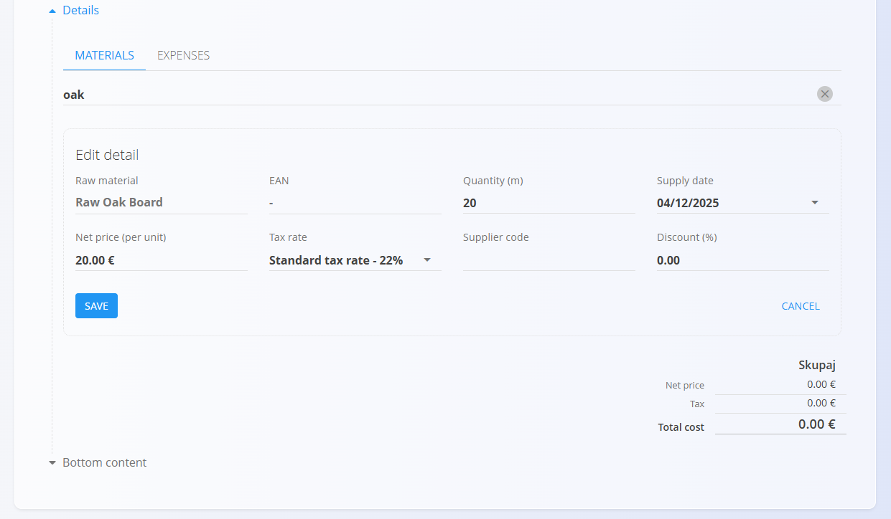

# Nabavni nalogi

**Nabavni nalog** je uradni nabavni dokument, s katerim organizacija potrdi naročilo materialov ali storitev pri dobavitelju. Določa, *kaj* bo organizacija prejela, *kdaj* in *pod kakšnimi pogoji*, ter predstavlja osnovo za nadaljnje operativne procese, kot so **prevzemi materiala** in **razporejanje stroškov**.

Za dostop do **Nabavnih nalogov** pojdite na **Nabava / Dokumenti / Nabavni nalogi** v [navigaciji](../../Skupno/UI/Navigacija.md).

## Kako se nabavni nalogi vključujejo v nabavni proces

Nabavni nalogi predstavljajo formalno potrditveno fazo v procesu nabave.

1. Zahteva se običajno začne s **[Povpraševanjem](Povprasevanja.md)**.  
2. Po potrditvi se iz povpraševanja ustvari **Nabavni nalog** prek razdelka **Povezani dokumenti**.  
   - Nabavni nalogi se lahko ustvarijo tudi neposredno, brez predhodnega povpraševanja, ter se po potrebi naknadno povežejo.  
3. Iz nabavnega naloga lahko ustvarite enega ali več **[Prevzemov](../../Logistika/Dokumenti/Prevzemi.md)**:  
   - več **delnih prevzemov**, ali  
   - en **celoten prevzem**.  
4. Ko so vsi materiali prevzeti, se nabavni nalog samodejno premakne v stanje **Zaključeno**.  
   - Če je prevzem le delni, dokument ostane v stanju **Na voljo**, dokler ni v celoti zaključen.

## Shema

| Polje | Opis |
|------|------|
| [**Koda**](../../Skupno/UI/KodeDokumentov.md) | Sistemsko generiran enolični identifikator nabavnega naloga. |
| **Dobavitelj** | Dobavitelj materialov ali storitev, izbran iz **[Poslovnega imenika](../../Skupno/Sifranti/PoslovniImenik.md)**. |
| **Datum dokumenta** | Datum nastanka nabavnega naloga. |
| **Datum dobave** | Načrtovani datum dobave zahtevanih materialov (obvezno). |
| **Rabat** | Neobvezni popust, uporabljen za celoten nabavni nalog. |
| [**Stroškovno mesto**](../../Skupno/Sifranti/StroskovnaMesta.md) | Interno stroškovno mesto, povezano z nabavo. |
| **Šifra ponudbe** | Neobvezna referenca na ponudbo dobavitelja ali zunanji dokument. |
| **Dostava – podjetje / naslov** | Podatki o lokaciji dostave, povzeti iz Poslovnega imenika ali ročno prilagojeni. |
| **Zgornje besedilo** | Vnaprej določeno uvodno besedilo iz **[Vnaprej določenih besedil](../../Skupno/Sifranti/VnaprejDolocenaBesedila.md)** (entiteta: *Nabavni nalog*). |
| **Spodnje besedilo** | Zaključna ali pravna besedila iz vnaprej določenih besedil. |
| **Postavke** | Seznam naročenih materialov ali stroškov, vključno s količinami, cenami, davki in podatki o dobavi. |

### Polja postavk

| Polje | Opis |
|------|------|
| [**Material**](../../Sredstva/Domena/Materiali.md) | Material, ki se nabavlja. |
| **EAN** | Črtna koda materiala (neobvezno). |
| **Količina** | Naročena količina. |
| **Datum dobave** | Specifični datum dobave za to postavko. |
| **Neto cena (na enoto)** | Cena na enoto, povzeta iz **[Materialov dobaviteljev](../Sifranti/MaterialiDobaviteljev.md)** ali vnesena ročno. |
| **Popust (%)** | Neobvezni popust za posamezno postavko. |
| [**Davčna stopnja**](../../Skupno/Sifranti/DavcneStopnje.md) | Uporabljena davčna stopnja. |
| **Dobaviteljeva šifra** | Interna oznaka materiala pri dobavitelju. |
| **Skupni znesek** | Znesek postavke (količina × neto cena − popust + davek). |

## Upravljanje

### Stanja dokumenta

Nabavni nalogi se v svojem življenjskem ciklu pomikajo skozi naslednja stanja:

- **Osnutek** – dokument še ni objavljen; vsa polja je mogoče prosto urejati.  
- **Objavljeno** – dokument je objavljen in ga ni več mogoče izbrisati ali prosto spreminjati.
  - **Na voljo** – nalog je veljaven in pripravljen za prevzeme.
  - **V obdelavi** – del materialov je že bil prevzet (delni prevzemi).
  - **Zaključeno** – vsi materiali so prevzeti in dokument je v celoti obdelan.

### Seznam dokumentov

Seznam **Nabavnih nalogov** prikazuje vse dokumente z njihovim trenutnim stanjem in načrtovanimi datumi dobave.

Na vrhu seznama sistem prikaže dva ključna indikatorja:

- **Po datumu dobave** (interaktivno) – nabavni nalogi, katerih načrtovani datum dobave je potekel in še niso v celoti prevzeti. S klikom se seznam samodejno filtrira.
- **Skupni znesek** – prikazuje skupno vrednost (neto + davek) vseh nabavnih nalogov v aktivnem filtru.

### Filtri

Razpoložljivi filtri vključujejo:

- **Datumi dokumentov**  
- **Datumi dobave**  
- **Pogled**
  - Osnutki  
- **Objavljeno**
  - Na voljo  
  - V obdelavi  
  - Zaključeno  
- **Stanje storna: Stornirano**  
- **Dobavitelj**  
- Iskalno polje  

## Dejanja

### Ustvarjanje novega nabavnega naloga

Nabavni nalogi se lahko ustvarijo:

- neposredno iz seznama **Nabavni nalogi** z uporabo [**akcijskega gumba**](../../Skupno/UI/AkcijskiGumb.md),
- iz objavljenega **[Povpraševanja](Povprasevanja.md)** prek **Povezani dokumenti → + Nabavni nalog**.

V drugem primeru se večina polj (dobavitelj, podatki o dostavi, postavke) samodejno predizpolni.

Postopek:

1. Kliknite **+** za ustvarjanje novega nabavnega naloga.  
2. Vnesite ali preverite **Dobavitelja**, **Datum dokumenta** in **Datum dobave**.

   

3. V razdelku **Postavke** vnesite ali skenirajte **serijsko številko**, **EAN** ali **ime materiala**.  
   Sistem prikaže vsa ujemanja materialov in serijskih številk.

   

4. Preglejte ali prilagodite podatke o dostavi v razdelku **Dostava**.  
5. (Neobvezno) dodajte **Priloge** ali povežite dokument s projektom prek **Povezani dokumenti**.  
6. Ko ste pripravljeni, kliknite **Objavi**.

Po objavi se dokument premakne v stanje **Objavljeno → Na voljo**, kar omogoči vse nadaljnje aktivnosti, kot so prevzemi.

#### Priloge

Na vrhu vsakega dokumenta je na voljo razdelek **Priloge**.

Naložite lahko katerokoli ustrezno datoteko (dobavnice, transportne dokumente, fotografije, spremno dokumentacijo). Vse priloge ostanejo shranjene skupaj z dokumentom.

#### Povezani dokumenti

Razdelek **Povezani dokumenti** omogoča ustvarjanje in povezovanje nadaljnjih operativnih dokumentov.

Razpoložljiva dejanja vključujejo:

- **Dodaj projekt**  
- [**+ Prazen prevzem**](../../Logistika/Dokumenti/Prevzemi.md)  
- [**+ Celoten prevzem**](../../Logistika/Dokumenti/Prevzemi.md)  
- [**Prevzem**](../../Logistika/Dokumenti/Prevzemi.md) – povezava obstoječega osnutka prevzema  
- **Dodaj opravilo**  
- **Kopiraj nabavni nalog**

#### Razdelek Dokument

Razdelek **Dokument** vsebuje:

- Kodo  
- Dobavitelja  
- Datum dokumenta  
- Datum dobave  
- Rabat  
- Stroškovno mesto  
- Šifro ponudbe  
- Dostavo  
- Zgornje besedilo  

#### Razdelek Dostava

Razdelek **Dostava** določa, kam bodo materiali dostavljeni. Privzeto se podatki prevzamejo iz dostavnega naslova podjetja, vendar jih je mogoče po potrebi prilagoditi za posamezno nabavo.

Ti podatki vplivajo na tiskani nabavni nalog in nadaljnje logistične dokumente (npr. **Prevzeme**), ne pa na osnovne podatke v Poslovnem imeniku.

#### Postavke

Razdelek **Postavke** omogoča dodajanje materialov ali stroškov.

##### Urejanje postavke

Polja vključujejo:

- Material  
- EAN  
- Količina  
- Datum dobave  
- Neto cena (na enoto)  
- Davčna stopnja  
- Dobaviteljeva šifra  
- Popust (%)  

Povzetek na dnu prikazuje:

- Neto znesek  
- Davek  
- Skupni znesek  

### Urejanje nabavnega naloga

Kliknite nabavni nalog v seznamu, da ga odprete. Nabavne naloge v stanju **Osnutek** je mogoče prosto urejati.

Razširljivi razdelki vključujejo:

- Povezani dokumenti  
- Priloge  
- Dokument  
- Dostava  
- Zgornje besedilo  
- Postavke  
- Spodnje besedilo  

### Zaključevanje nabavnega naloga

Nabavni nalog se šteje za zaključen, ko so vsi materiali v celoti prevzeti.

Ob zaključevanju:

- dokument preide iz stanja **Na voljo** v **Zaključeno**,  
- urejanje postane omejeno,  
- večina dejanj v **Povezanih dokumentih** je onemogočena (vključno z ustvarjanjem novih prevzemov),  
- morebitne preostale odprte količine se obravnavajo kot zaključene.

> [!NOTE]
> Zaključevanje nabavnega naloga je administrativno dejanje, ki zaključi njegov življenjski cikel. Ne povzroča dodatnih premikov zaloge — ti se izvajajo v povezanih dokumentih **Prevzema**.

## Meni

**Meni** v zgornjem desnem kotu ponuja:

- **Tiskanje** – tiskanje nabavnega naloga  
- **Izvoz** – izvoz v PDF  
- **Pošlji po e-pošti**  
- **Storniraj dokument**

## Brisanje

Nabavne naloge v stanju **Osnutek** je mogoče izbrisati na zaslonu za urejanje, vendar le, če **ne vsebujejo postavk**.

Če osnutek vsebuje postavke:

1. Kliknite postavko, da odprete zaslon za urejanje.  
2. Kliknite **Izbriši** v oknu za urejanje postavke.  
3. Postopek ponovite za vse postavke.

Ko dokument ne vsebuje več postavk, kliknite **Izbriši** za trajno odstranitev.

> [!NOTE]
> - Izbris je mogoč samo za nabavne naloge v stanju **Osnutek**.  
> - Objavljenih dokumentov ni mogoče izbrisati.  
> - Objavljeni dokumenti se lahko **[stornirajo](../../Logistika/Dokumenti/Storno.md)**.

---
