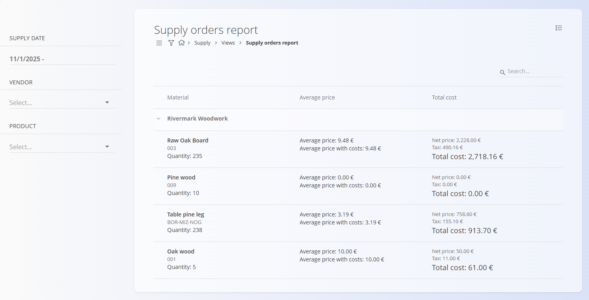

# Poročilo nabavnih nalogov

Pogled **Poročilo nabavnih nalogov** nudi konsolidiran pregled naročenih materialov in storitev, združenih po dobaviteljih. Namenjen je analizi in poročanju ter **ne omogoča** ustvarjanja ali spreminjanja dokumentov.

Za dostop do tega pregleda pojdite na **Nabava / Pregledi / Poročilo nabavnih nalogov** v [navigaciji](../../Skupno/UI/Navigacija.md).

## Namen pregleda

Poročila nabavnih nalogov omogočajo:

- Analizo naročenih količin in vrednosti po dobaviteljih
- Pregled zgodovine naročil za posamezne materiale
- Razumevanje povprečnih cen in skupnih naročenih stroškov
- Hiter vpogled v uspešnost nabave brez odpiranja posameznih dokumentov

Ta pregled je **samo za branje** in prikazuje podatke iz potrjenih dokumentov [**Nabavni nalogi**](../Dokumenti/NabavniNalogi.md).

## Postavitev in struktura

Poročilo je hierarhično organizirano:

- **Dobavitelji** predstavljajo najvišji nivo združevanja
- Pod vsakim dobaviteljem so prikazani naročeni **materiali**
- Vsaka vrstica materiala združuje podatke iz vseh ustreznih dokumentov [**Nabavni nalogi**](../Dokumenti/NabavniNalogi.md)

Za vsak material poročilo prikazuje:
- Naročeno **količino**
- **Povprečno ceno**
- **Skupni strošek**, vključno z neto vrednostjo in davkom

## Filtri

Filtri na levi strani omogočajo zoženje poročila:

- **Datum dobave** — Filtriranje naročil znotraj izbranega časovnega obdobja
- **Dobavitelj** — Prikaz podatkov naročil za enega ali več izbranih dobaviteljev
- **Izdelek** — Prikaz naročil materialov, namenjenih določenim izdelkom (npr. **Borova plošča** za **Borovo mizo**)

Filtre je mogoče kombinirati za natančno analizo specifičnih scenarijev nabave.

## Razlaga vrednosti

- **Količina** predstavlja skupno naročeno količino materiala
- **Povprečna cena** je izračunana na podlagi vseh ustreznih dokumentov [**Nabavni nalogi**](../Dokumenti/NabavniNalogi.md)
- **Skupni strošek** vključuje:
  - Neto ceno
  - Znesek davka
  - Končno skupno vrednost

Vsi zneski so izračunani na podlagi dokumentov [**Nabavni nalogi**](../Dokumenti/NabavniNalogi.md), vključenih glede na izbrane filtre.

## Opombe

- V poročilo so vključeni samo **potrjeni nabavni nalogi**
- Osnutki ali stornirani nabavni nalogi niso prikazani
- Pregled je namenjen **izključno analizi** in ne omogoča dejanj, kot so urejanje, storniranje ali ustvarjanje dokumentov

Za podrobnejše informacije na ravni dokumentov odprite ustrezne [**Nabavne naloge**](../Dokumenti/NabavniNalogi.md) neposredno v razdelku **Nabava / Dokumenti / Nabavni nalogi**.

---
