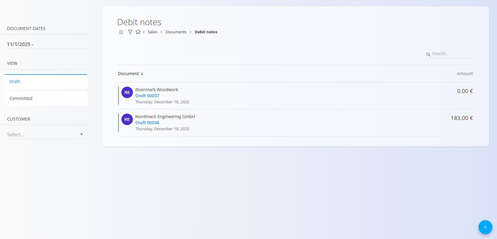
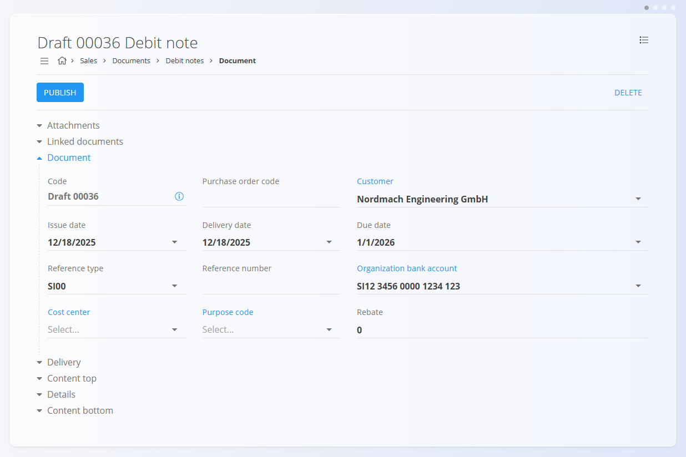
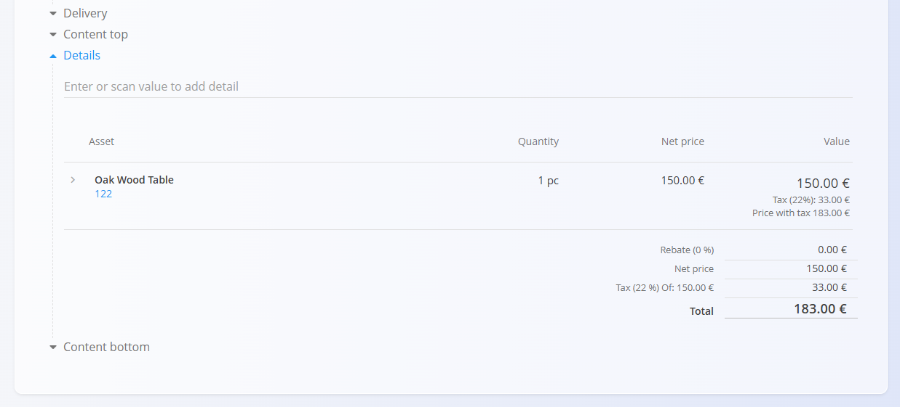

# Bremepisi

**Bremepis** je prodajni dokument, ki se uporablja za **povečanje** zneska, ki ga dolguje stranka, po tem ko je bil račun že izdan. Običajno se ustvari, kadar je potrebno dodatno zaračunati stroške, kot so popravki cen, dodatne storitve ali stroški, ki niso bili vključeni v prvotni račun.

Bremepisi povečujejo odprto obveznost stranke. Za zmanjšanja ali vračila glejte **[Dobropise](Dobropisi.md)**.

> [!TIP]
> Za hiter pregled trenutnih **bremenitev in dobropisov** po posameznih strankah uporabite pregled **[Poslovne kartice](../Pregledi/PoslovneKartice.md)**.

Za dostop do tega dokumenta pojdite na **Prodaja / Dokumenti / Bremepisi** v [**navigaciji**](../../Skupno/UI/Navigacija.md).

## Vloga bremepisov v prodajnem procesu

Bremepisi se uporabljajo po tem, ko je bil račun že izdan:

1. Izdajte **[Izdani račun](IzdaniRacuni.md)** za dobavljeno blago ali storitve.  
2. Ugotovite potrebo po dodatnem zaračunu ali popravku, ki poveča znesek računa.  
3. Ustvarite **Bremepis**, povezan z izdanim računom ali kot samostojen dokument.  
4. Preglejte in objavite bremepis, s čimer preide v stanje **Potrjeno**.  
5. Znesek bremepisa poveča obveznost stranke in se vključi v računovodstvo.  
6. Če je bil bremepis ustvarjen pomotoma, ga stornirajte (glejte **[Storno](../../Logistika/Dokumenti/Storno.md)**).

Bremepisi vplivajo izključno na računovodstvo in ne vplivajo na zalogo.

## Shema

  
<strong>Dokument</strong>

| Polje | Opis |
|------|------|
| [**Šifra**](../../Skupno/UI/SifreDokumentov.md) | Sistemsko generiran identifikator bremepisa. |
| **Številka naročilnice** | Neobvezna referenca na naročilo stranke. |
| **Stranka** | Stranka, ki ji je zaračunan bremepis, izbrana iz šifranta [**Poslovni imenik**](../../Skupno/Upravljanje/PoslovniImenik.md) (obvezno). |
| **Datum dokumenta** | Datum izdaje bremepisa. |
| **Datum opravljene storitve** | Prvotni datum dobave zaračunanega blaga ali storitev. |
| **Datum zapadlosti** | Datum, ko dodatni znesek zapade v plačilo (obvezno). |
| **Tip reference** | Vrsta uporabljenega plačilnega sklica (obvezno). |
| **Sklic** | Sklicna številka glede na izbrano vrsto sklica. |
| [**Bančni račun organizacije**](../Upravljanje/BancniRacuniOrganizacije.md) | Bančni račun, na katerega se prejme plačilo (obvezno). |
| [**Stroškovno mesto**](../../Skupno/Upravljanje/StroskovnaMesta.md) | Neobvezna razporeditev na stroškovno mesto. |
| **Koda namena** | Neobvezna oznaka ali razlog za bremepis. |
| **Rabat** | Skupni rabat, uporabljen na bremepis (če je primerno). |
| **Vsebina zgoraj** | Uvodno besedilo iz [**Vnaprej določenih besedil**](../../Skupno/Upravljanje/VnaprejDolocenaBesedila.md). |
| **Vsebina spodaj** | Zaključna ali pravna besedila iz [**Vnaprej določenih besedil**](../../Skupno/Upravljanje/VnaprejDolocenaBesedila.md). |

  
<strong>Transport, alternativna valuta in dostava</strong>

| Polje | Opis |
|--------|-------------|
| **[Pogoj dobave](../../Skupno/Upravljanje/PogojiDobave.md)** | Dobavni pogoji, dogovorjeni s stranko. |
| **[Vrsta transporta](../../Skupno/Upravljanje/VrstaTransporta.md)** | Način transporta, dogovorjen s stranko. |
| [**Alternativna valuta**](../../Skupno/Upravljanje/Valute.md) | Alternativna valuta glede na privzeto valuto, uporabljeno v dokumentu. |
| [**Tečaj**](../Upravljanje/MenjalniTecaji.md) | Tečaj alternativne valute glede na privzeto valuto. |
| **Dobava – Podjetje / Naslov** | Dobavni podatki stranke, povzeti iz [Poslovnega imenika](../../Skupno/Upravljanje/PoslovniImenik.md). |

  
<strong>Postavke</strong>

| Polje | Opis |
|------|------|
| [**Sredstvo**](../../Sredstva/Materiali/Izdelki.md) | Zaračunano blago ali storitev. |
| **Količina** | Zaračunana količina (pozitivna vrednost). |
| **Neto cena** | Neto cena na enoto. |
| **Popust (%)** | Neobvezen popust na ravni postavke. |
| **Vrednost** | Izračunane vrednosti (neto, davek, bruto) s pozitivnimi zneski. |

## Upravljanje

Bremepisi imajo lahko status **Osnutek** ali **Potrjeno**.

### Seznam

Seznam bremepisov je mogoče filtrirati po:
- **Datumih dokumentov**
- **Pogledu** (Osnutki / Potrjeno)
- **Stranki**

Vsaka vrstica prikazuje:
- Stranko  
- Šifro dokumenta  
- Datum dokumenta  
- Znesek bremepisa  

Osnutke je mogoče urejati, potrjeni bremepisi pa so dokončni, razen če so stornirani.

## Dejanja

### Ustvarjanje novega bremepisa

Bremepise je mogoče ustvariti na dva načina:

- Z uporabo [**akcijskega gumba**](../../Skupno/UI/AkcijskiGumb.md) na zaslonu **Bremepisi**  
- Iz obstoječega **[Izdanega računa](IzdaniRacuni.md)** prek *Povezani dokumenti → + Bremepis*

Po začetku novega bremepisa sledite korakom:

1. Ustvarite nov osnutek bremepisa.

   

2. Izpolnite zahtevana polja, kot so **Stranka**, **Datumi**, **Tip reference** in **Bančni račun organizacije**.

3. V razdelku **Postavke** dodajte postavke z vnosom ali skeniranjem **naziva sredstva**, **EAN** ali **serijske številke**.

   

4. Prilagodite količine in vrednosti ter kliknite **Shrani**.

5. Ko je bremepis pripravljen, kliknite **Objavi**.  
   Dokument preide iz stanja **Osnutek** v **Potrjeno** in postane finančno veljaven.

> [!NOTE]
> Po objavi bremepisa ga ni več mogoče urejati. Vse popravke je treba izvesti s storniranjem.

### Urejanje bremepisa

Urejati je mogoče samo bremepise v stanju **Osnutek**.

Uredite lahko:
- Glavna polja  
- Alternativna valuta
- Transport
- Podatki o dostavi
- Postavke  
- Besedila (zgoraj in spodaj)

Potrjeni bremepisi so samo za branje.

#### Priponke

V razdelku **Priponke** lahko shranite podporne dokumente, kot so dogovori ali obrazložitve popravkov.

#### Povezani dokumenti

Razdelek **Povezani dokumenti** omogoča povezavo s predhodno ustvarjenim **[Izdanim računom](IzdaniRacuni.md)**.

Potrjeni bremepisi razdelka **Povezani dokumenti** ne prikazujejo.

#### Alternativna valuta

Razdelek Alternativna valuta omogoča izražanje cen v dokumentu v valuti, ki je različna od privzete sistemske valute. To se običajno uporablja pri mednarodni prodaji. Tečaji se povzemajo iz šifranta [Devizni tečaji](../Upravljanje/MenjalniTecaji.md).

Ko je izbrana alternativna valuta, se cene v dokumentu samodejno preračunajo z uporabo navedenega deviznega tečaja.

#### Transport

Razdelek Transport določa, kako se blago dostavi stranki in pod kakšnimi dobavnimi pogoji.

Tukaj vneseni podatki se uporabljajo pri usklajevanju logistike, komunikaciji s stranko in na izpisih dokumentov.

## Meni

Meni dokumenta omogoča dodatna dejanja:

- **Tiskanje**
- **Izvoz**
- **Pošlji po e-pošti**
- **Storniraj dokument**
- **Vrni v osnutek** (če je dovoljeno)

Storniranje bremepisa izniči njegov finančni učinek. Za podrobnosti glejte **[Storno](../../Logistika/Dokumenti/Storno.md)**.

## Brisanje

Bremepise v stanju **Osnutek** je mogoče izbrisati le, če **ne vsebujejo postavk**.  
Postavke lahko odstranite preko menija → **Izbriši vse postavke**.

Za brisanje posameznih postavk:
1. Odprite postavko s klikom nanjo.  
2. Kliknite **Izbriši**.  
3. Postopek ponovite po potrebi.

Ko je bremepis brez postavk, lahko izvedete **Izbriši**.

Potrjenih bremepisov **ni mogoče** izbrisati, mogoče pa jih je **stornirati** ali **vrniti v osnutek**.
