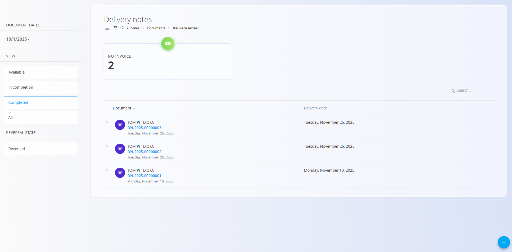
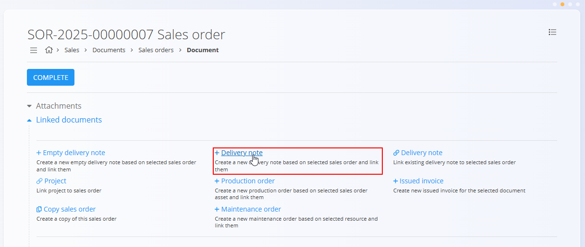
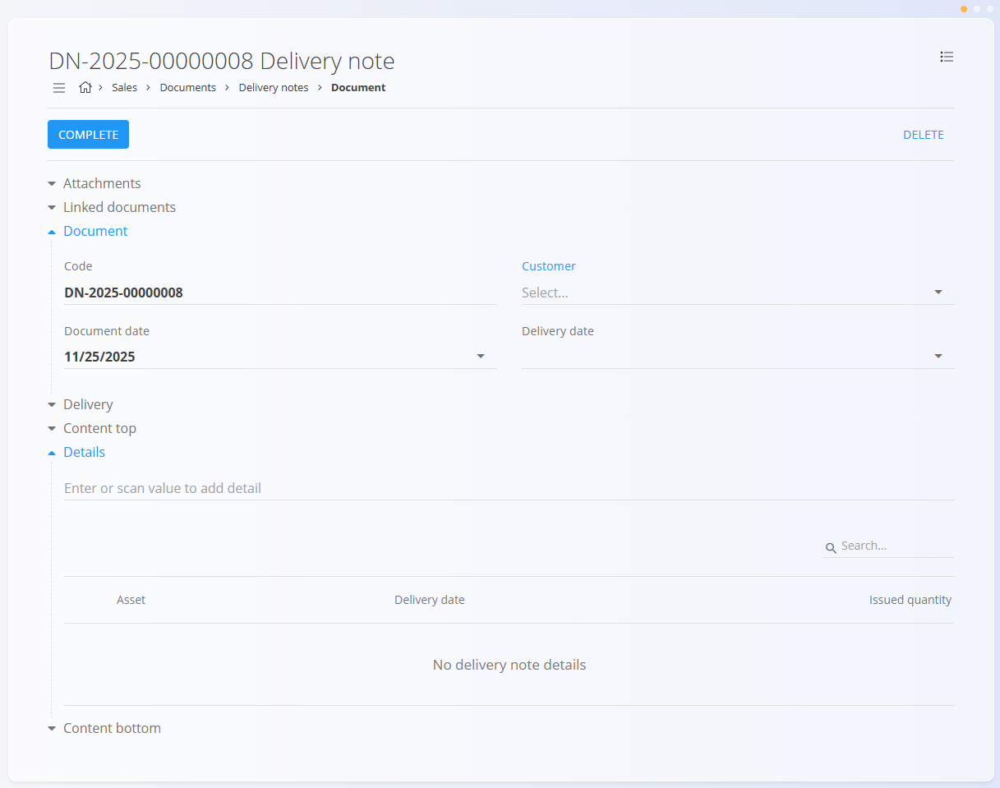
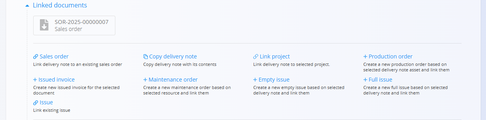

# Dobavnice

**Dobavnica** je logistični dokument, ki spremlja blago ob dobavi. Potrjuje, kateri izdelki se dobavljajo, v kakšnih količinah in na kateri datum. Dobavnice se običajno ustvarijo na podlagi **Naročila stranke**, lahko pa se po potrebi ustvarijo tudi samostojno.

Dobavnica **ni** finančni dokument – namenjena je predvsem operativni uporabi. Po izvedeni dobavi dobavnica praviloma vodi v ustvarjanje dokumenta **Izdaja** (izhod iz skladišča), kasneje pa še v **Izdani račun**.

Za dostop do tega dokumenta pojdite na **Prodaja / Dokumenti / Dobavnice** v [navigaciji](../../Skupno/UI/Navigacija.md).

## Vloga dobavnic v prodajnem procesu

Dobavnice predstavljajo povezavo med prodajnimi in skladiščnimi procesi:

1. Stranka potrdi naročilo → ustvari se [**Naročilo stranke**](NarocilaStrank.md).  
2. Iz naročila stranke uporabnik ustvari **Dobavnico** prek *Povezani dokumenti → + Dobavnica*.  
3. Ko je dobavnica pripravljena, se ustvari in poveže dokument [**Izdaja**](../../Logistika/Dokumenti/Izdajnice.md) (delna ali celotna dobava).  
4. Po dobavi se proces nadaljuje z ustvarjanjem [**Izdani račun**](IzdaniRacuni.md).

Dobavnice je mogoče tudi kopirati, povezati z obstoječimi izdajami ali projekti ter jih uporabiti za sprožanje proizvodnih ali vzdrževalnih nalogov.

## Shema

| Polje | Opis |
|------|------|
| [**Šifra**](../../Skupno/UI/SifreDokumentov.md) | Sistemsko generiran identifikator dobavnice. |
| **Stranka** | Prejemnik dobave, izbran iz šifranta [Poslovni imenik](../../Skupno/Upravljanje/PoslovniImenik.md) (obvezno). |
| **Datum dokumenta** | Datum nastanka dobavnice. |
| **Datum opravljene storitve** | Datum, ko je dobava predvidena (obvezno). |
| **[Pogoj dobave](../Upravljanje/PogojiDobave.md)** | Dogovorjeni pogoji dobave s stranko. |
| **[Vrsta transporta](../../Skupno/Upravljanje/VrstaTransporta.md)** | Dogovorjeni način transporta s stranko. |
| **Dobava – Podjetje / Naslov** | Dobavni podatki stranke, povzeti iz [Poslovnega imenika](../../Skupno/Upravljanje/PoslovniImenik.md). |
| **Vsebina zgoraj** | Neobvezno uvodno besedilo iz šifranta [Vnaprej določena besedila](../../Skupno/Upravljanje/VnaprejDolocenaBesedila.md) (entiteta: *Dobavnica*). |
| **Postavke** | Seznam vseh dobavljenih postavk (obvezno). |
| **Vsebina spodaj** | Neobvezno zaključna ali pravna besedila iz [Vnaprej določena besedila](../../Skupno/Upravljanje/VnaprejDolocenaBesedila.md) (entiteta: *Dobavnica*). |

### Postavke

| Polje | Opis |
|------|------|
| [**Sredstvo**](../../Sredstva/Materiali/Izdelki.md) | Izdelek ali storitev, ki se dobavlja. |
| **Datum opravljene storitve** | Datum dobave za posamezno postavko. |
| **Izdana količina** | Prikazuje, koliko enot je že izdanih (npr. *0/3* pred izdajo, *3/3* po celotni izdaji). |

## Upravljanje

### Statusi dokumenta

Dobavnice uporabljajo poenostavljen nabor statusov:

- **Na voljo** – Dobavnica je ustvarjena in pripravljena za obdelavo. Ta status deluje podobno kot *osnutek* pri drugih dokumentih. Dokument še ni ustvaril dokumenta [**Izdaja**](../../Logistika/Dokumenti/Izdajnice.md) in vse količine so še vedno uredljive.

- **V zaključevanju** – Dobavnica je delno obdelana. To se običajno zgodi, ko je bila ustvarjena [**Izdaja**](../../Logistika/Dokumenti/Izdajnice.md) samo za del dobavljenega blaga ali ko dobava še ni zaključena.

- **Zaključen** – Vsa dejanja, povezana z dobavnico, so bila izvedena. Dokumenta ni več mogoče spreminjati, še vedno pa ga je mogoče natisniti, izvoziti ali uporabiti za ustvarjanje računa.

### Seznam

Seznam dobavnic prikazuje vse dokumente, razvrščene po statusih:

- **Na voljo**
- **V zaključevanju**
- **Zaključen**
- **Vsi**
- **[Stornirano](../../Logistika/Dokumenti/Storno.md)** (stanje storniranja)

**Kazalniki na vrhu seznama:**

- **Brez računa** (interaktivno) – Dobavnice, za katere še ni bil izdan račun. Klik prikaže samo dobavnice brez računa.

Kazalniki se samodejno posodabljajo glede na izbrane filtre (datumi dokumentov, status, stanje storniranja, stranka).

**Primer – Na voljo:**

**Primer – Zaključeno:**

## Dejanja

### Ustvarjanje nove dobavnice

Dobavnice je mogoče ustvariti na dva načina:

- Iz seznama **Dobavnice** s klikom na [**akcijski gumb**](../../Skupno/UI/AkcijskiGumb.md).
- Iz **Naročila stranke** prek *Povezani dokumenti → + Dobavnica*.

  

Primer praznega osnutka dobavnice:

### Urejanje dobavnice

S klikom na dobavnico odprete urejanje. Dokument je razdeljen v razširljive razdelke:

- Priponke
- Povezani dokumenti
- Dokument
- Alternativna valuta
- Transport
- Dobava
- Vsebina zgoraj
- Postavke
- Vsebina spodaj

> [!NOTE]
> Količina razdelkov, ki jih je mogoče urejati, je odvisna od statusa dobavnice.

#### Priponke

Na vrhu vsakega dokumenta je razdelek **Priponke**.

Naložite lahko datoteke, kot so transportni dokumenti, fotografije ali druga dokazila. Vse priloge se shranijo skupaj z dokumentom.

#### Povezani dokumenti

Razdelek **Povezani dokumenti** omogoča ustvarjanje in pregled povezanih dokumentov.

> [!NOTE]
> Razpoložljiva dejanja v razdelku **Povezani dokumenti** so odvisna od tipa in statusa dokumenta.

Razpoložljiva dejanja za dobavnice v statusu **Na voljo** vključujejo:

- [**Naročilo stranke**](NarocilaStrank.md) – povezava z obstoječim naročilom stranke
- **Kopiraj dobavnico**
- **Kopiraj dobavnico z vsebino**
- **Poveži projekt**
- [**+ Proizvodni nalog**](../../Proizvodnja/Dokumenti/ProizvodniNalogi.md)
- [**+ Vzdrževalni nalog**](../../Vzdrzevanje/Dokumenti/VzdrzevalniNalogi.md)
- [**+ Izdani račun**](IzdaniRacuni.md)
- **[+ Prazna izdaja](../../Logistika/Dokumenti/Izdajnice.md)**
- **[+ Polna izdaja](../../Logistika/Dokumenti/Izdajnice.md)**
- **[Izdaja](../../Logistika/Dokumenti/Izdajnice.md)** – povezava z obstoječo izdajo

#### Alternativna valuta

Razdelek Alternativna valuta omogoča izražanje cen v dokumentu v valuti, ki je različna od privzete sistemske valute. To se običajno uporablja pri mednarodni prodaji. Tečaji se povzemajo iz šifranta [Devizni tečaji](../../Skupno/Sifranti/DevizniTecaji.md).

Ko je izbrana alternativna valuta, se cene v dokumentu samodejno preračunajo z uporabo navedenega deviznega tečaja.

#### Transport

Razdelek Transport določa, kako se blago dostavi stranki in pod kakšnimi dobavnimi pogoji.

Tukaj vneseni podatki se uporabljajo pri usklajevanju logistike, komunikaciji s stranko in na izpisih dokumentov.

### Zaključevanje dobavnice

Ko je dobavnica pripravljena, kliknite **Zaključi** na vrhu strani.

## Meni

Meni v zgornjem desnem kotu omogoča:

- **Tiskanje**
- **Izvoz (PDF)**
- **Tiskaj sredstvo** (zaključeni dokumenti)
- **Storniraj dokument** (zaključeni dokumenti)
- **Povrni v osnutek** (zaključeni dokumenti)

> **Opomba o storniranju:**  
> Stornirana dobavnica je prikazana pod *Stanje storniranja → Stornirano* v stranskem meniju.

## Brisanje

Dobavnice v osnutku je mogoče izbrisati le, če **ne vsebujejo postavk**.

Če osnutek vsebuje postavke:

1. Kliknite serijsko številko postavke, da odprete **Uredi postavko**.  
2. Kliknite **Izbriši** v oknu urejanja postavke.  
3. Postopek ponovite za vse preostale postavke.

Ko dokument ne vsebuje več postavk, ga lahko izbrišete. Ob potrditvi se dokument trajno odstrani.

> [!NOTE]  
> - Dobavnice ni mogoče izbrisati, če je uporabljena v odvisnih dokumentih (Izdaje, Računi, Proizvodni nalogi itd.).  
> - Zaključenih dokumentov **ni mogoče** izbrisati – mogoče jih je le stornirati ali vrniti v osnutek.

---
