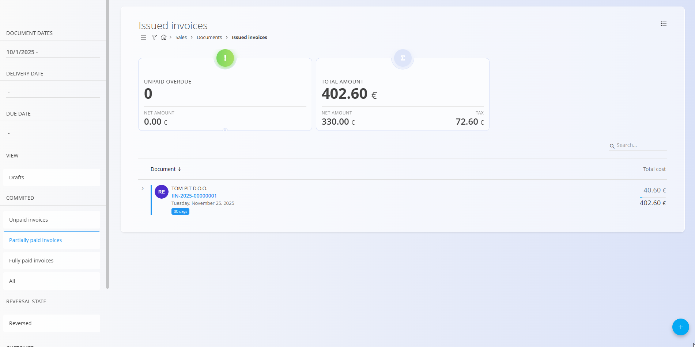
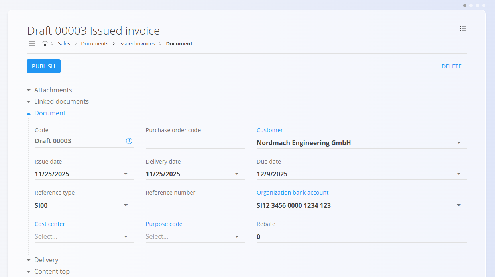
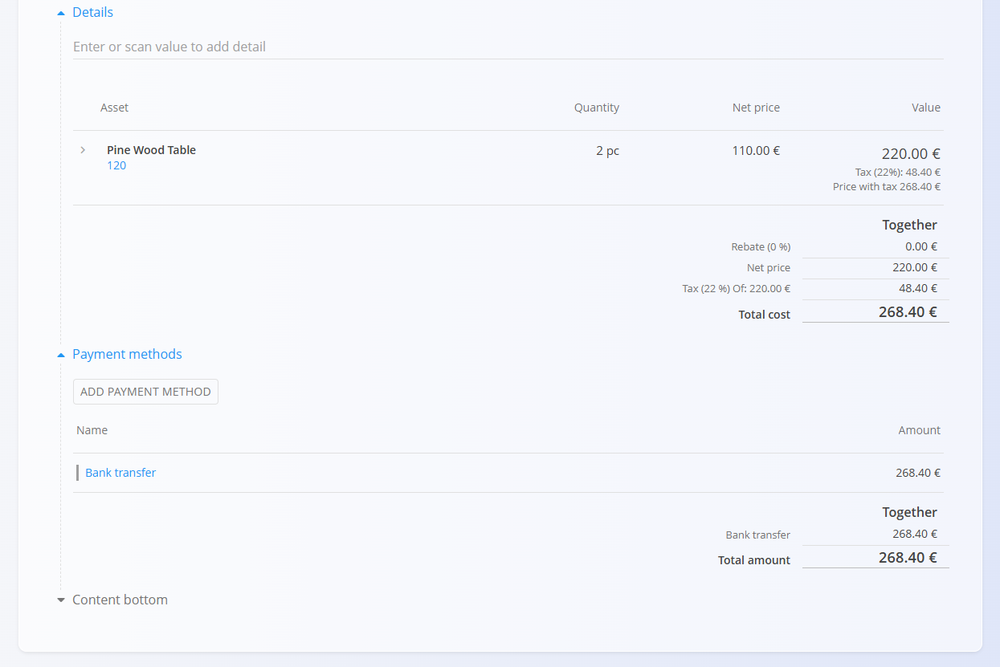

# Izdani računi

**Izdani računi** so finančni dokumenti, poslani strankam za plačilo potrjenih prodaj. Povzemajo dobavljeno blago ali storitve, davke, roke plačila in izbrane načine plačila. Na strani **Izdani računi** lahko evidentirate tudi delna ali celotna plačila neposredno na posameznem računu.

Za dostop do te strani pojdite na **Prodaja / Dokumenti / Izdani računi** v [navigaciji](../../Skupno/UI/Navigacija.md).

## Vloga izdanih računov v prodajnem procesu

Izdani računi se običajno ustvarijo na koncu prodajnega procesa:

1. Stranka sprejme **[Ponudbo](Ponudbe.md)**.  
2. Ustvari in izvede se **[Naročilo stranke](NarocilaStrank.md)**.  
3. Blago se odpremi z uporabo **[Dobavnic](Dobavnice.md)** in povezanih izdaj.  
4. Na koncu se ustvari **Izdani račun** (pogosto iz dobavnice ali naročila stranke) in se pošlje stranki v plačilo.

Račune je mogoče ustvariti tudi ročno kot samostojne dokumente, kadar je to potrebno.

## Shema

| Polje | Opis |
|------|------|
| [**Koda**](../../Skupno/UI/KodeDokumentov.md) | Enolični identifikator računa (sistemsko generiran). |
| **Številka naročila kupca** | Neobvezna referenca na naročilo stranke. |
| **Stranka** | Prejemnik računa, izbran iz šifranta [**Poslovni imenik**](../../Skupno/Sifranti/PoslovniImenik.md) (obvezno). |
| **Datum izdaje** | Datum izdaje računa. |
| **Datum dobave** | Datum, ko je bilo blago ali storitev dobavljena. |
| **Datum zapadlosti** | Rok plačila, prikazan stranki (obvezno). |
| **Vrsta sklica** | Vrsta plačilnega sklica (npr. strukturiran sklic, model) (obvezno). |
| **Sklicna številka** | Sklicna številka za plačilne dokumente, glede na izbrano vrsto sklica. |
| [**Bančni računi organizacije**](../Sifranti/BancniRacuniOrganizacije.md) | Račun za prejem plačila, izbran iz šifranta bančnih računov organizacije (obvezno). |
| [**Stroškovno mesto**](../../Skupno/Sifranti/StroskovnaMesta.md) | Neobvezna razporeditev prihodka na stroškovno mesto. |
| **Koda namena** | Neobvezna koda namena računa (če je konfigurirana). |
| **Rabat** | Skupni rabat, uporabljen na celoten znesek računa. |
| **Vsebina zgoraj** | Uvodno besedilo iz [**Vnaprej določenih besedil**](../../Skupno/Sifranti/VnaprejDolocenaBesedila.md). |
| **Dobava** | Podatki o podjetju in naslovu dobave. |
| **Vsebina spodaj** | Zaključna ali pravna besedila iz [**Vnaprej določenih besedil**](../../Skupno/Sifranti/VnaprejDolocenaBesedila.md). |
| **Način plačila** | Izbrani način plačila iz šifranta [**Način plačila**](../Sifranti/NacinPlacila.md). |

### Polja postavk

| Polje | Opis |
|------|------|
| [**Sredstvo**](../../Sredstva/Sifranti/Izdelki.md) | Zaračunan izdelek ali storitev iz področja Sredstva. |
| **Količina** | Količina zaračunanega sredstva. |
| **Neto cena** | Neto cena na enoto, običajno povzeta iz cenikov ali povezanega dokumenta. |
| **Popust (%)** | Neobvezen popust na ravni postavke. |
| **Vrednost** | Izračunane vrednosti postavke (neto, davek in bruto). |

## Upravljanje

### Statusi dokumenta

Izdani računi uporabljajo plačilno osnovane statuse:

- **Osnutek** – Račun še ni objavljen; vsa polja so prosto uredljiva.

- **Potrjeno** – Račun je objavljen in postane uradni finančni dokument. Po potrditvi je mogoče spreminjati le omejena polja, dokumenta pa ni mogoče izbrisati.

  - **Neplačani računi** – Račun je izdan, vendar plačila še niso evidentirana.  
  - **Delno plačani računi** – Evidentirano je eno ali več plačil, vendar ostaja odprt znesek.  
  - **V celoti plačani računi** – Račun je v celoti poravnan.  
  - **Stornirano** – Ustvarjen je bil storno dokument za popravek ali preklic računa.

Ti statusi določajo razpoložljiva dejanja (evidentiranje plačil, storniranje, izvoz ipd.) in način prikaza v seznamih.

### Seznam

Seznam prikazuje vse račune, ki ustrezajo izbranim filtrom in časovnim obdobjem.

**Kazalniki**

Na vrhu seznama so prikazani ključni kazalniki:

- **Zapadli neplačani** (interaktivno) – Število in vrednost zapadlih neplačanih računov; klik prikaže samo te račune.  
- **Skupni znesek** – Skupni bruto znesek računov v trenutnem pogledu.

Kazalniki se posodabljajo glede na izbrane filtre:
- **Datumi dokumentov**
- **Datum dobave**
- **Datum zapadlosti**
- **Pogled**  
  - **Osnutki**  
  - **Potrjeno**  
  - **Neplačani računi**  
  - **Delno plačani računi**  
  - **V celoti plačani računi**  
  - **Vse**
- **Stanje storniranja**
- **Stranka**
- **Način plačila**

Za hitro iskanje uporabite polje **Iskanje**.

## Dejanja

### Ustvarjanje novega izdanega računa

Izdane račune je mogoče ustvariti na dva načina:

- Neposredno na zaslonu **Izdani računi** z uporabo [**akcijskega gumba**](../../Skupno/UI/AkcijskiGumb.md).  
- Iz drugih prodajnih dokumentov prek **Povezani dokumenti → + Izdani račun**, na primer iz:
  - potrjenega [**Naročila stranke**](NarocilaStrank.md)  
  - [**Dobavnice**](Dobavnice.md)

  V teh primerih se večina polj samodejno izpolni.

  

Po začetku novega računa sledite korakom:

1. Uporabite **akcijski gumb** ali razdelek **Povezani dokumenti**, da ustvarite osnutek.  
2. Izpolnite ključna polja:
   - **Stranka**  
   - **Datum izdaje**  
   - **Datum dobave**  
   - **Datum zapadlosti**  
   - **Vrsta sklica / Sklicna številka**  
   - **Bančni račun organizacije**  
   - **Način plačila**

   

3. Dodajte postavke v razdelku **Postavke**.  
4. Prilagodite količine, cene, popuste ali davčne stopnje in kliknite **Shrani**.

   

5. Dodajte poljubno število postavk.

   

6. (Neobvezno) Dodajte besedila, podatke o dobavi ali priloge.  
7. Kliknite **Objavi**, da potrdite račun.

> [!NOTE]
> Po objavi izdanega računa ni več mogoče urejati ali izbrisati. Za popravke uporabite dejanje **Storniraj dokument**.

### Evidentiranje plačil

Po objavi računa kliknite **Plačilo**, da evidentirate prejeto plačilo.

Sistem samodejno posodobi status računa glede na zabeležena plačila.

## Meni

Meni v zgornjem desnem kotu omogoča:

- tiskanje  
- izvoz  
- pošiljanje po e-pošti  
- **storniranje dokumenta**  
- vrnitev v osnutek (če je dovoljeno)

## Brisanje

Izbris je mogoč samo za dokumente v stanju **Osnutek** in le, če **ne vsebujejo postavk**.

> [!NOTE]
> Objavljenih računov ni mogoče izbrisati. Uporabite **Storniraj dokument** ali **Vrni v osnutek**, če je na voljo.

---
