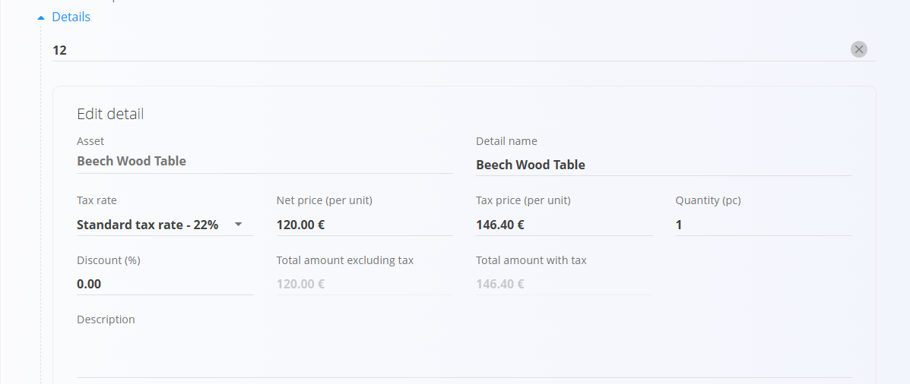
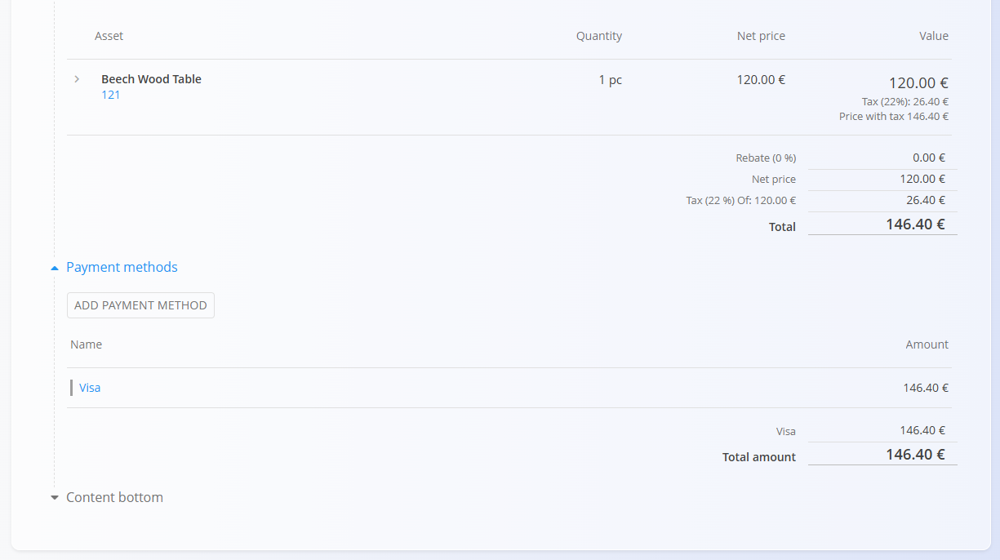

# Maloprodajna predplačila

**Maloprodajno predplačilo** je prodajni dokument, ki se uporablja v maloprodajnih scenarijih za evidentiranje prodaje v obliki predračuna, pri čemer omogoča **fleksibilno evidentiranje plačil** (takojšnja ali kasnejša plačila).  
Dokument je namenjen prodaji na blagajni ali v trgovini in podpira enak življenjski cikel plačil kot **[maloprodajni računi](MaloprodajniRacuni.md)**.

Maloprodajna predplačila je mogoče natisniti ali poslati stranki v katerikoli fazi.

Za dostop do te strani pojdite na **Prodaja / Dokumenti / Maloprodajna predplačila** v [navigaciji](../../Skupno/UI/Navigacija.md).

## Vloga maloprodajnih predplačil v prodajnem procesu

Maloprodajna predplačila se uporabljajo pri neposredni prodaji končnim kupcem:

1. Kupec izbere enega ali več izdelkov v trgovini.  
2. Uporabnik ročno ustvari **Maloprodajno predplačilo** z uporabo [**akcijskega gumba**](../../Skupno/UI/AkcijskiGumb.md).  
3. Dokument se objavi in preide v stanje **Neplačani**.  
4. Plačila se evidentirajo z gumbom **Plačilo**:
   - Delna plačila premaknejo dokument v stanje **Delno plačani**.
   - Celotno plačilo premakne dokument v stanje **V celoti plačani**.
5. Dokument je mogoče natisniti ali poslati stranki.  
6. Zaloga se prilagodi **ločeno** z dokumentom [**Izdaja**](../../Logistika/Dokumenti/Izdajnice.md)  
   (ali z uporabo [**Dobavnice**](Dobavnice.md) in nato **Izdaje**).

> [!IMPORTANT]  
> Maloprodajna predplačila **ne vplivajo na zalogo**.

## Shema

| Polje | Opis |
|------|------|
| [**Šifra**](../../Skupno/UI/SifreDokumentov.md) | Sistemsko generiran identifikator dokumenta. |
| **Številka naročilnice** | Neobvezna referenca kupca. |
| **Stranka** | Obvezno. Izbrana iz [**Poslovnega imenika**](../../Skupno/Sifranti/PoslovniImenik.md). Na voljo so le zapisi z oznakama **Stranka** in **Oseba**. |
| **Datum dokumenta** | Datum nastanka dokumenta. |
| **Datum opravljene storitve** | Datum izročitve ali prevzema blaga. |
| **Datum zapadlosti** | Rok plačila (obvezno). |
| **Tip reference** | Vrsta plačilnega sklica (obvezno). |
| **Sklic** | Sklicna številka za plačilo. |
| [**Bančni račun organizacije**](../Sifranti/BancniRacuniOrganizacije.md) | Račun za prejem plačila (obvezno). |
| [**Stroškovno mesto**](../../Skupno/Sifranti/StroskovnaMesta.md) | Neobvezna razporeditev prihodka. |
| **Koda namena** | Neobvezna koda namena transakcije. |
| **Rabat** | Skupni rabat na dokumentu. |
| **Dostava** | Podatki o podjetju in naslovu dobave. |
| **Vsebina zgoraj** | Uvodno besedilo iz [**Vnaprej določenih besedil**](../../Skupno/Sifranti/VnaprejDolocenaBesedila.md). |
| **Vsebina spodaj** | Zaključna ali pravna besedila iz [**Vnaprej določenih besedil**](../../Skupno/Sifranti/VnaprejDolocenaBesedila.md). |

### Polja postavk

| Polje | Opis |
|------|------|
| [**Sredstvo**](../../Sredstva/Sifranti/Izdelki.md) | Prodan izdelek ali storitev. |
| **Količina** | Količina sredstva (privzeto **1**). |
| **Cena brez DDV** | Neto cena na enoto. |
| **Popust (%)** | Neobvezen popust na postavki. |
| **Vrednost** | Izračunane vrednosti (neto, davek, bruto). |

## Upravljanje

Maloprodajna predplačila podpirajo naslednja stanja:

- **Osnutki**
- **Neplačani**
- **Delno plačani**
- **Plačani**

Po objavi dokumenta postane na voljo gumb **Plačilo**.

### Seznam

Seznam je mogoče filtrirati po:
- **Datumih dokumentov**
- **Pogledu** (Osnutki, Neplačani, Delno plačani, Plačani)
- **Stranki**

Vsaka vrstica prikazuje:
- Stranko  
- Kodo dokumenta  
- Datum dokumenta  
- Plačan znesek  
- Skupni znesek  

## Dejanja

### Ustvarjanje novega maloprodajnega predplačila

Maloprodajna predplačila je mogoče ustvariti **samo ročno**.

1. Kliknite [**akcijski gumb**](../../Skupno/UI/AkcijskiGumb.md) za ustvarjanje novega osnutka.

   

2. Izberite **Stranko**. Na voljo so le zapisi z oznakama **Stranka** in **Oseba**.

   

3. Izpolnite obvezna polja: **Datum zapadlosti**, **Tip reference**, **Sklic** in **Bančni račun organizacije**.

4. V razdelku **Postavke** dodajte postavke z vnosom ali skeniranjem **serijske številke**, **EAN** ali **naziva sredstva**.

   

5. Shranite postavke.

6. (Neobvezno) Izberite **Način plačila** na dnu dokumenta.

   

7. Kliknite **Objavi**.  
   Dokument preide iz **Osnutka** v **Neplačani**.

### Evidentiranje plačil

Plačila se evidentirajo z gumbom **Plačilo** na vrhu dokumenta.

V pogovornem oknu so prikazani:
- **Skupni znesek**  
- **Plačilo** – znesek in datum plačila  
- **Preostali znesek**

Evidentirati je mogoče več plačil. Sistem samodejno posodobi stanje dokumenta:
- **Neplačani**
- **Delno plačani**
- **V celoti plačani**

## Urejanje maloprodajnega predplačila

Dokument je mogoče urejati **le v stanju Osnutek**.

Urejate lahko:
- Glavo dokumenta  
- Postavke  
- Dobavne podatke  
- Vsebino zgoraj in spodaj  

Po objavi urejanje ni več dovoljeno, razen če je dokument **vrnjen v osnutek** (če to dovoljuje konfiguracija).

## Meni

Meni dokumenta omogoča:
- **Tiskanje**
- **Izvoz**
- **Pošiljanje po e-pošti**
- **Storniraj dokument**
- **Vrni v osnutek**

> [!NOTE]
> Osnutki nimajo možnosti **Storniraj dokument**, imajo pa možnost **Izbriši vse postavke**.

## Ravnanje z zalogo

Maloprodajna predplačila **ne zmanjšujejo zaloge**, ne glede na stanje plačila.

Za prilagoditev zaloge:
- ustvarite dokument [**Izdaja**](../../Logistika/Dokumenti/Izdajnice.md), ali  
- ustvarite [**Dobavnico**](Dobavnice.md) in nato [**Izdajo**](../../Logistika/Dokumenti/Izdajnice.md).

## Brisanje

Dokument je mogoče izbrisati **samo v stanju Osnutek** in le, če **ne vsebuje postavk**.

Objavljenih dokumentov **ni mogoče** izbrisati, lahko pa jih **stornirate** ali **vrnete v osnutek**, če je to dovoljeno s sistemsko konfiguracijo.

---
