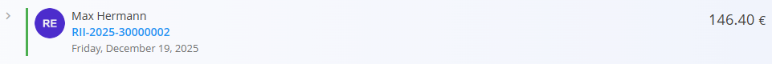
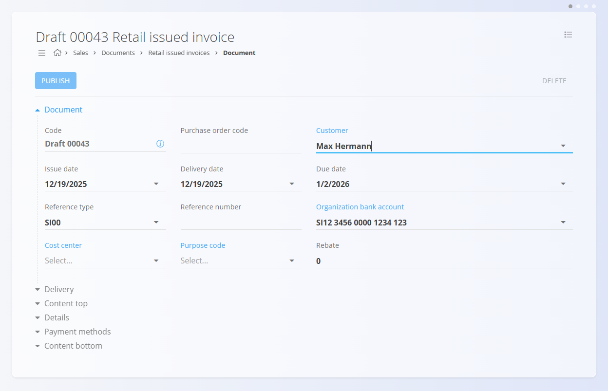

# Maloprodajni računi

**Maloprodajni račun** je prodajni dokument, namenjen neposredni prodaji končnim kupcem (npr. prodaja na blagajni ali v trgovini). Običajno se ustvari ob samem nakupu, brez predhodne ponudbe ali naročila stranke.  
Maloprodajni računi omogočajo takojšnje ali kasnejše evidentiranje plačil, vendar **ne vplivajo na stanje zaloge**. Premiki zaloge se vedno izvajajo ločeno prek logističnih dokumentov.

Za dostop do te strani pojdite na **Prodaja / Dokumenti / Maloprodajni računi** v [navigaciji](../../Skupno/UI/Navigacija.md).

## Vloga maloprodajnih računov v prodajnem procesu

Maloprodajni računi so namenjeni hitri prodaji »na licu mesta«:

1. Kupec izbere enega ali več izdelkov.  
2. Uporabnik ročno ustvari **Maloprodajni račun**.  
3. Račun se objavi in je privzeto v stanju **Neplačano**.  
4. Plačila se evidentirajo neposredno na računu (delna ali celotna).  
5. Račun se samodejno premakne v stanje **Delno plačano** ali **V celoti plačano**, glede na prejeta plačila.  
6. Zaloga se prilagodi ločeno z dokumentom [**Izdaja**](../../Logistika/Dokumenti/Izdaje.md)  
   (ali z uporabo [**Dobavnice**](Dobavnice.md) + [**Izdaje**](../../Logistika/Dokumenti/Izdaje.md), če gre za dostavo).

## Shema

| Polje | Opis |
|------|------|
| [**Šifra**](../../Skupno/UI/SifreDokumentov.md) | Sistemsko generiran identifikator maloprodajnega računa. |
| **Številka naročila kupca** | Neobvezna referenca kupca. |
| **Stranka** | Kupec, izbran iz [**Poslovnega imenika**](../../Skupno/Sifranti/PoslovniImenik.md) (obvezno). Na voljo so le zapisi z oznakama **Stranka** in **Oseba**. |
| **Datum dokumenta** | Datum izdaje računa. |
| **Datum dobave** | Datum izročitve ali dostave blaga. |
| **Datum zapadlosti** | Rok plačila (obvezno). |
| **Tip reference** | Vrsta plačilnega sklica (obvezno). |
| **Sklic** | Sklicna številka glede na izbrano vrsto sklica. |
| [**Bančni račun organizacije**](../Sifranti/BancniRacuniOrganizacije.md) | Račun za prejem plačila (obvezno). |
| [**Stroškovno mesto**](../../Skupno/Sifranti/StroskovnaMesta.md) | Neobvezna razporeditev prihodka. |
| **Koda namena** | Neobvezna koda namena transakcije. |
| **Rabat** | Skupni rabat na računu. |
| **Dobava** | Podatki o podjetju in naslovu dobave. |
| **Vsebina zgoraj** | Uvodno besedilo iz [**Vnaprej določenih besedil**](../../Skupno/Sifranti/VnaprejDolocenaBesedila.md). |
| **Vsebina spodaj** | Zaključna ali pravna besedila iz [**Vnaprej določenih besedil**](../../Skupno/Sifranti/VnaprejDolocenaBesedila.md). |

### Polja postavk

| Polje | Opis |
|------|------|
| [**Sredstvo**](../../Sredstva/Sifranti/Izdelki.md) | Prodan izdelek ali storitev. |
| **Količina** | Prodana količina (privzeto **1**). |
| **Neto cena** | Neto cena na enoto. |
| **Popust (%)** | Neobvezen popust na postavki. |
| **Vrednost** | Izračunane vrednosti (neto, davek, bruto). |

## Upravljanje

Maloprodajni računi prehajajo skozi naslednja stanja:

- **Osnutek**
- **Neplačani**
- **Delno plačani**
- **V celoti plačani**

### Seznam

Seznam je mogoče filtrirati po:
- **Datumih dokumentov**
- **Pogledu** (Osnutki, Obdelan, Neplačani, Delno plačani, Plačani)
- **Stranki**
- **Načinu plačila**

Vsaka vrstica prikazuje:
- Ime stranke  
- Šifro dokumenta  
- Datum dokumenta  
- Plačan znesek in skupni znesek  

Pri delnem plačilu se dokument prikaže v pogledu **Delno plačani**, vrstica pa je označena z **modro** barvo.

Pri celotnem plačilu se dokument prikaže v pogledu **V celoti plačani**, vrstica pa je označena z **zeleno** barvo.

## Dejanja

### Ustvarjanje novega maloprodajnega računa

Maloprodajne račune je mogoče ustvariti **samo ročno**.

1. Kliknite [**akcijski gumb**](../../Skupno/UI/AkcijskiGumb.md) za ustvarjanje novega osnutka.

   

2. Izberite **Stranko**. Na voljo so le zapisi z oznakama **Stranka** in **Oseba**.

   

3. Izpolnite obvezna polja, kot so **Datum zapadlosti**, **Tip reference** in **Bančni račun organizacije**.

4. V razdelku **Postavke** dodajte postavke z vnosom ali skeniranjem naziva ali šifre sredstva.

   

5. Shranite postavke in preverite izračune.

6. (Neobvezno) Dodajte **Načine plačila** na dnu dokumenta.

   

7. Kliknite **Objavi**.  
   Dokument preide v stanje **Neplačani**.

## Evidentiranje plačil

Plačila se evidentirajo z gumbom **Plačilo** na vrhu dokumenta.

V oknu za plačilo so prikazani:
- **Skupni znesek**  
- **Plačilo** – znesek in datum trenutnega plačila  
- **Preostali znesek**

Možno je evidentirati več plačil. Sistem samodejno posodablja stanje dokumenta:
- **Neplačani**
- **Delno plačani**
- **V celoti plačani**

## Ravnanje z zalogo

Maloprodajni računi **ne zmanjšujejo zaloge**, ne glede na stanje plačila.

Za prilagoditev zaloge:
- ustvarite dokument [**Izdaja**](../../Logistika/Dokumenti/Izdaje.md), ali  
- ustvarite [**Dobavnico**](Dobavnice.md) in nato [**Izdajo**](../../Logistika/Dokumenti/Izdaje.md).

## Meni

Meni objavljenega dokumenta omogoča:
- **Tiskanje**
- **Izvoz**
- **Pošiljanje po e-pošti**
- **Storniraj dokument** – glejte [**Storno**](../../Logistika/Dokumenti/Storno.md)
- **Vrni v osnutek**

> [!NOTE]
> Osnutki nimajo možnosti **Storniraj dokument**, imajo pa možnost **Izbriši vse postavke**.

## Brisanje

Maloprodajni računi v stanju **Osnutek** se lahko izbrišejo le, če **ne vsebujejo postavk**.

Če osnutek vsebuje postavke:
1. Kliknite postavko za urejanje.  
2. Kliknite **Izbriši** v oknu urejanja.  
3. Postopek ponovite za vse postavke.

Objavljenih računov (ne glede na stanje plačila) **ni mogoče izbrisati**, mogoče pa jih je **stornirati** ali **vrniti v osnutek**, če je to dovoljeno s konfiguracijo.

---
