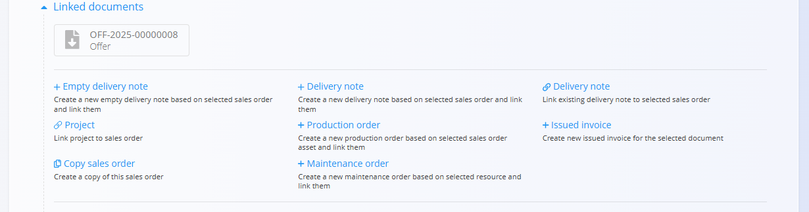

# Naročila strank

**Naročilo stranke** predstavlja potrjeno namero stranke za nakup blaga ali storitev. Najpogosteje se ustvari na podlagi potrjene **Ponudbe**, lahko pa se ustvari tudi samostojno.  
Naročila strank določajo, *kaj* bo stranka prejela, *kdaj* in *pod kakšnimi pogoji*, ter predstavljajo osnovo za procese dostave, proizvodnje, nabave in izdajanja računov.

Za dostop do tega dokumenta pojdite na **Prodaja / Dokumenti / Naročila strank** v [navigaciji](../../Skupno/UI/Navigacija.md).

## Vloga naročil strank v prodajnem procesu

Naročila strank so eden ključnih korakov v prodajni verigi:

1. Ponudba se pripravi v dokumentu **[Ponudba](Ponudbe.md)**.  
2. Ko stranka potrdi ponudbo, se iz nje ustvari **Naročilo stranke** (prek razdelka [*Povezani dokumenti*](Ponudbe.md#povezani-dokumenti)).  
3. Naročilo stranke sproži nadaljnje operativne procese:
   - [**Dobavnice**](Dobavnice.md)
   - [**Proizvodni nalogi**](../../Proizvodnja/Dokumenti/ProizvodniNalogi.md)
   - [**Vzdrževalni nalogi**](../../Vzdrzevanje/Dokumenti/VzdrzevalniNalogi.md)
   - [**Nabavni nalogi**](../../Nabava/Dokumenti/NabavniNalogi.md)
   - [**Izdani računi**](IzdaniRacuni.md)

Ko je naročilo stranke v celoti izpolnjeno in obračunano, se premakne v zaključeno stanje.

> [!NOTE]
> Podjetje lahko uporablja vse ali le nekatere korake, odvisno od vrste dejavnosti (npr. storitvena podjetja morda ne uporabljajo dobavnic).

## Shema

| Polje | Opis |
|------|------|
| [**Šifra**](../../Skupno/UI/SifreDokumentov.md) | Sistemsko generiran identifikator naročila stranke. |
| **Stranka** | Stranka, ki odda naročilo, izbrana iz šifranta [Poslovni imenik](../../Skupno/Upravljanje/PoslovniImenik.md) (obvezno). |
| **Datum dokumenta** | Datum nastanka naročila stranke. |
| **Datum prodaje** | Predviden datum dobave naročila (obvezno). |
| **Rabat** | Neobvezen popust na celotno naročilo stranke. |
| **Številka naročilnice** | Neobvezna povezava na povezani [nabavni nalog](../../Nabava/Dokumenti/NabavniNalogi.md). |
| **[Pogoj dobave](../Upravljanje/PogojiDobave.md)** | Dogovorjeni pogoji dobave s stranko. |
| **[Vrsta transporta](../../Skupno/Upravljanje/VrstaTransporta.md)** | Dogovorjeni način transporta s stranko. |
| **Dobava – Podjetje / Naslov** | Dobavni podatki stranke, povzeti iz [Poslovnega imenika](../../Skupno/Upravljanje/PoslovniImenik.md). |
| **Postavke** | Seznam prodanih postavk (sredstev) z datumi dobave, cenami, količinami in davki (obvezno). |
| [**Način plačila**](../Upravljanje/NacinPlacila.md) | Načini plačila, povezani z naročilom stranke. |

### Polja postavk

| Polje | Opis |
|------|------|
| **Sredstvo** | Izdelek ali storitev, ki se prodaja. |
| **Datum dobave** | Načrtovan datum dobave za posamezno postavko. |
| **Količina** | Količina izbranega sredstva. |
| **Cena brez DDV (na enoto)** | Uporabljena cena na enoto (iz nastavitev sredstva ali cenikov). |
| **Popust (%)** | Popust za posamezno postavko. |
| [**Davčne stopnje**](../../Skupno/Upravljanje/DavcneStopnje.md) | Uporabljena davčna stopnja. |
| **Vrednost** | Končna vrednost postavke (količina × cena − popust). |

## Upravljanje

### Statusi dokumenta

Dokumenti v svojem življenjskem ciklu prehajajo skozi naslednje statuse:

- **Osnutki** – Dokument še ni objavljen; vsa polja so prosto uredljiva.
- **Obdelan** – Dokument je objavljen; ni ga mogoče izbrisati ali prosto spreminjati.
  - **Na voljo** – Dokument je veljaven in pripravljen za nadaljnjo obdelavo.
  - **V zaključevanju** – Dokument je delno obdelan (npr. delno dobavljen).
  - **Zaključen** – Vsa dejanja, povezana z dokumentom, so zaključena.

### Seznam

Seznam prikazuje vsa naročila strank z njihovim trenutnim statusom in datumi dobave.

Na vrhu seznama sistem prikazuje povzetne kazalnike glede na trenutno uporabljene filtre:

- **Zamujena naročila** – Naročila strank, katerih predviden datum dobave je potekel in še niso zaključena.
- **Skupna cena vseh naročil** – Skupna cena vseh naročil strank v aktivnem filtru.

**Osnutki:**

**Na voljo (potrjena):**

Filtri vključujejo:
- **Datumi dokumentov**
- **Osnutki**
- **Obdelan:** Na voljo, V zaključevanju, Zaključen
- **Stranka**
- **Poslovni vnos**
- **Iskalno polje**

## Dejanja

### Ustvarjanje novega naročila stranke

Naročila strank je mogoče ustvariti na dva načina:

- Neposredno na zaslonu **Naročila strank** z uporabo [**akcijskega gumba**](../../Skupno/UI/AkcijskiGumb.md)
- Iz potrjene [**Ponudbe**](Ponudbe.md) prek *Povezani dokumenti → + Naročilo stranke*. V tem primeru se večina polj (stranka, dobava, postavke) samodejno izpolni na podlagi ponudbe.

  

Za ustvarjanje novega naroila stranke sledite korakom:

1. Kliknite **akcijski gumb** za novo naročilo stranke.  
2. Vnesite ali preverite **Stranko**, **Datum dokumenta** in **Datum dobave**.

   

3. Dodajte postavke v razdelek Postavke. Vnesite ali skenirajte **serijsko številko**, **EAN** ali **naziv materiala**.
   - Sistem prikaže **vsa ujemajoča se sredstva in serijske številke**.

   

4. Po potrebi prilagodite **Količino**, **Datum dobave** ali druga polja.  
5. Kliknite **Shrani**, da potrdite dodane postavke.  
6. Preglejte ali prilagodite podatke v razdelku **Dobava**.  
7. (Neobvezno) Dodajte priloge ali povežite naročilo s projektom preko **Povezanih dokumentov**.  
8. Kliknite **Objavi**, ko je naročilo pripravljeno.

Po objavi se naročilo stranke premakne v stanje **Potrjeno → Na voljo** in omogoči nadaljnja dejanja.

### Urejanje naročila stranke

Naroilo stranke je razdeljeno v več razširljivih razdelkov.

#### Priponke

Na vrhu dokumenta je razdelek **Priponke**, kjer lahko naložite spremljajoče datoteke.

#### Povezani dokumenti

Razdelek **Povezani dokumenti** omogoča ustvarjanje in pregled povezanih dokumentov.

> [!NOTE]
> Razpoložljiva dejanja v razdelku **Povezani dokumenti** so odvisna od tipa in statusa dokumenta.

Razpoložljiva dejanja vključujejo:

- [**+ Dobavnica**](Dobavnice.md)
- **+ Prazna dobavnica**
- **Poveži obstoječo dobavnico**
- [**+ Proizvodni nalog**](../../Proizvodnja/Dokumenti/ProizvodniNalogi.md)
- [**+ Vzdrževalni nalog**](../../Vzdrzevanje/Dokumenti/VzdrzevalniNalogi.md)
- [**+ Izdani račun**](IzdaniRacuni.md)
- **Poveži s projektom**
- **Kopiraj naročilo stranke**

#### Dokument

Vključuje osnovna polja:

- Šifra  
- Stranka  
- Datum dokumenta  
- Datum dobave  
- Rabat  
- Številka naročilnice  

#### Alternativna valuta

Razdelek Alternativna valuta omogoča izražanje cen v dokumentu v valuti, ki je različna od privzete sistemske valute. To se običajno uporablja pri mednarodni prodaji. Tečaji se povzemajo iz šifranta [Devizni tečaji](../../Skupno/Sifranti/DevizniTecaji.md).

Ko je izbrana alternativna valuta, se cene v dokumentu samodejno preračunajo z uporabo navedenega deviznega tečaja.

#### Transport

Razdelek Transport določa, kako se blago dostavi stranki in pod kakšnimi dobavnimi pogoji.

Tukaj vneseni podatki se uporabljajo pri usklajevanju logistike, komunikaciji s stranko in na izpisih dokumentov.

#### Dobava

Razdelek Dobava določa naslov dostave. Privzeto se izpolni iz podatkov stranke, vendar ga je mogoče prilagoditi.

#### Postavke

Postavke določajo naročene izdelke ali storitve.

#### Načini plačila

Načini plačila so prikazani na dnu dokumenta.

### Objavljanje in zaključevanje naročila stranke

S klikom na **Objavi** se dokument potrdi in premakne v stanje **Potrjeno → Na voljo**.

> [!NOTE]
> Objavljanje dokumenta ne povzroči dodatnih premikov zaloge ali finančnih knjiženj – ti se izvajajo v povezanih dokumentih.

Ko je naročilo stranke zaključeno (npr. po izdaji dobavnice ali računa), kliknite **Zaključi**:

## Meni

Kontekstni meni omogoča:
- tiskanje  
- izvoz (PDF)  
- uvoz postavk (za osnutke)  
- brisanje vseh postavk (za osnutke)  
- vrnitev v osnutek (za zaključene dokumente)

## Brisanje

Osnutke je mogoče izbrisati le, če **ne vsebujejo postavk**.

Če osnutek vsebuje postavke:
1. Odprite **Uredi postavko**.  
2. Kliknite **Izbriši** za vsako postavko.  

Ko dokument ne vsebuje več postavk, ga lahko izbrišete.

> [!NOTE]
> - Izbrisati je mogoče samo **osnutke**.  
> - Po objavi naročila stranke ni več mogoče izbrisati; uporabite **Vrni v osnutek**.

---
