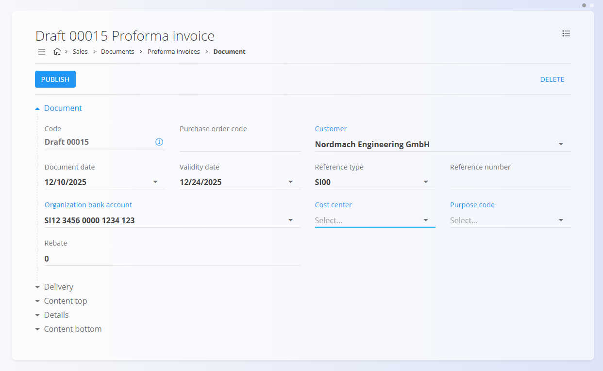
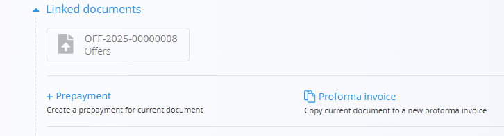
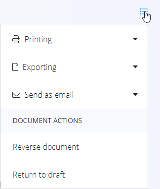

# Predračuni

**Predračun** je informativni prodajni dokument, ki se uporablja za posredovanje podrobne cenovne ponudbe stranki, preden je blago ali storitev dobavljena.  
Predračun **ne sproži** računovodskih ali skladiščnih knjiženj, vendar predstavlja potrjeno komercialno ponudbo.

Predračuni se najpogosteje ustvarijo iz potrjene **[Ponudbe](Ponudbe.md)**, lahko pa se ustvarijo tudi samostojno z uporabo [**akcijskega gumbа**](../../Skupno/UI/AkcijskiGumb.md).

Za dostop do tega dokumenta pojdite na **Prodaja / Dokumenti / Predračuni** v [**navigaciji**](../../Skupno/UI/Navigacija.md).

## Vloga predračunov v prodajnem procesu

Predračuni se uporabljajo kot vmesni korak pri potrjevanju komercialnih pogojev s stranko:

1. Ustvarite **[Ponudbo](Ponudbe.md)** in jo po potrditvi objavite.  
2. Pretvorite potrjeno ponudbo v **Predračun** prek *Povezani dokumenti → + Predračun* ali ustvarite predračun ročno.  
3. Predračun pošljete stranki kot formalno ponudbo.  
4. (Neobvezno) Iz potrjenega predračuna ustvarite enega ali več **[Predplacila](Predplacila.md)**.  
5. Po dobavi blaga ali storitev predračun pretvorite v končni **[Izdani račun](IzdaniRacuni.md)**.  
6. Po potrebi predračun stornirate z dejanjem **[Storno](../../Logistika/Dokumenti/Storno.md)**.

Potrjeni predračuni so informativni in ne vplivajo na finančna ali skladiščna stanja.

## Shema

  
<strong>Dokument</strong>

| Polje | Opis |
|------|------|
| [**Šifra**](../../Skupno/UI/SifreDokumentov.md) | Sistemsko generiran identifikator predračuna. |
| **Številka naročilnice** | Neobvezna referenca na naročilo stranke. |
| **Stranka** | Prejemnik dokumenta, izbran iz šifranta [**Poslovni imenik**](../../Skupno/Upravljanje/PoslovniImenik.md) (obvezno). |
| **Datum dokumenta** | Datum nastanka predračuna. |
| **Datum veljavnosti** | Datum, do katerega so cene in pogoji veljavni (obvezno). |
| **Tip reference** | Vrsta plačilnega sklica (obvezno). |
| **Sklic** | Sklicna številka glede na izbrano vrsto sklica. |
| [**Bančni račun organizacije**](../Upravljanje/BancniRacuniOrganizacije.md) | Bančni račun, prikazan na dokumentu (obvezno). |
| [**Stroškovno mesto**](../../Skupno/Upravljanje/StroskovnaMesta.md) | Neobvezna razporeditev na stroškovno mesto. |
| **Koda namena** | Neobvezni opis namena dokumenta. |
| **Rabat** | Skupni rabat, uporabljen na celoten znesek. |
| **Vsebina zgoraj** | Uvodno besedilo iz [**Vnaprej določenih besedil**](../../Skupno/Upravljanje/VnaprejDolocenaBesedila.md). |
| **Vsebina spodaj** | Zaključna ali pravna besedila iz [**Vnaprej določenih besedil**](../../Skupno/Upravljanje/VnaprejDolocenaBesedila.md). |

  
<strong>Transport, alternativna valuta in dostava</strong>

| Polje | Opis |
|--------|-------------|
| **[Pogoj dobave](../../Skupno/Upravljanje/PogojiDobave.md)** | Dobavni pogoji, dogovorjeni s stranko. |
| **[Vrsta transporta](../../Skupno/Upravljanje/VrstaTransporta.md)** | Način transporta, dogovorjen s stranko. |
| [**Alternativna valuta**](../../Skupno/Upravljanje/Valute.md) | Alternativna valuta glede na privzeto valuto, uporabljeno v dokumentu. |
| [**Tečaj**](../Upravljanje/MenjalniTecaji.md) | Tečaj alternativne valute glede na privzeto valuto. |
| **Dobava – Podjetje / Naslov** | Dobavni podatki stranke, povzeti iz [Poslovnega imenika](../../Skupno/Upravljanje/PoslovniImenik.md). |

  
<strong>Postavke</strong>

| Polje | Opis |
|------|------|
| [**Sredstvo**](../../Sredstva/Materiali/Izdelki.md) | Izdelek ali storitev na predračunu. |
| **Količina** | Količina sredstva. |
| **Neto cena** | Neto cena na enoto. |
| **Popust (%)** | Neobvezen popust na ravni postavke. |
| **Vrednost** | Izračunane vrednosti (neto, davek, bruto) postavke. |

## Upravljanje

Predračuni imajo lahko status **Osnutek** ali **Potrjeno**.

### Seznam

Seznam predračunov je mogoče filtrirati po:
- **Datumih dokumentov**
- **Pogledu** (Osnutek / Potrjeno)
- **Stranki**

Vsaka vrstica prikazuje:
- Stranko  
- Kodo dokumenta  
- Datum dokumenta  
- Znesek dokumenta  

Osnutke je mogoče urejati, potrjeni predračuni pa so dokončni, razen če so stornirani.

## Dejanja

### Ustvarjanje novega predračuna

Predračune je mogoče ustvariti na dva načina:

- Neposredno na zaslonu **Predračuni** z uporabo [**akcijskega gumbа**](../../Skupno/UI/AkcijskiGumb.md).  
- Iz potrjene **[Ponudbe](Ponudbe.md)** prek **Povezani dokumenti → + Predračun**.  
  V tem primeru se večina polj samodejno izpolni.

Koraki:

1. Ustvarite osnutek predračuna z akcijskim gumbom ali prek povezanih dokumentov.  
2. Izpolnite ali preverite:
   - **Stranko**  
   - **Datum dokumenta**  
   - **Datum veljavnosti**  
   - **Rabat** (neobvezno)  
   - **Tip reference / Sklic**  
   - **Bančni račun organizacije**

   

3. V razdelku **Postavke** dodajte postavke z vnosom ali skeniranjem **serijske številke**, **EAN** ali **naziva sredstva**.

   

4. Shranite postavko.

   

5. Ko je dokument pripravljen, kliknite **Objavi**.

> [!NOTE]  
> Potrjenih predračunov ni mogoče urejati, lahko pa služijo kot osnova za **avansna plačila** ali končni račun.

## Urejanje predračuna

Osnutek predračuna je mogoče prosto urejati.  
Spremenite lahko:

- Glavna polja  
- Alternativna valuta
- Podatki o dobavi  
- Transport  
- Postavke (sredstva, količine, cene)  
- Vsebina zgoraj/spodaj  

Po objavi dokument preide v stanje **Potrjeno** in urejanje ni več dovoljeno.

### Priponke

V razdelku **Priponke** lahko dodate podporne dokumente, kot so pogodbe ali potrditve stranke.

### Povezani dokumenti

Razdelek **Povezani dokumenti** omogoča ustvarjanje nadaljnjih dokumentov in prikazuje obstoječe povezave.

Pogosta dejanja:
- **[+ Predplačilo](Predplacila.md)** – ustvari predplačilo iz potrjenega predračuna  
  Zaloga: brez vpliva. Finance: evidentiranje avansnega plačila.
- **Predračun** – kopira vsebino v nov predračun  
- **[Ponudba](Ponudbe.md)** – prikaže izvorno ponudbo (če obstaja); omogoča sledljivost od ponudbe → predračun.

> [!NOTE]
> Razpoložljiva dejanja so odvisna od statusa dokumenta.

#### Alternativna valuta

Razdelek Alternativna valuta omogoča izražanje cen v dokumentu v valuti, ki je različna od privzete sistemske valute. To se običajno uporablja pri mednarodni prodaji. Tečaji se povzemajo iz šifranta [Devizni tečaji](../Upravljanje/MenjalniTecaji.md).

Ko je izbrana alternativna valuta, se cene v dokumentu samodejno preračunajo z uporabo navedenega deviznega tečaja.

### Dostava

Razdelek **Dostava** določa naslov dostave. Privzeto se izpolni iz podatkov stranke, vendar ga je mogoče prilagoditi.

Ti podatki vplivajo na izpis dokumenta in nadaljnje logistične dokumente, ne spreminjajo pa osnovnih podatkov.

## Meni

Meni dokumenta omogoča naslednja dejanja:

- **Tiskanje**
- **Izvoz**
- **Pošiljanje po e-pošti**
- **Storniraj dokument**  
- **Vrni v osnutek** (če sistemska pravila dovoljujejo)

Storniranje predračuna razveljavi njegov potrjeni učinek in ustvari storno dokument. Za več informacij glejte **[Storno](../../Logistika/Dokumenti/Storno.md)**.

## Brisanje

Predračun je mogoče izbrisati **samo v stanju Osnutek** in le, če **ne vsebuje postavk**.

Če osnutek vsebuje postavke:

1. Odprite postavko.  
2. Kliknite **Izbriši**.  
3. Postopek ponovite za vse postavke.

Ko dokument ne vsebuje več postavk, ga lahko izbrišete.

Potrjenih predračunov **ni mogoče** izbrisati, lahko pa jih **stornirate**.
