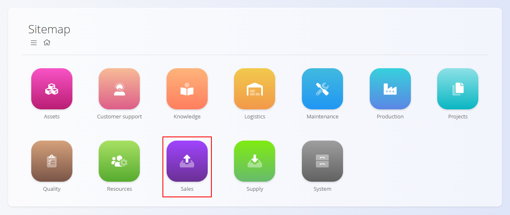
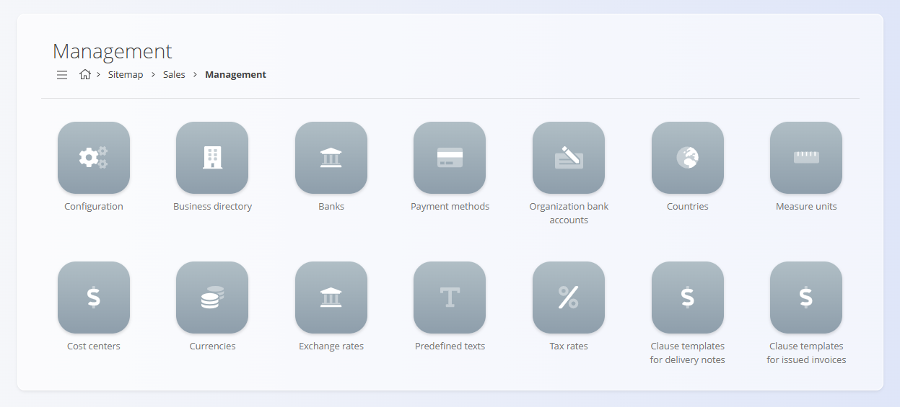

# Prodaja

Področje **Prodaja** vsebuje vse zapise in dokumente, potrebne za upravljanje komercialnih transakcij s strankami. Vključuje dokumente, kot so [**Ponudbe**](../Dokumenti/Ponudbe.md), [**Naročila strank**](../Dokumenti/NarocilaStrank.md), [**Dobavnice**](../Dokumenti/Dobavnice.md), [**Izdani računi**](../Dokumenti/IzdaniRacuni.md), ter analitične preglede, namenjene razumevanju prodajne uspešnosti in tokov dokumentov.

Medtem ko področje **[Sredstva](../../Sredstva/Domena/Sredstva.md)** določa, *kaj* se prodaja, področje Prodaja določa, *kako* se izdelki ali storitve ponudijo, potrdijo, dobavijo in zaračunajo.

Za dostop do tega področja pojdite na **Prodaja** v [navigaciji](../../Skupno/UI/Navigacija.md).

> [!NOTE]  
> Razpoložljiva področja so odvisna od konfiguracije in poslovnega modela posameznega podjetja.

## Kaj vključuje področje Prodaja?

Področje je organizirano v več funkcionalnih sklopov:

- **[Dokumenti](#dokumenti)** – vsi prodajni dokumenti za komercialne transakcije  
- **[Pregledi](#pregledi)** – analitični pogledi za spremljanje prodajne aktivnosti in uspešnosti  
- **[Šifranti](#sifranti)** – nastavitve in osnovni podatki za prodajne procese  

## Dokumenti

Razdelek **Dokumenti** vsebuje prodajne dokumente, ki podpirajo celoten življenjski cikel – od prve ponudbe do končnega računa.

Razpoložljivi prodajni dokumenti vključujejo:

- **[Ponudbe](../Dokumenti/Ponudbe.md)** – Komercialne ponudbe, ustvarjene pred potrditvijo naročila.  
- **[Naročila strank](../Dokumenti/NarocilaStrank.md)** – Potrjene komercialne obveznosti, ki sprožijo dobavo in obračun.  
- **[Dobavnice](../Dokumenti/Dobavnice.md)** – Dokumenti, ki spremljajo dobavo blaga strankam.  
- **[Izdani računi](../Dokumenti/IzdaniRacuni.md)** – Računi za dobavljene izdelke ali storitve.  
- **[Dobropisi](../Dokumenti/Dobropisi.md)** – Negativni računi za popravke ali vračila.  
- **[Bremepisi](../Dokumenti/Bremepisi.md)** – Dodatna zaračunavanja k že izdanemu računu.  
- **[Predračuni](../Dokumenti/Predracuni.md)** – Informativni računi, izdani pred dobavo ali plačilom; ne potrjujejo dobave.  
- **[Predplačila](../Dokumenti/Predplacila.md)** – Upravljanje prejetih predplačil strank.  
- **[Opomini](../Dokumenti/Opomini.md)** – Obvestila o neplačanih ali zapadlih računih.  
- **[Maloprodajni računi](../Dokumenti/MaloprodajniRacuni.md)** – Računi, ustvarjeni v maloprodajnih procesih; zaloga se ureja prek logistike.  
- **[Maloprodajna predplačila](../Dokumenti/MaloprodajnaPredplacila.md)** – Maloprodajni predračuni in predplačila.

Vsaka vrsta dokumenta prispeva k prodajnemu toku in zagotavlja popolno sledljivost od začetne ponudbe do končnega obračuna.

## Pregledi

Razdelek **Pregledi** vsebuje analitična orodja za razumevanje uspešnosti in obnašanja prodajnih dokumentov.

Razpoložljivi pregledi vključujejo:

- **[Poslovne kartice](../Pregledi/PoslovneKartice.md)** – Finančni pregledi bremenitev in dobroimetij po strankah.  
- **[Poročila dobavnic](../Pregledi/PorocilaDobavnic.md)** – Konsolidirana analiza dobavljenih sredstev po strankah; samo za branje; temelji na potrjenih [dobavnicah](../Dokumenti/Dobavnice.md).  
- **[Poročila naročil strank](../Pregledi/PorocilaNarocilStrank.md)** – Konsolidirana analiza naročenih sredstev po strankah; samo za branje; temelji na potrjenih [naročilih strank](../Dokumenti/NarocilaStrank.md).  
- **[Postavke naročil strank](../Pregledi/PostavkeNarocilStrank.md)** – Podroben pregled posameznih postavk naročil strank.

Ti pregledi **ne ustvarjajo** transakcij – namenjeni so analizi in podpori odločanju.

## Šifranti

Razdelek **Šifranti** vsebuje konfiguracijo in osnovne podatke, potrebne za delovanje prodajnih in finančnih procesov.

Razpoložljive nastavitve in šifranti vključujejo:

- **[Konfiguracija prodaje](../Sifranti/KonfiguracijaProdaje.md)** – Globalne nastavitve prodajnih procesov.  
- **[Poslovni imenik](../../Skupno/Sifranti/PoslovniImenik.md)** – Zapisi strank in partnerjev.  
- **[Banke](../../Skupno/Sifranti/BancniRacuni.md)** – Definicije bank za plačila in račune.  
- **[Način plačila](../Sifranti/NacinPlacila.md)** – Načini poravnave prodajnih obveznosti.  
- **[Bančni računi organizacije](../Sifranti/BancniRacuniOrganizacije.md)** – Interni bančni računi za izdajanje računov.  
- **[Države](../../Skupno/Sifranti/Drzave.md)** – Geografski podatki za dokumente in stranke.  
- **[Merske enote](../../Skupno/Sifranti/MerskeEnote.md)** – Enote mere v prodajnih dokumentih.  
- **[Stroškovna mesta](../../Skupno/Sifranti/StroskovnaMesta.md)** – Razporeditev prihodkov po stroškovnih mestih.  
- **[Valute](../../Skupno/Sifranti/Valute.md)** – Valute, uporabljene v cenikih in računih.  
- **[Menjalni tečaji](../Sifranti/MenjalniTecaji.md)** – Tečaji za preračun valut.  
- **[Vnaprej določena besedila](../../Skupno/Sifranti/VnaprejDolocenaBesedila.md)** – Standardna besedila v prodajnih dokumentih.  
- **[Davčne stopnje](../../Skupno/Sifranti/DavcneStopnje.md)** – Davčne definicije za obračun DDV.  
- **[Predloge klavzul za dobavnice](../Sifranti/PredlogeKlavzulZaDobavnice.md)** – Predloge besedil za dobavnice.  
- **[Predloge klavzul za izdane račune](../Sifranti/PredlogeKlavzulZaIzdaneRacune.md)** – Predloge besedil za izdane račune.

Ti elementi določajo, kako se prodajni procesi izvajajo in kako so strukturirani prodajni podatki.

## Prodajni procesi

Prodajni procesi običajno sledijo strukturiranemu življenjskemu ciklu:

### **1. Ponujanje**  
Prodajni predstavniki ustvarijo [ponudbe](../Dokumenti/Ponudbe.md), ki opredelijo izdelke, količine in cene.

### **2. Naročanje**  
Stranke potrdijo ponudbe, kar ustvari [naročila strank](../Dokumenti/NarocilaStrank.md), ki sprožijo izvedbo.

### **3. Dobava**  
[Dobavnice](../Dokumenti/Dobavnice.md) beležijo premik blaga k stranki in povezujejo prodajo s področjem **[Logistika](../../Logistika/Domena/Logistika.md)**.

### **4. Obračun**  
[Izdani računi](../Dokumenti/IzdaniRacuni.md) zaračunajo stranki, po potrebi podprti z [bremepisi](../Dokumenti/Bremepisi.md), [dobropisi](../Dokumenti/Dobropisi.md) in [predplačili](../Dokumenti/Predplacila.md).

### **5. Analiza**  
Pregledi omogočajo vpogled v prodajno uspešnost, aktivnosti strank in staranje dokumentov.

## Prodaja in druga področja

Področje Prodaja je tesno povezano z drugimi operativnimi področji:

| Področje | Povezava |
|--------|----------|
| **[Sredstva](../../Sredstva/Domena/Sredstva.md)** | Določa izdelke, cene in konfiguracije, uporabljene v prodajnih dokumentih. |
| **[Materiali](../../Sredstva/Domena/Materiali.md)** | Zagotavlja podatke o razpoložljivosti in zalogi. |
| **[Logistika](../../Logistika/Domena/Logistika.md)** | Upravljanje fizične dobave blaga. |
| **[Nabava](../../Nabava/Domena/Nabava.md)** | Zagotavlja nabavo izdelkov, prodanih strankam. |

## Povzetek

Področje Prodaja upravlja vse komercialne aktivnosti s strankami ter zagotavlja celovit potek od ponudbe do računa.  
Nudi orodja za ustvarjanje, sledenje in analizo prodajnih dokumentov ter se tesno povezuje z logistiko, nabavo, sredstvi in financami.

---
