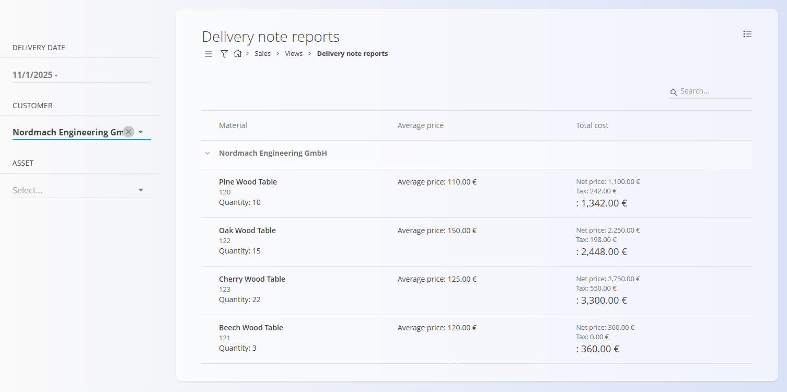

# Poročila dobavnic

Pogled **Poročila dobavnic** nudi konsolidiran pregled **dobavljenih postavk**, združenih po **strankah**. Namenjen je analizi in poročanju ter **ne omogoča** ustvarjanja, urejanja ali spreminjanja dokumentov.

Za dostop do tega pregleda pojdite na **Prodaja / Pregledi / Poročila dobavnic** v [navigaciji](../../Skupno/UI/Navigacija.md).

## Namen pregleda

Poročila dobavnic omogočajo:

- Analizo dobavljenih količin in vrednosti po strankah  
- Pregled zgodovine dobav za posamezna sredstva  
- Razumevanje povprečnih cen in skupnih dobavljenih stroškov  
- Hiter vpogled v uspešnost dobav brez odpiranja posameznih dokumentov  

Pregled je **samo za branje** in prikazuje podatke iz potrjenih [**Dobavnic**](../Dokumenti/Dobavnice.md).

## Postavitev in struktura

Poročilo je hierarhično organizirano:

- **Stranke** predstavljajo najvišji nivo združevanja  
- Pod vsako stranko so prikazana dobavljena **sredstva**  
- Vsaka vrstica sredstva združuje podatke iz vseh ustreznih [**Dobavnic**](../Dokumenti/Dobavnice.md)

Za vsako sredstvo so prikazani:
- Dobavljena **količina**  
- **Povprečna cena**  
- **Skupni strošek**, vključno z neto vrednostjo in davkom  

## Filtri

Filtri na levi strani omogočajo zoženje poročila:

- **Datum opravljene storitve** — Prikaz dobav znotraj izbranega časovnega obdobja  
- **Stranka** — Prikaz dobav za eno ali več izbranih strank  
- **Vrsta blaga oz. storitev** — Prikaz dobav za izbrana sredstva  

Filtre je mogoče kombinirati za natančno analizo določenih dobavnih scenarijev.

## Razlaga vrednosti

- **Količina** predstavlja skupno dobavljeno količino sredstva  
- **Povprečna cena** je izračunana na podlagi vseh dobav istega sredstva za stranko  
- **Skupni strošek** vključuje:
  - Neto vrednost  
  - Znesek davka  
  - Končno skupno vrednost  

Vsi zneski temeljijo na podatkih iz [**Dobavnic**](../Dokumenti/Dobavnice.md), vključenih glede na izbrane filtre.

## Opombe

- V poročilo so vključene samo **potrjene dobavnice**  
- Osnutki ali stornirane dobavnice niso prikazane  
- Pregled je namenjen **izključno analizi** in ne omogoča dejanj, kot so urejanje, storniranje ali ustvarjanje dokumentov  

Za podrobnejše informacije na ravni dokumentov odprite ustrezne [**Dobavnice**](../Dokumenti/Dobavnice.md) neposredno v razdelku **Prodaja / Dokumenti / Dobavnice**.

---
