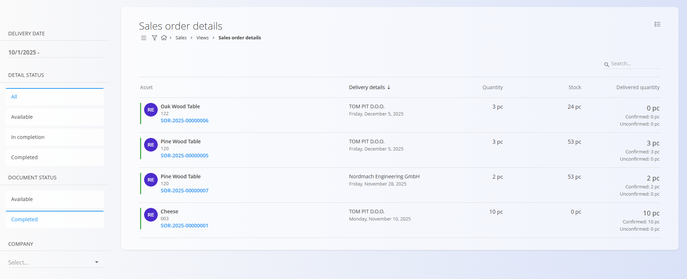

# Postavke naročil strank

Pogled **Postavke naročil strank** prikazuje agregiran seznam vseh **postavk** iz izhodnih dokumentov [**Naročila strank**](../Dokumenti/NarocilaStrank.md).  
Namesto dokumentov so v tem pogledu prikazane **posamezne postavke naročil**, kar omogoča natančno spremljanje dobav, količin in odprtih obveznosti.

Ta pogled je izključno analitičen — **ne omogoča** ustvarjanja ali spreminjanja naročil strank.

Za dostop do tega pregleda pojdite na **Prodaja / Pregledi / Postavke naročil strank** v [**navigaciji**](../../Skupno/UI/Navigacija.md).

## Seznam postavk naročil strank

Vsaka vrstica v seznamu predstavlja **eno posamezno postavko naročila stranke**, vključno z naslednjimi podatki:

- **Vrsta blaga oz. storitev** – Izdelek ali storitev, ki se prodaja  
- **Podrobnosti o dobavi** – Stranka in predviden datum dobave  
- **Količina** – Naročena količina  
- **Zaloga** – Trenutna zaloga v skladišču  
- **Dostavljena količina** – Prikaz potrjene in nepotrjene dobave  
  - Primer: *0 kos (Potrjeno: 0 / Nepotrjeno: 0)*  
  - To omogoča spremljanje napredka izpolnjevanja naročila

Na ta način je mogoče enostavno preveriti, **katere postavke še čakajo na dobavo**, neodvisno od samega dokumenta naročila stranke.

## Filtri

Leva stranska vrstica vsebuje filtre za spremljanje uspešnosti dobav:

- **Datum prodaje** – Izbira časovnega obdobja dobave  
- **Stanje postavke**  
  - *Vsi*  
  - *Na voljo*  
  - *V zaključevanju*  
  - *Zaključen*  
- **Stanje dokumenta**  
  - *Na voljo*  
  - *Zaključen*  
- **Stranka** – Filtriranje po stranki  

Filtri omogočajo hiter vpogled v stanje dobav in odprte obveznosti.

## Namen

Pogled **Postavke naročil strank** je uporaben za:

- Planiranje prihajajočih dobav  
- Spremljanje, katere postavke so v celoti ali delno dobavljene  
- Prepoznavanje ozkih grl (npr. pomanjkanje zaloge)  
- Pregled obremenitve logistike in skladišča  

Ta pregled dopolnjuje zaslon dokumentov **[Naročila strank](../Dokumenti/NarocilaStrank.md)**, saj se osredotoča na **postavke**, ne na dokumente.

---
